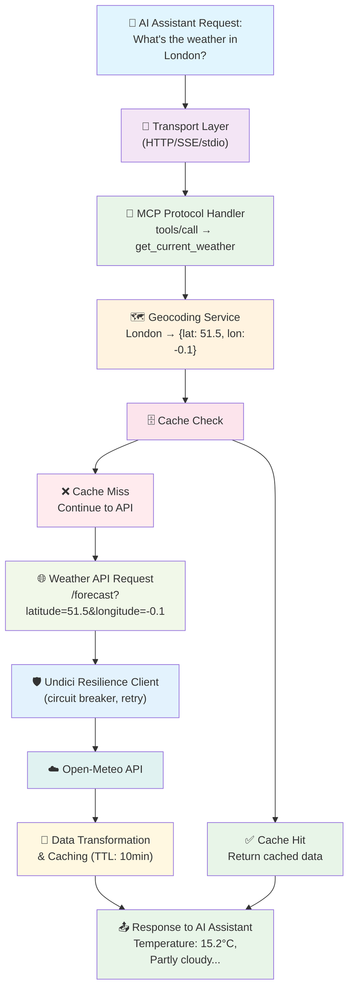
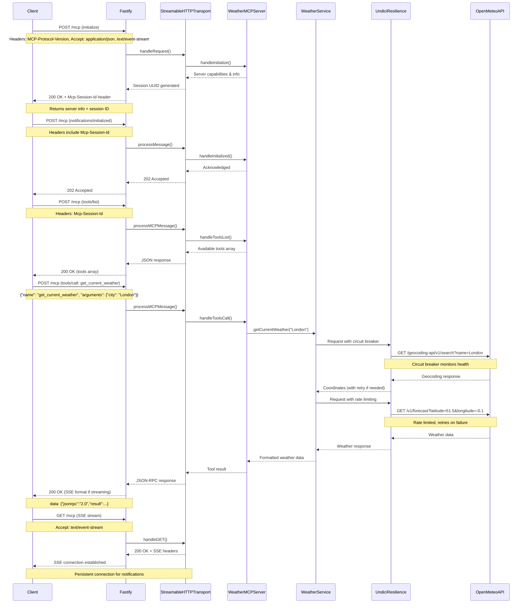
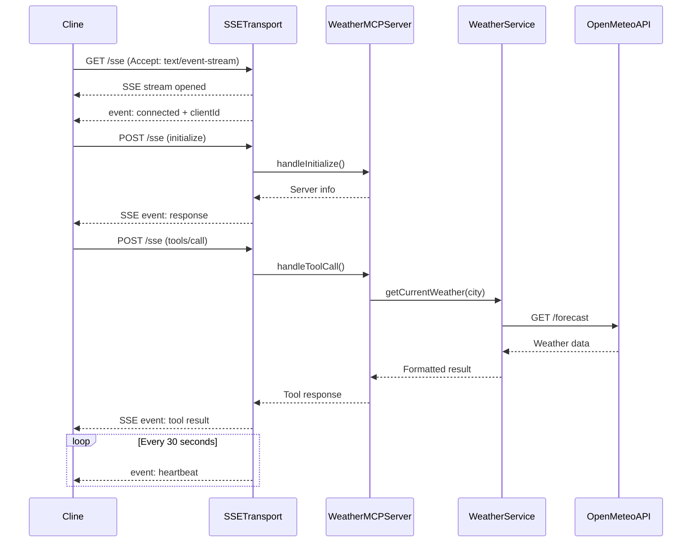
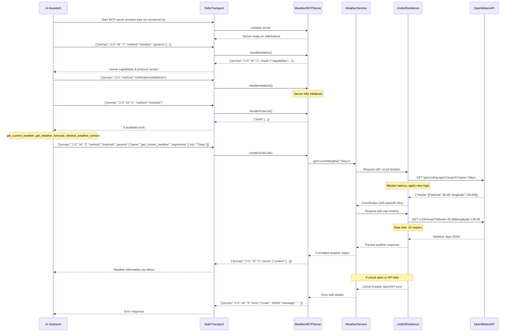
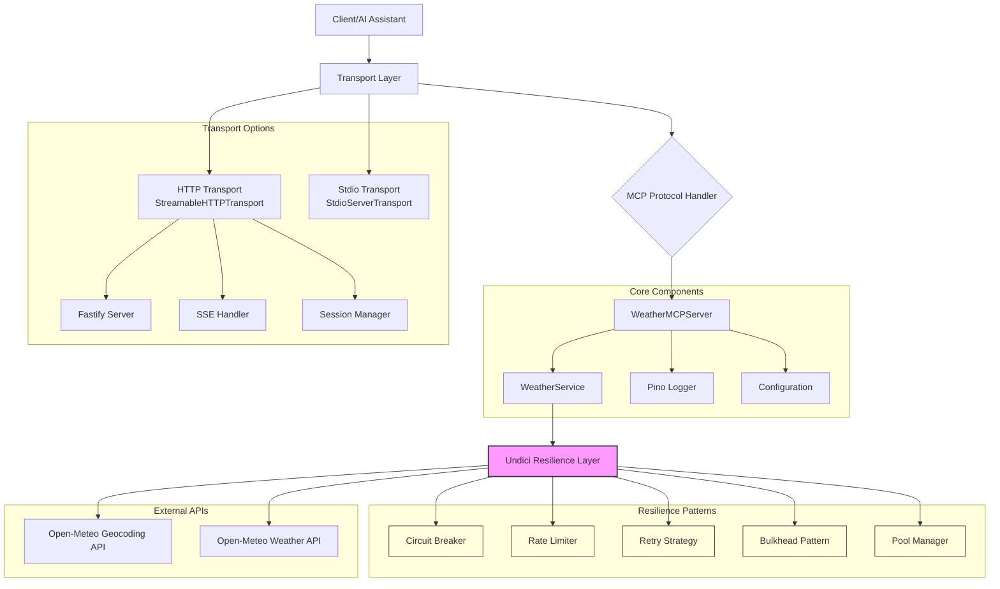

# MCP Weather Server

A production-ready **Model Context Protocol (MCP)** server that provides weather information using the **Open-Meteo API**. Built with TypeScript, Node.js 22.x, and implements a **three-transport strategy** for maximum compatibility: Official stdio MCP SDK for local development, Official Streamble HTTP SDK for production APIs, and Custom SSE for remote Cline connections.

This MCP Weather Server is a production-ready example of how to build robust, scalable MCP servers with proper error handling, resilience patterns, and clean architecture. The codebase demonstrates best practices for TypeScript development, async programming, and API integration.

[](https://nodejs.org/)
[](https://www.typescriptlang.org/)
[](https://modelcontextprotocol.io/)
[](https://opensource.org/licenses/MIT)

## 📋 Table of Contents

- [MCP Weather Server](#mcp-weather-server)
  - [📋 Table of Contents](#-table-of-contents)
  - [🌟 Features](#-features)
  - [🛠️ Technology Stack](#️-technology-stack)
  - [📊 Data Flow](#-data-flow)
  - [🏗️ MCP Weather Server - Overview](#️-mcp-weather-server---overview)
  - [🚀 Quick Start](#-quick-start)
    - [Prerequisites](#prerequisites)
    - [1️⃣ Installation](#1️⃣-installation)
    - [2️⃣ AI Assistant Configurations](#2️⃣-ai-assistant-configurations)
      - [Cline (VS Code)](#cline-vs-code)
      - [Claude Desktop](#claude-desktop)
      - [Cursor](#cursor)
      - [GitHub Copilot (Future MCP Support)](#github-copilot-future-mcp-support)
      - [Test with AI Assistant](#test-with-ai-assistant)
  - [Directory Structure](#directory-structure)
  - [🏗️ Architecture \& Design](#️-architecture--design)
    - [High-Level Architecture](#high-level-architecture)
    - [Transport Strategy](#transport-strategy)
      - [Transport Decision Matrix](#transport-decision-matrix)
    - [System Flow](#system-flow)
      - [Streamable HTTP Transport Sequence Diagram](#streamable-http-transport-sequence-diagram)
      - [Custom SSE Transport Sequence Diagram](#custom-sse-transport-sequence-diagram)
      - [Stdio Transport Sequence Diagram](#stdio-transport-sequence-diagram)
    - [Component Interactions](#component-interactions)
  - [🔧 Configuration](#-configuration)
    - [Key Configuration Options](#key-configuration-options)
  - [📡 API Usage](#-api-usage)
    - [MCP Protocol](#mcp-protocol)
      - [1. `get_current_weather`](#1-get_current_weather)
      - [2. `get_weather_forecast`](#2-get_weather_forecast)
      - [3. `retrieve_weather_context`](#3-retrieve_weather_context)
    - [HTTP Transport](#http-transport)
  - [🧪 Testing](#-testing)
    - [Quick Test Commands](#quick-test-commands)
      - [Unit Tests](#unit-tests)
      - [HTTP Transport Testing](#http-transport-testing)
      - [SSE Transport Testing](#sse-transport-testing)
      - [Stdio Transport Testing](#stdio-transport-testing)
      - [MCP Inspector Testing](#mcp-inspector-testing)
      - [Postman Testing](#postman-testing)
  - [🔌 Integration Examples](#-integration-examples)
    - [Cline (Local \& Remote AI Assistant)](#cline-local--remote-ai-assistant)
      - [Configuration Files](#configuration-files)
  - [📊 Monitoring \& Observability](#-monitoring--observability)
    - [Logging](#logging)
    - [Health Checks](#health-checks)
    - [Metrics](#metrics)
  - [🔒 Security](#-security)
  - [📊 Session Management (HTTP Transport)](#-session-management-http-transport)
    - [Session Manager Components](#session-manager-components)
      - [1. **Session Identification**](#1-session-identification)
      - [2. **Client Connection Registry**](#2-client-connection-registry)
      - [3. **Message Queue System**](#3-message-queue-system)
      - [4. **Connection Lifecycle**](#4-connection-lifecycle)
    - [Message Queueing Behavior](#message-queueing-behavior)
    - [Session Recovery Flow](#session-recovery-flow)
    - [Production Considerations](#production-considerations)
  - [🤝 Contributing](#-contributing)
  - [📝 License](#-license)
  - [🙏 Acknowledgments](#-acknowledgments)
  - [📞 Support](#-support)

## 🌟 Features

- **🤖 LLM-Friendly Design**: Clear tool descriptions, structured responses, input validation & error context and idempotent operations
- **🌤️ Real-time Weather**: Current weather conditions with temperature, humidity, wind speed
- **📅 Weather Forecasts**: Up to 7-day forecasts with detailed conditions
- **🤖 AI Agent Support**: `retrieve_weather_context` tool for natural language queries
- **🔄 Three Transport Types**: 
  - **Offical Stdio**: Local development with Cline in VS Code
  - **Offica Streamble HTTP**: Production APIs, LangChain, microservices
  - **Custom SSE**: Remote Cline connections, lightweight clients
- **🛡️ Resilience Patterns**: Circuit breaker, retry strategies, rate limiting, bulkhead isolation
- **⚡ High Performance**: Undici-based HTTP client with connection pooling and streaming
- **🔒 Security First**: Input validation, Origin checks, CORS support, session management
- **📊 Observability**: Structured logging with Pino, real-time metrics, health monitoring
- **🧪 Comprehensive Testing**: Unit tests, integration tests, chaos engineering, load testing
- **🚀 Production Ready**: Docker containerization, graceful shutdown, error recovery

## 🛠️ Technology Stack

| Technology | Version | Purpose |
|------------|---------|---------|
| [**Node.js**](https://nodejs.org/) | `>=22.0.0` | JavaScript runtime environment |
| [**TypeScript**](https://github.com/microsoft/TypeScript) | `~5.9.0` | Type-safe JavaScript development | 
| [**Fastify**](https://fastify.dev/) | `~5.6.0` | High-performance web framework for HTTP transport (replaces Express.js) |
| [**@modelcontextprotocol/sdk**](https://github.com/modelcontextprotocol/typescript-sdk) | `~1.17.5` | MCP protocol implementation |
| [**Pino**](https://github.com/pinojs/pino) | `~9.9.0` | High-performance structured logging |
| [**Vitest**](https://github.com/vitest-dev/vitest)| `~3.2.0` | Next-generation testing framework |
| [**undici**](https://github.com/nodejs/undici) | `~7.16.0` | High-performance HTTP client with connection pooling |
| [**Open-Meteo API**](https://open-meteo.com/) | N/A | Free weather data provider |

> **Note**: The project includes an advanced `undici-resilience` package that enhances the standard undici client with enterprise-grade resilience patterns including circuit breakers, retry strategies, rate limiting, and comprehensive monitoring. This ensures reliable weather API calls even under adverse conditions.

## 📊 Data Flow



## 🏗️ MCP Weather Server - Overview

This server provides **weather information tools** to AI assistants, enabling them to:

- Get current weather conditions for any location
- Retrieve weather forecasts (1-7 days)
- Handle complex weather queries with context
- Provide reliable, cached responses with resilience patterns

## 🚀 Quick Start

### Prerequisites
- **Node.js 22.x** or later
- **npm** or **yarn**

### 1️⃣ Installation

```bash
# Clone the repository
git clone https://github.com/kumaran-is/mcp-weather-server.git
cd mcp-weather-server

# Install dependencies
npm install

# Build the project
npm run build

```

### 2️⃣ AI Assistant Configurations

#### Cline (VS Code)
**Local Configuration** (`cline_mcp_settings.json`):
```json
{
  "mcpServers": {
    "weather": {
      "autoApprove": [
        "get_current_weather",
        "get_weather_forecast",
        "retrieve_weather_context"
      ],
      "disabled": true,
      "timeout": 30000,
      "type": "stdio",
      "command": "npx",
      "args": [
        "tsx",
        "src/server.ts"
      ],
      "cwd": "/path-to/mcp-weather-server",
      "env": {
        "MCP_TRANSPORT": "stdio",
        "LOG_LEVEL": "info",
        "NODE_ENV": "production"
      }
    }
  }
}
```

**Remote Configuration** (for SSE):
```json
{
  "mcpServers": {
    "weather-remote": {
      "autoApprove": [
        "get_current_weather",
        "get_weather_forecast",
        "retrieve_weather_context"
      ],
      "disabled": false,
      "timeout": 30000,
      "type": "sse",
      "url": "http://localhost:8081/sse"
    }
  }
}
```

#### Claude Desktop
**Configuration** (`~/Library/Application Support/Claude/claude_desktop_config.json` on macOS):
```json
{
  "mcpServers": {
    "weather": {
      "command": "node",
      "args": ["/path/to/mcp-weather-server/dist/server.js"],
      "env": {
        "MCP_TRANSPORT": "stdio"
      }
    }
  }
}
```

#### Cursor
**Configuration** (`.cursor/mcp_config.json` in project root):
```json
{
  "mcpServers": {
    "weather": {
      "command": "npx",
      "args": ["tsx", "src/server.ts"],
      "cwd": "${workspaceFolder}",
      "env": {
        "MCP_TRANSPORT": "stdio"
      }
    }
  }
}
```

#### GitHub Copilot (Future MCP Support)
```json
{
  "github.copilot.mcpServers": {
    "weather": {
      "command": "node",
      "args": ["./dist/server.js"],
      "transport": "stdio"
    }
  }
}
```

#### Test with AI Assistant
Once configured, you can test with natural language:
- "What's the weather in Paris?"
- "Show me a 5-day forecast for New York"
- "Is it going to rain in Seattle tomorrow?"

## Directory Structure

```
src/
├── server.ts                ← 🎯 Entry point & transport selection
├── mcp-server.ts            ← 🧠 Core MCP protocol implementation
├── weather-service.ts       ← 🌤️ Business logic for weather operations
├── types.ts                 ← 📝 TypeScript interfaces
├── logger-pino.ts           ← 📊 Production logging with Pino
│
├── config/                  ← ⚙️ Configuration management
│   ├── config.ts           
│   └── config.spec.ts
│
├── cache/                   ← 🗄️ Intelligent LRU caching
│   ├── weather-cache.ts     
│   └── weather-cache.spec.ts
│
├── transports/              ← 🚌 Communication protocols
│   ├── http-transport.ts    ← Streamble HTTP with Fastify
│   ├── sse-transport.ts     ← Simple Custom SSE for remote AI Assitant like Cline, Copilot, Cursor etc
│   └── *.spec.ts
│
├── undici-resilience/       ← 🛡️ Advanced HTTP resilience
│   ├── index.ts             ← Main exports
│   ├── http/                ← Connection pooling
│   ├── resilience/          ← Circuit breaker, retry, timeout, fallback, rate limiting, bulkhead pattern.
│   ├── streaming/           ← Backpressure handling
│   └── monitoring/          ← Metrics and health
│
├── errors/                  ← 🚨 Custom error handling
├── middleware/              ← 🛡️ Request validation
└── utils/                   ← 🔧 Utility functions

```

## 🏗️ Architecture & Design

### High-Level Architecture


```
┌─────────────────────────────────────────────────────────────┐
│                    CLIENT LAYER                             │
│ AI Assistants (Cline, Claude) | AI Agents (Streamble HTTP)  │
└─────────────────┬───────────────────────────────────────────┘
                  │
┌─────────────────▼───────────────────────────────────────────┐
│                 TRANSPORT LAYER                             │
│  ┌──────────────┬──────────────────┬──────────────────┐    │
│  │ Stdio        │ HTTP (Fastify)   │ SSE (Custom)     │    │
│  │ Local Dev    │ Production APIs  │ Remote Cline     │    │
│  └──────────────┴──────────────────┴──────────────────┘    │
└─────────────────┬───────────────────────────────────────────┘
                  │
┌─────────────────▼───────────────────────────────────────────┐
│                MCP PROTOCOL LAYER                           │
│       WeatherMCPServer (src/mcp-server.ts)                 │
│  ┌─────────────────────────────────────────────────────┐    │
│  │ Tool Registration | Request Routing | Validation    │    │
│  └─────────────────────────────────────────────────────┘    │
└─────────────────┬───────────────────────────────────────────┘
                  │
┌─────────────────▼───────────────────────────────────────────┐
│                BUSINESS LOGIC LAYER                         │
│       WeatherService (src/weather-service.ts)              │
│  ┌─────────────────────────────────────────────────────┐    │
│  │ API Integration | Caching | Data Transformation     │    │
│  └─────────────────────────────────────────────────────┘    │
└─────────────────┬───────────────────────────────────────────┘
                  │
┌─────────────────▼───────────────────────────────────────────┐
│              INFRASTRUCTURE LAYER                           │
│  ┌─────────────────────────────────────────────────────┐    │
│  │ Undici Resilience | Cache | Config | Logging        │    │
│  │ External APIs (Open-Meteo) | Error Handling         │    │
│  └─────────────────────────────────────────────────────┘    │
└─────────────────────────────────────────────────────────────┘
```

### Transport Strategy

The MCP Weather Server implements a **three-transport strategy** for maximum compatibility:

| Transport | Port | Best For | Protocol | Cline Support |
|-----------|------|----------|----------|---------------|
| **Official Stdio** | N/A | Local development, VS Code | Process I/O | ✅ Local only |
| **Official Streamable HTTP(/mcp)** | 8080 | Production APIs, LangChain | Bidirectional - Single Endpoint Architecture | ❌ No |
| **Custom SSE(/sse & /sse/messages)** | 8081 | Remote Cline, lightweight clients | Custom SSE + HTTP| ✅ Remote |

**Deprecation Note:** [Offical SSE MCP SDK](https://modelcontextprotocol.io/specification/2024-11-05/basic/transports#http-with-sse) is Being Deprecated in MCP.  [Official Streamable HTTP MCP SDK](https://modelcontextprotocol.io/specification/2025-06-18/basic/transports#streamable-http) transport replaced [Offical SSE MCP SDK](https://modelcontextprotocol.io/specification/2024-11-05/basic/transports#http-with-sse) transport. For more detail refer [SSE-TO-StreamableHTTP](./docs/SSE-TO-StreamableHTTP.md)

#### Transport Decision Matrix

| Your Need | Recommended Transport | Start Command |
|-----------|----------------------|---------------|
| Local Cline in VS Code | **Stdio** | (auto-spawned) |
| Remote Cline access | **Custom SSE** | `npm run sse` |
| Production API | **Streamable HTTP** | `npm run http` |
| Docker deployment | **Streamable HTTP**  | See docker-compose |
| LangChain integration | **Streamable HTTP** | `npm run http` |
| MCP Inspector testing | Any | See docs |

### System Flow

#### Streamable HTTP Transport Sequence Diagram



#### Custom SSE Transport Sequence Diagram



#### Stdio Transport Sequence Diagram



### Component Interactions



## 🔧 Configuration

The server uses environment variables for configuration. Copy `.env.example` to `.env` and modify as needed.

### Key Configuration Options

```bash
# Transport selection (stdio, http, sse)
MCP_TRANSPORT=stdio

# Port configuration
MCP_HTTP_PORT=8080  # For HTTP transport
MCP_SSE_PORT=8081   # For SSE transport

# Logging
LOG_LEVEL=info
```

For complete configuration options, see:
- [.env.example](.env.example) - Development configuration
- [.env.production.example](.env.production.example) - Production configuration

## 📡 API Usage

### MCP Protocol

The server implements the **Model Context Protocol (2025-06-18)** with the following tools:

#### 1. `get_current_weather`
Get current weather for a city.

**Parameters:**
- `city` (string): City name (e.g., "London", "New York")

**Example:**
```json
{
  "jsonrpc": "2.0",
  "id": "123",
  "method": "tools/call",
  "params": {
    "name": "get_current_weather",
    "arguments": { "city": "London" }
  }
}
```

**Response:**
```json
{
  "jsonrpc": "2.0",
  "id": "123",
  "result": {
    "content": [{
      "type": "text",
      "text": "Weather in London:\n• Temperature: 15.2°C\n• Condition: Partly cloudy\n• Humidity: 72%\n• Wind Speed: 8.5 m/s\n• Feels Like: 14.8°C\n• Pressure: 1013.25 hPa"
    }]
  }
}
```

#### 2. `get_weather_forecast`
Get weather forecast for a city (1-7 days).

**Parameters:**
- `city` (string): City name
- `days` (number, optional): Number of days (1-7, default: 5)

**Example:**
```json
{
  "jsonrpc": "2.0",
  "id": "124",
  "method": "tools/call",
  "params": {
    "name": "get_weather_forecast",
    "arguments": { "city": "Tokyo", "days": 3 }
  }
}
```

#### 3. `retrieve_weather_context`
Retrieve weather context for AI agent queries.

**Parameters:**
- `query` (string): Natural language query containing city reference

**Example:**
```json
{
  "jsonrpc": "2.0",
  "id": "125",
  "method": "tools/call",
  "params": {
    "name": "retrieve_weather_context",
    "arguments": { "query": "weather in Paris for travel" }
  }
}
```

### HTTP Transport

When using HTTP transport, the server exposes endpoints:

- `POST /mcp` - Send MCP messages
- `GET /mcp` - Establish SSE stream for receiving messages
- `DELETE /mcp` - Terminate session

**Headers:**
- `MCP-Protocol-Version: 2025-06-18`
- `Mcp-Session-Id: <uuid>`
- `Content-Type: application/json`
- `Accept: application/json, text/event-stream`

## 🧪 Testing

For comprehensive testing instructions, see **[TESTING.md](docs/TESTING.md)** - a complete guide covering all three transports (stdio, HTTP, and SSE).

### Quick Test Commands

#### Unit Tests

**Run All Tests**
```bash
npm test
```

**Run Tests with Coverage**
```bash
npm run test:coverage
```

#### HTTP Transport Testing

**Start HTTP Server**
```bash
npm run http
```

**Test with curl**
```bash
# Initialize session
curl -X POST http://localhost:8080/mcp \
  -H "Content-Type: application/json" \
  -H "MCP-Protocol-Version: 2025-06-18" \
  -d '{"jsonrpc":"2.0","id":"1","method":"initialize","params":{"protocolVersion":"2025-06-18","capabilities":{},"clientInfo":{"name":"curl-test","version":"1.0.0"}}}'

# Get current weather (use session ID from initialize response)
curl -X POST http://localhost:8080/mcp \
  -H "Content-Type: application/json" \
  -H "Mcp-Session-Id: YOUR_SESSION_ID" \
  -d '{"jsonrpc":"2.0","id":"2","method":"tools/call","params":{"name":"get_current_weather","arguments":{"city":"London"}}}'
```

**Health Check**
```bash
curl http://localhost:8080/health
```

#### SSE Transport Testing

**Start SSE Server**
```bash
npm run sse
```

**Test with curl**
```bash
# Connect to SSE stream
curl -N -H "Accept: text/event-stream" http://localhost:8081/sse

# Send command (in another terminal)
curl -X POST http://localhost:8081/sse \
  -H "Content-Type: application/json" \
  -d '{"jsonrpc":"2.0","id":"1","method":"tools/list"}'
```

#### Stdio Transport Testing

**Quick Stdio Test**
```bash
echo '{"jsonrpc":"2.0","id":"1","method":"tools/list"}' | npm run stdio
```

#### MCP Inspector Testing

For comprehensive testing with the official MCP Inspector tool:
- **[MCP Inspector Guide](docs/MCP-INSPECTOR-GUIDE.md)** - Step-by-step testing with visual interface
- Supports all three transports (stdio, HTTP, SSE)
- Interactive tool testing and protocol validation

For detailed testing scenarios including manual curl commands, environment configuration, load testing, and troubleshooting, refer to **[docs/TESTING.md](docs/TESTING.md)**.

#### Postman Testing

**Quick Import:**
1. Start the server: `npm run http`
2. Open Postman and click "Import"
3. Import the file **[docs/mcp_weather.postman_collection.json](docs/mcp_weather.postman_collection.json)**
4. All requests are pre-configured with proper headers and variables!

## 🔌 Integration Examples

### Cline (Local & Remote AI Assistant)

**Complete Setup Guide**: See **[CLINE-INTEGRATION.md](docs/agent_mcp_setting/CLINE-INTEGRATION.md)** for detailed Cline integration instructions.

#### Configuration Files

| Use Case | Transport | Config File |
|----------|-----------|-------------|
| **Local Cline** | Stdio | [cline_mcp_settings.json](docs/agent_mcp_setting/cline_mcp_settings.json) |
| **Remote Cline** | Custom SSE | [cline_mcp_settings_sse.json](docs/agent_mcp_setting/cline_mcp_settings_sse.json) |
| **Documentation Only** | Streamable HTTP | [cline_mcp_settings_http.json](docs/agent_mcp_setting/cline_mcp_settings_http.json) |

**Note**: Cline does NOT support HTTP transport. Use Stdio for local or SSE for remote connections.

**Usage**: Ask Cline natural language questions like "What's the weather in London?" or "Should I bring an umbrella to Paris?"

## 📊 Monitoring & Observability

### Logging
The server uses structured logging with Pino:

```json
{
  "level": "info",
  "time": "2025-01-08T16:30:00.000Z",
  "msg": "Weather MCP Server initialized",
  "name": "weather-mcp-server",
  "version": "1.0.0",
  "protocolVersion": "2025-06-18"
}
```

### Health Checks
```bash
curl http://localhost:8080/health
```

### Metrics
- Request/response times
- API call success rates
- Active connections
- Error rates by endpoint

## 🔒 Security

- **Input Validation**: All inputs are validated and sanitized
- **Origin Checks**: CORS validation for HTTP requests
- **Rate Limiting**: Built-in request throttling
- **HTTPS**: SSL/TLS support in production
- **No API Keys**: Uses free Open-Meteo API (no credentials needed)

## 📊 Session Management (HTTP Transport)

The HTTP transport includes a sophisticated session management system for handling stateful connections over HTTP/SSE:

### Session Manager Components

#### 1. **Session Identification**
- Generates unique UUID v4 session IDs for each client
- Session ID transmitted via `Mcp-Session-Id` header
- Sessions persist across multiple HTTP requests

#### 2. **Client Connection Registry**
```typescript
private clients: Map<string, ClientConnection> = new Map();
```
- Maintains active SSE connections mapped by session ID
- Tracks response objects for real-time message delivery
- Enables targeted notifications to specific clients

#### 3. **Message Queue System**
```typescript
private messageQueues: Map<string, unknown[]> = new Map();
```
- **In-memory message buffering** for disconnected clients
- Messages queued when client temporarily offline
- Automatic delivery when client reconnects with same session ID
- Supports resumable connections via `Last-Event-Id` header

#### 4. **Connection Lifecycle**
- **Session Creation**: New UUID generated on first request without session ID
- **Keep-Alive**: Maintains persistent SSE connections for real-time updates
- **Graceful Disconnection**: Automatic cleanup on client disconnect
- **Explicit Termination**: DELETE request ends session and clears queues

### Message Queueing Behavior

**When Messages are Queued:**
- Client connection lost (network interruption)
- Client not yet established SSE stream
- Server needs to send notification to offline client

**Queue Limitations:**
⚠️ **Important**: Messages are stored in-memory only
- Lost on server restart
- No persistence to disk/database
- Limited by available RAM
- No built-in size limits or TTL

**Queue Cleanup Triggers:**
1. Client disconnects normally (SSE stream closes)
2. Connection error occurs
3. Session explicitly terminated (DELETE request)
4. Server shutdown

### Session Recovery Flow

1. Client disconnects unexpectedly
2. Server queues subsequent messages for that session
3. Client reconnects with same `Mcp-Session-Id`
4. Client provides `Last-Event-Id` header (optional)
5. Server delivers all queued messages
6. Normal SSE stream resumes

### Production Considerations

For production deployments, consider:
- Adding Redis/database for persistent message storage
- Implementing queue size limits and message TTL
- Setting session timeout policies
- Adding metrics for queue depths and session counts
- Implementing distributed session storage for multi-server deployments

## 🤝 Contributing

1. Fork the repository
2. Create a feature branch: `git checkout -b feature/amazing-feature`
3. Commit changes: `git commit -m 'Add amazing feature'`
4. Push to branch: `git push origin feature/amazing-feature`
5. Open a Pull Request

## 📝 License

This project is licensed under the **MIT License** - see the [LICENSE](LICENSE) file for details.

## 🙏 Acknowledgments

- [Model Context Protocol](https://modelcontextprotocol.io/) - The protocol specification
- [Open-Meteo](https://open-meteo.com/) - Free weather API
- [Pino](https://getpino.io/) - Node.js logging library
- [Node.js](https://nodejs.org/) - JavaScript runtime

## 📞 Support

- **Issues**: [GitHub Issues](https://github.com/kumaran-is/mcp-weather-server/issues)
- **Discussions**: [GitHub Discussions](https://github.com/kumaran-is/mcp-weather-server/discussions)
- **Documentation**: See `docs/` directory
- **Cline Integration**: [CLINE-INTEGRATION.md](docs/agent_mcp_setting/CLINE-INTEGRATION.md) - Complete Cline setup guide

**Made with ❤️ for the AI assistant community**
