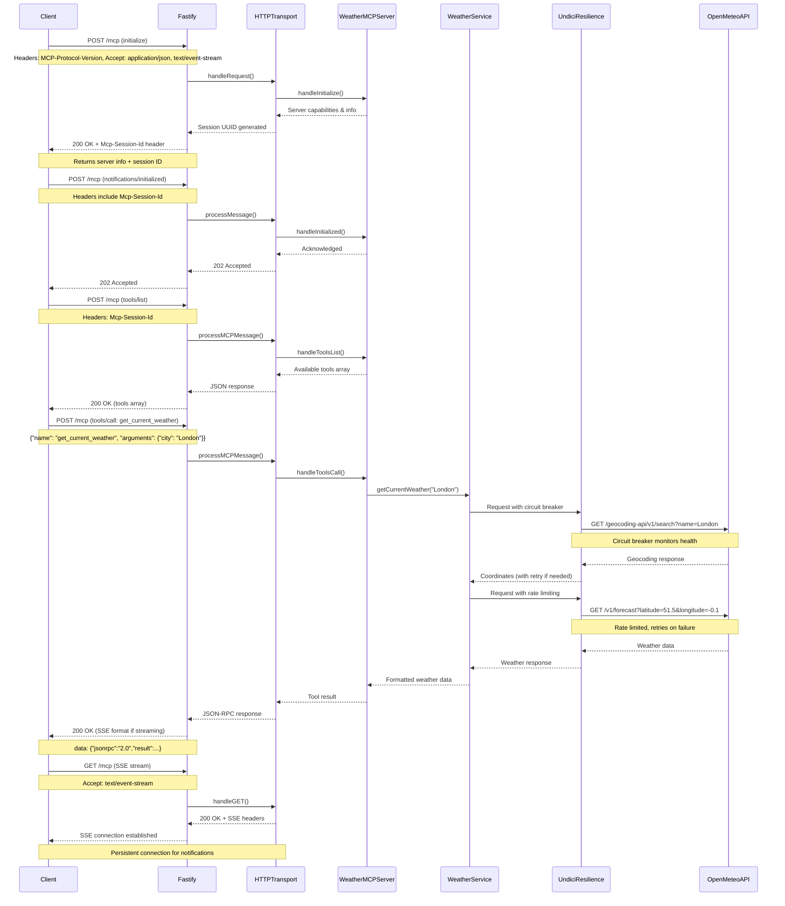
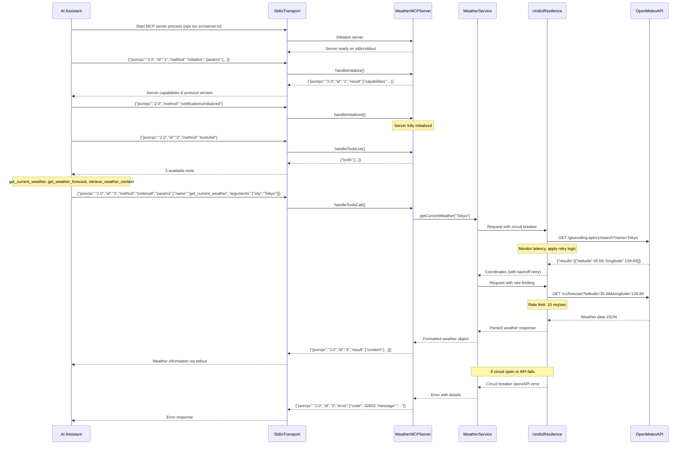
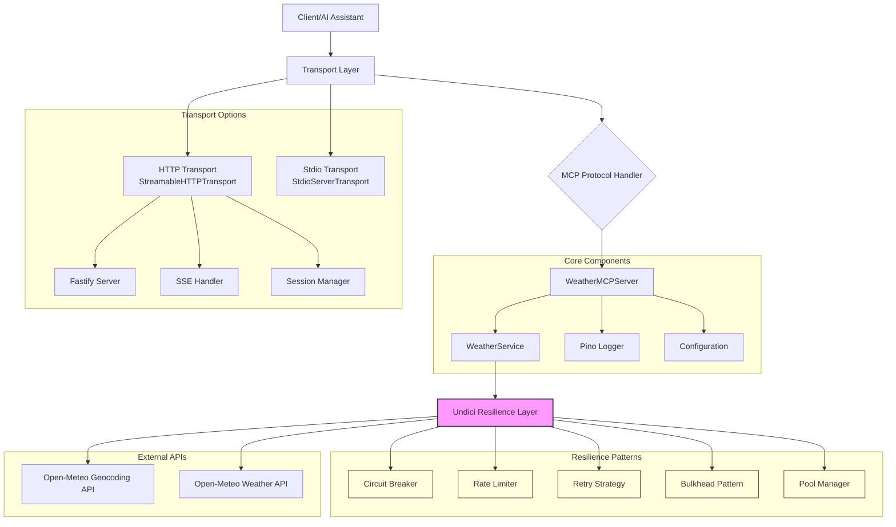

# MCP Weather Server

A production-ready **Model Context Protocol (MCP)** server that provides weather information using the **Open-Meteo API**. Built with TypeScript, Node.js 22.x, and designed for both local AI assistants (like Cline) and remote HTTP clients.

[](https://nodejs.org/)
[](https://www.typescriptlang.org/)
[](https://modelcontextprotocol.io/)
[](https://opensource.org/licenses/MIT)

## 📋 Table of Contents

- [MCP Weather Server](#mcp-weather-server)
  - [📋 Table of Contents](#-table-of-contents)
  - [🌟 Features](#-features)
  - [🛠️ Technology Stack](#️-technology-stack)
  - [🏗️ Architecture](#️-architecture)
    - [System Flow](#system-flow)
      - [HTTP Transport Sequence Diagram](#http-transport-sequence-diagram)
      - [Stdio Transport Sequence Diagram](#stdio-transport-sequence-diagram)
    - [Component Interactions](#component-interactions)
  - [🚀 Quick Start](#-quick-start)
    - [Prerequisites](#prerequisites)
    - [Installation](#installation)
    - [Running the Server](#running-the-server)
      - [Development Mode](#development-mode)
      - [Production Mode](#production-mode)
      - [Docker](#docker)
  - [🔧 Configuration](#-configuration)
  - [📡 API Usage](#-api-usage)
    - [MCP Protocol](#mcp-protocol)
      - [1. `get_current_weather`](#1-get_current_weather)
      - [2. `get_weather_forecast`](#2-get_weather_forecast)
      - [3. `retrieve_weather_context`](#3-retrieve_weather_context)
    - [HTTP Transport](#http-transport)
  - [🧪 Testing](#-testing)
    - [Quick Test Commands](#quick-test-commands)
      - [Unit Tests](#unit-tests)
      - [HTTP Transport Testing](#http-transport-testing)
      - [Stdio Transport Testing](#stdio-transport-testing)
      - [Postman Testing](#postman-testing)
  - [🔌 Integration Examples](#-integration-examples)
    - [Cline (Local AI Assistant)](#cline-local-ai-assistant)
    - [HTTP Client](#http-client)
  - [📊 Monitoring \& Observability](#-monitoring--observability)
    - [Logging](#logging)
    - [Health Checks](#health-checks)
    - [Metrics](#metrics)
  - [🐳 Docker Deployment](#-docker-deployment)
    - [Production Deployment](#production-deployment)
    - [Docker Compose](#docker-compose)
  - [🔒 Security](#-security)
  - [🤝 Contributing](#-contributing)
    - [Development Setup](#development-setup)
  - [📝 License](#-license)
  - [🙏 Acknowledgments](#-acknowledgments)
  - [📞 Support](#-support)
  - [🧪 Postman Testing Guide](#-postman-testing-guide)
    - [Setup](#setup)
    - [Required Headers (Add to all requests)](#required-headers-add-to-all-requests)
    - [Key Endpoints](#key-endpoints)
      - [1. Initialize Connection](#1-initialize-connection)
      - [2. List Tools](#2-list-tools)
      - [3. Get Current Weather](#3-get-current-weather)
      - [4. Get Weather Forecast](#4-get-weather-forecast)
      - [5. Test Error Handling](#5-test-error-handling)
    - [Postman Tips](#postman-tips)

## 🌟 Features

- **🌤️ Real-time Weather**: Current weather conditions with temperature, humidity, wind speed
- **📅 Weather Forecasts**: Up to 7-day forecasts with detailed conditions
- **🤖 AI Agent Support**: `retrieve_weather_context` tool for natural language queries
- **🔄 Dual Transport**: Stdio for local AI assistants, HTTP/SSE for remote clients
- **🛡️ Resilience Patterns**: Circuit breaker, retry strategies, rate limiting, bulkhead isolation
- **⚡ High Performance**: Undici-based HTTP client with connection pooling and streaming
- **🔒 Security First**: Input validation, Origin checks, CORS support, session management
- **📊 Observability**: Structured logging with Pino, real-time metrics, health monitoring
- **🧪 Comprehensive Testing**: Unit tests, integration tests, chaos engineering, load testing
- **🚀 Production Ready**: Docker containerization, graceful shutdown, error recovery

## 🛠️ Technology Stack

| Technology | Version | Purpose | Links |
|------------|---------|---------|-------|
| **Node.js** | `>=22.0.0` | JavaScript runtime environment | [Homepage](https://nodejs.org/) |
| **TypeScript** | `^5.8.0` | Type-safe JavaScript development | [Homepage](https://www.typescriptlang.org/) \| [GitHub](https://github.com/microsoft/TypeScript) |
| **Fastify** | `^5.6.0` | High-performance web framework for HTTP transport (replaces Express.js) | [Homepage](https://fastify.dev/) \| [GitHub](https://github.com/fastify/fastify) |
| **@modelcontextprotocol/sdk** | `^1.17.5` | MCP protocol implementation | [GitHub](https://github.com/modelcontextprotocol/typescript-sdk) |
| **Pino** | `~8.15.0` | High-performance structured logging | [Homepage](https://getpino.io/) \| [GitHub](https://github.com/pinojs/pino) |
| **Vitest** | `^2.1.8` | Next-generation testing framework | [Homepage](https://vitest.dev/) \| [GitHub](https://github.com/vitest-dev/vitest) |
| **dotenv** | `~16.4.1` | Environment variable management | [Homepage](https://dotenvx.com/) \| [GitHub](https://github.com/motdotla/dotenv) |
| **undici** | `^6.19.8` | High-performance HTTP client with connection pooling | [GitHub](https://github.com/nodejs/undici) |
| **uuid** | `~9.0.1` | RFC-compliant UUID generation | [GitHub](https://github.com/uuidjs/uuid) |
| **Open-Meteo API** | N/A | Free weather data provider | [Homepage](https://open-meteo.com/) |

> **Note**: The project includes an advanced `undici-resilience` package that enhances the standard undici client with enterprise-grade resilience patterns including circuit breakers, retry strategies, rate limiting, and comprehensive monitoring. This ensures reliable weather API calls even under adverse conditions.

## 🏗️ Architecture

```
mcp-weather-server/
├── src/
│   ├── config/              # Centralized configuration
│   ├── transports/          # HTTP & stdio transport implementations
│   ├── undici-resilience/   # Advanced HTTP client with resilience patterns
│   ├── chaos/               # Chaos engineering & fault injection
│   ├── benchmarks/          # Performance testing framework
│   ├── test/                # MCP protocol test clients
│   ├── types.ts             # TypeScript type definitions
│   ├── logger.ts            # Structured logging with Pino
│   ├── weather-service.ts   # Open-Meteo API integration
│   ├── mcp-server.ts        # MCP protocol implementation
│   └── server.ts            # Application entry point
├── docs/
│   ├── agent_mcp_setting/   # Cline configuration examples
│   ├── TESTING.md           # Comprehensive testing guide
│   ├── CLINE-INTEGRATION.md # Cline setup instructions
│   └── PHASE-4-IMPLEMENTATION.md # Chaos testing documentation
├── test-results/            # Test execution reports
├── Dockerfile               # Containerization
└── docker-compose.yml       # Orchestration
```

### System Flow

#### HTTP Transport Sequence Diagram



#### Stdio Transport Sequence Diagram



### Component Interactions



## 🚀 Quick Start

### Prerequisites

- **Node.js 22.x** or later
- **npm** or **yarn**

### Installation

1. **Clone the repository**
   ```bash
   git clone https://github.com/kumaran-is/mcp-weather-server.git
   cd mcp-weather-server
   ```

2. **Install dependencies**
   ```bash
   npm install
   ```

3. **Build the project**
   ```bash
   npm run build
   ```

### Running the Server

#### Development Mode

**HTTP Transport** (recommended for development)
```bash
npm run http
```

**Stdio Transport** (for AI assistants)
```bash
npm run stdio
```

**Development with Auto-restart**
```bash
npm run dev
```

#### Production Mode

**Build the Project**
```bash
npm run build
```

**Start Production Server**
```bash
npm start
```

#### Docker

**Build Docker Image**
```bash
docker build -t mcp-weather-server .
```

**Run Docker Container**
```bash
docker run -p 8080:8080 mcp-weather-server
```

**Run with Docker Compose**
```bash
docker-compose up
```

## 🔧 Configuration

The server uses environment variables for configuration. Copy `.env` and modify as needed:

```env
# Server Configuration
NODE_ENV=development
MCP_TRANSPORT=http                    # 'stdio' or 'http'
MCP_HTTP_PORT=8080

# Open-Meteo API
OPEN_METEO_BASE_URL=https://api.open-meteo.com/v1
GEOCODING_API_URL=https://geocoding-api.open-meteo.com/v1

# Security
ALLOWED_ORIGINS=http://localhost:3000,http://localhost:8080

# Logging
LOG_LEVEL=debug                       # 'fatal', 'error', 'warn', 'info', 'debug', 'trace'

# Performance
API_TIMEOUT=5000                      # milliseconds
HTTP_TIMEOUT=30000
```

## 📡 API Usage

### MCP Protocol

The server implements the **Model Context Protocol (2025-06-18)** with the following tools:

#### 1. `get_current_weather`
Get current weather for a city.

**Parameters:**
- `city` (string): City name (e.g., "London", "New York")

**Example:**
```json
{
  "jsonrpc": "2.0",
  "id": "123",
  "method": "tools/call",
  "params": {
    "name": "get_current_weather",
    "arguments": { "city": "London" }
  }
}
```

**Response:**
```json
{
  "jsonrpc": "2.0",
  "id": "123",
  "result": {
    "content": [{
      "type": "text",
      "text": "Weather in London:\n• Temperature: 15.2°C\n• Condition: Partly cloudy\n• Humidity: 72%\n• Wind Speed: 8.5 m/s\n• Feels Like: 14.8°C\n• Pressure: 1013.25 hPa"
    }]
  }
}
```

#### 2. `get_weather_forecast`
Get weather forecast for a city (1-7 days).

**Parameters:**
- `city` (string): City name
- `days` (number, optional): Number of days (1-7, default: 5)

**Example:**
```json
{
  "jsonrpc": "2.0",
  "id": "124",
  "method": "tools/call",
  "params": {
    "name": "get_weather_forecast",
    "arguments": { "city": "Tokyo", "days": 3 }
  }
}
```

#### 3. `retrieve_weather_context`
Retrieve weather context for AI agent queries.

**Parameters:**
- `query` (string): Natural language query containing city reference

**Example:**
```json
{
  "jsonrpc": "2.0",
  "id": "125",
  "method": "tools/call",
  "params": {
    "name": "retrieve_weather_context",
    "arguments": { "query": "weather in Paris for travel" }
  }
}
```

### HTTP Transport

When using HTTP transport, the server exposes endpoints:

- `POST /mcp` - Send MCP messages
- `GET /mcp` - Establish SSE stream for receiving messages
- `DELETE /mcp` - Terminate session

**Headers:**
- `MCP-Protocol-Version: 2025-06-18`
- `Mcp-Session-Id: <uuid>`
- `Content-Type: application/json`
- `Accept: application/json, text/event-stream`

## 🧪 Testing

For comprehensive testing instructions, see **[TESTING.md](docs/TESTING.md)** - a complete guide covering both stdio and HTTP transport testing.

### Quick Test Commands

#### Unit Tests

**Run All Tests**
```bash
npm test
```

**Run Tests with Coverage**
```bash
npm run test:coverage
```

**Run Chaos Engineering Tests** (Safe load testing with system monitoring)
```bash
npm run test:chaos
```

**Run Resilience Validation** (Validates all resilience patterns)
```bash
npm run test:resilience
```

**Run Safe Load Test** (Capacity-aware performance testing)
```bash
npm run test:load
```

#### HTTP Transport Testing

**Start Server and Run Full Test Suite**
```bash
npm run http & sleep 2 && npm run client
```

**Test Current Weather**
```bash
npm run client weather "London"
```

**Test Weather Forecast**
```bash
npm run client forecast "Tokyo" 3
```

#### Stdio Transport Testing

**Quick Stdio Test**
```bash
echo '{"jsonrpc":"2.0","id":"1","method":"tools/list"}' | npm run stdio
```

For detailed testing scenarios including manual curl commands, environment configuration, load testing, and troubleshooting, refer to **[TESTING.md](docs/TESTING.md)**.

#### Postman Testing

**Quick Import (Recommended):**
1. Start the server: `npm run http`
2. Open Postman and click "Import"
3. Import the file `docs/mcp_weather.postman_collection.json`
4. All requests are pre-configured with proper headers and variables!

**Or create manually:**
1. Start the server: `npm run http`
2. Create a new collection in Postman
3. Use these key endpoints:

**Initialize Connection:**
```http
POST http://localhost:8080/mcp
Content-Type: application/json
MCP-Protocol-Version: 2025-06-18
Accept: application/json, text/event-stream

{
  "jsonrpc": "2.0",
  "id": "init-123",
  "method": "initialize",
  "params": {
    "protocolVersion": "2025-06-18",
    "capabilities": {"sampling": {}},
    "clientInfo": {"name": "postman-test", "version": "1.0.0"}
  }
}
```

**Get Current Weather:**
```http
POST http://localhost:8080/mcp
Content-Type: application/json
MCP-Protocol-Version: 2025-06-18
Mcp-Session-Id: YOUR_SESSION_ID
Accept: application/json, text/event-stream

{
  "jsonrpc": "2.0",
  "id": "weather-123",
  "method": "tools/call",
  "params": {
    "name": "get_current_weather",
    "arguments": {"city": "London"}
  }
}
```

For complete Postman setup with all endpoints, request examples, and collection templates, see the **[Postman Testing Guide](#postman-testing-guide)** below.

## 🔌 Integration Examples

### Cline (Local AI Assistant)

**Complete Setup Guide**: See **[CLINE-INTEGRATION.md](docs/CLINE-INTEGRATION.md)** for detailed Cline integration instructions.

**Quick Configuration** (Stdio Transport):
```json
{
  "mcpServers": {
    "weather": {
      "autoApprove": [
        "get_current_weather",
        "get_weather_forecast",
        "retrieve_weather_context"
      ],
      "disabled": false,
      "timeout": 30000,
      "type": "stdio",
      "command": "npx",
      "args": ["tsx", "src/server.ts"],
      "cwd": "/path/to/mcp-weather-server",
      "env": {
        "MCP_TRANSPORT": "stdio",
        "LOG_LEVEL": "info"
      }
    }
  }
}
```

**Example Configuration Files**: See `docs/agent_mcp_setting/` directory for complete Cline configuration examples for both stdio and HTTP transports.

**Usage**: Ask Cline natural language questions like "What's the weather in London?" or "Should I bring an umbrella to Paris?"

### HTTP Client
```javascript
// Initialize connection
const response = await fetch('http://localhost:8080/mcp', {
  method: 'POST',
  headers: {
    'Content-Type': 'application/json',
    'MCP-Protocol-Version': '2025-06-18',
    'Accept': 'application/json, text/event-stream'
  },
  body: JSON.stringify({
    jsonrpc: '2.0',
    id: '123',
    method: 'initialize',
    params: {
      protocolVersion: '2025-06-18',
      capabilities: { sampling: {} },
      clientInfo: { name: 'my-client', version: '1.0.0' }
    }
  })
});
```

## 📊 Monitoring & Observability

### Logging
The server uses structured logging with Pino:

```json
{
  "level": "info",
  "time": "2025-01-08T16:30:00.000Z",
  "msg": "Weather MCP Server initialized",
  "name": "weather-mcp-server",
  "version": "1.0.0",
  "protocolVersion": "2025-06-18"
}
```

### Health Checks
```bash
curl http://localhost:8080/health
```

### Metrics
- Request/response times
- API call success rates
- Active connections
- Error rates by endpoint

## 🐳 Docker Deployment

### Production Deployment

**Build Docker Image**
```bash
docker build -t mcp-weather-server .
```

**Run Production Container**
```bash
docker run -d \
  --name mcp-weather-server \
  -p 8080:8080 \
  -e NODE_ENV=production \
  mcp-weather-server
```

### Docker Compose
```yaml
version: '3.8'
services:
  mcp-weather-server:
    build: .
    ports:
      - "8080:8080"
    environment:
      - NODE_ENV=production
      - MCP_TRANSPORT=http
    restart: unless-stopped
```

## 🔒 Security

- **Input Validation**: All inputs are validated and sanitized
- **Origin Checks**: CORS validation for HTTP requests
- **Rate Limiting**: Built-in request throttling
- **HTTPS**: SSL/TLS support in production
- **No API Keys**: Uses free Open-Meteo API (no credentials needed)

## 🤝 Contributing

1. Fork the repository
2. Create a feature branch: `git checkout -b feature/amazing-feature`
3. Commit changes: `git commit -m 'Add amazing feature'`
4. Push to branch: `git push origin feature/amazing-feature`
5. Open a Pull Request

### Development Setup

**Install Dependencies**
```bash
npm install
```

**Run in Development Mode**
```bash
npm run dev
```

**Run Tests**
```bash
npm test
```

**Build for Production**
```bash
npm run build
```

## 📝 License

This project is licensed under the **MIT License** - see the [LICENSE](LICENSE) file for details.

## 🙏 Acknowledgments

- [Model Context Protocol](https://modelcontextprotocol.io/) - The protocol specification
- [Open-Meteo](https://open-meteo.com/) - Free weather API
- [Pino](https://getpino.io/) - Node.js logging library
- [Node.js](https://nodejs.org/) - JavaScript runtime

## 📞 Support

- **Issues**: [GitHub Issues](https://github.com/kumaran-is/mcp-weather-server/issues)
- **Discussions**: [GitHub Discussions](https://github.com/kumaran-is/mcp-weather-server/discussions)
- **Documentation**: See `docs/` directory
- **Cline Integration**: [CLINE-INTEGRATION.md](docs/CLINE-INTEGRATION.md) - Complete Cline setup guide
- **Phase 4 Implementation**: [PHASE-4-IMPLEMENTATION.md](docs/PHASE-4-IMPLEMENTATION.md) - Chaos Engineering & Performance Testing (Complete)
- **MCP Test Results**: [MCP-TEST-RESULTS.md](docs/MCP-TEST-RESULTS.md) - Comprehensive test validation results

## 🧪 Postman Testing Guide

### Setup
1. **Start the server**: `npm run http`
2. **Open Postman** and create a new collection
3. **Set base URL**: `http://localhost:8080`

### Required Headers (Add to all requests)
```
Content-Type: application/json
MCP-Protocol-Version: 2025-06-18
Accept: application/json,text/event-stream
```

### Key Endpoints

#### 1. Initialize Connection
```http
POST http://localhost:8080/mcp
Content-Type: application/json
MCP-Protocol-Version: 2025-06-18
Accept: application/json, text/event-stream

{
  "jsonrpc": "2.0",
  "id": "init-123",
  "method": "initialize",
  "params": {
    "protocolVersion": "2025-06-18",
    "capabilities": {"sampling": {}},
    "clientInfo": {"name": "postman-test", "version": "1.0.0"}
  }
}
```

#### 2. List Tools
```http
POST http://localhost:8080/mcp
Content-Type: application/json
MCP-Protocol-Version: 2025-06-18
Mcp-Session-Id: YOUR_SESSION_ID
Accept: application/json, text/event-stream

{
  "jsonrpc": "2.0",
  "id": "tools-123",
  "method": "tools/list"
}
```

#### 3. Get Current Weather
```http
POST http://localhost:8080/mcp
Content-Type: application/json
MCP-Protocol-Version: 2025-06-18
Mcp-Session-Id: YOUR_SESSION_ID
Accept: application/json, text/event-stream

{
  "jsonrpc": "2.0",
  "id": "weather-123",
  "method": "tools/call",
  "params": {
    "name": "get_current_weather",
    "arguments": {"city": "London"}
  }
}
```

#### 4. Get Weather Forecast
```http
POST http://localhost:8080/mcp
Content-Type: application/json
MCP-Protocol-Version: 2025-06-18
Mcp-Session-Id: YOUR_SESSION_ID
Accept: application/json, text/event-stream

{
  "jsonrpc": "2.0",
  "id": "forecast-123",
  "method": "tools/call",
  "params": {
    "name": "get_weather_forecast",
    "arguments": {"city": "Paris", "days": 3}
  }
}
```

#### 5. Test Error Handling
```http
POST http://localhost:8080/mcp
Content-Type: application/json
MCP-Protocol-Version: 2025-06-18
Mcp-Session-Id: YOUR_SESSION_ID
Accept: application/json, text/event-stream

{
  "jsonrpc": "2.0",
  "id": "error-123",
  "method": "tools/call",
  "params": {
    "name": "get_current_weather",
    "arguments": {"city": ""}
  }
}
```

### Postman Tips
- **Extract Session ID**: After initialize, save the `mcp-session-id` header value
- **Environment Variables**: Create `session_id` variable in Postman environment
- **Tests Tab**: Add scripts to automatically extract session IDs from responses

---

**Made with ❤️ for the AI assistant community**
