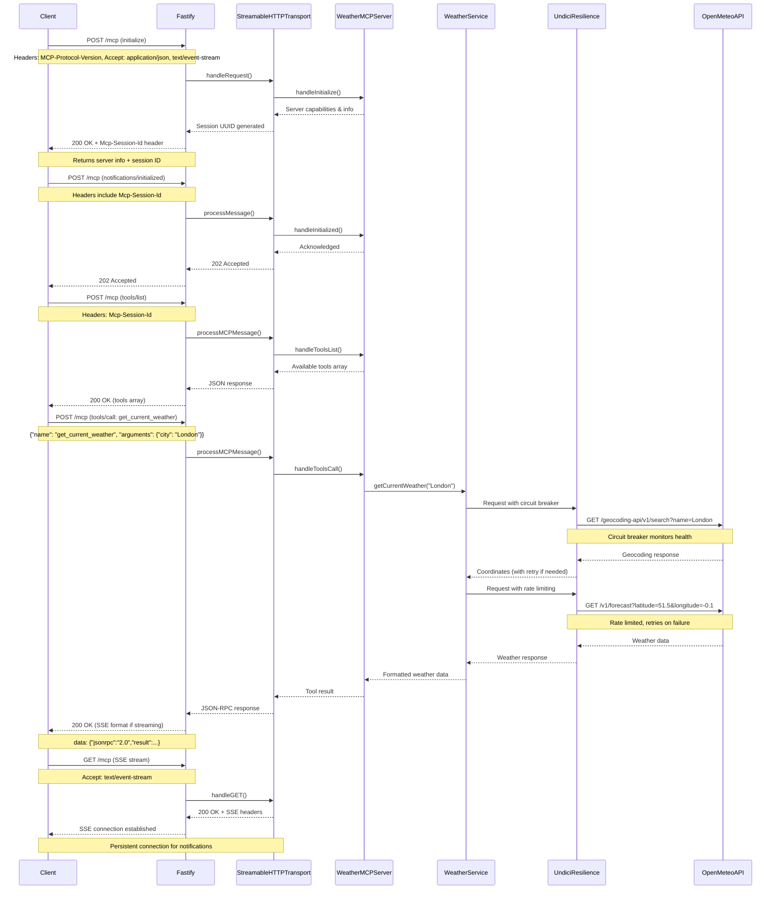
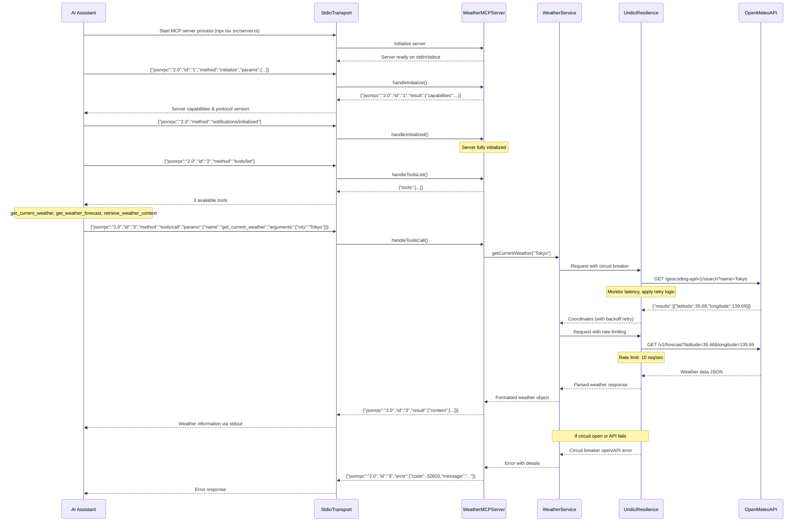
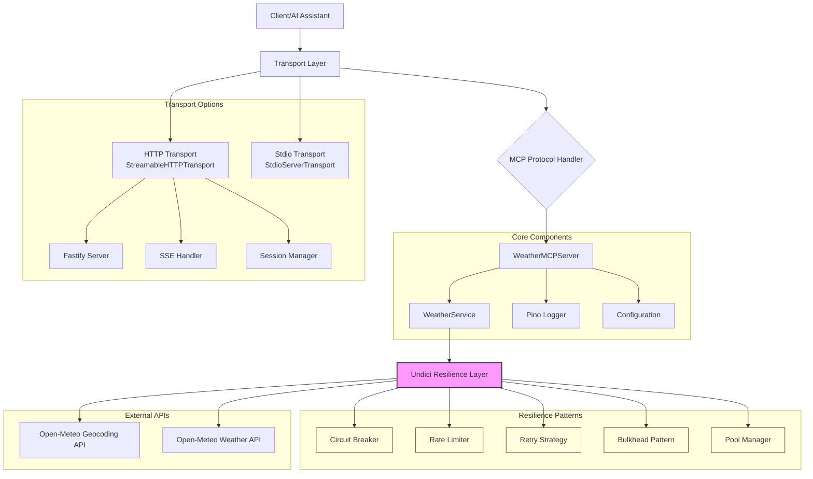

# MCP Weather Server

An **Enterprise-grade Model Context Protocol (MCP)** server that provides weather information using the **Open-Meteo API**. Built with TypeScript, Node.js 22.x, featuring **advanced monitoring, audit logging, security features, and resilience patterns** with **3-layer SOLID architecture**.

[](https://deepwiki.com/kumaran-is/mcp-weather-server)
[](https://nodejs.org/)
[](https://www.typescriptlang.org/)
[](https://fastify.dev/)
[](https://modelcontextprotocol.io/)
[](https://zod.dev/)
[](https://en.wikipedia.org/wiki/SOLID)
[](https://opensource.org/licenses/MIT)

## 📋 Table of Contents

- [MCP Weather Server](#mcp-weather-server)
  - [📋 Table of Contents](#-table-of-contents)
  - [🌟 Features](#-features)
  - [🛠️ Technology Stack](#️-technology-stack)
  - [📊 Data Flow](#-data-flow)
  - [🏗️ MCP Weather Server - Overview](#️-mcp-weather-server---overview)
  - [🚀 Quick Start](#-quick-start)
    - [Prerequisites](#prerequisites)
    - [1️⃣ Installation](#1️⃣-installation)
    - [2️⃣ AI Assistant Configurations](#2️⃣-ai-assistant-configurations)
      - [Cline (VS Code)](#cline-vs-code)
      - [Claude Desktop](#claude-desktop)
      - [Claude Desktop Demo](#claude-desktop-demo)
      - [Cursor](#cursor)
      - [GitHub Copilot (Future MCP Support)](#github-copilot-future-mcp-support)
  - [Test All Weather Tools](#test-all-weather-tools)
    - [**Quick Test - All Capabilities:**](#quick-test---all-capabilities)
    - [**Real-World Use Cases:**](#real-world-use-cases)
    - [**Individual Test Scenarios:**](#individual-test-scenarios)
    - [**Edge Cases \& Error Testing:**](#edge-cases--error-testing)
    - [**Performance \& Caching Test:**](#performance--caching-test)
    - [**Comparative Weather Analysis:**](#comparative-weather-analysis)
    - [**Expected Results:**](#expected-results)
    - [**Expected Error Behaviors:**](#expected-error-behaviors)
  - [Directory Structure](#directory-structure)
  - [🏗️ Architecture \& Design](#️-architecture--design)
    - [🏗️ Perfect 3-Layer SOLID Architecture](#️-perfect-3-layer-solid-architecture)
    - [Transport Strategy](#transport-strategy)
      - [McpServer vs Fastify - Architectural Layers](#mcpserver-vs-fastify---architectural-layers)
      - [Transport Decision Matrix](#transport-decision-matrix)
    - [System Flow](#system-flow)
      - [Streamable HTTP Transport Sequence Diagram](#streamable-http-transport-sequence-diagram)
      - [Stdio Transport Sequence Diagram](#stdio-transport-sequence-diagram)
    - [Component Interactions](#component-interactions)
  - [🔧 Configuration](#-configuration)
    - [Key Configuration Options](#key-configuration-options)
  - [📡 API Usage](#-api-usage)
    - [MCP Protocol](#mcp-protocol)
      - [1. `get_current_weather`](#1-get_current_weather)
      - [2. `get_weather_forecast`](#2-get_weather_forecast)
      - [3. `retrieve_weather_context`](#3-retrieve_weather_context)
    - [HTTP Transport](#http-transport)
  - [🧪 Testing](#-testing)
    - [Quick Test Commands](#quick-test-commands)
      - [Unit Tests](#unit-tests)
      - [HTTP Transport Testing](#http-transport-testing)
      - [Stdio Transport Testing](#stdio-transport-testing)
      - [MCP Inspector Testing](#mcp-inspector-testing)
      - [Postman Testing](#postman-testing)
  - [🔌 Integration Examples](#-integration-examples)
    - [Cline (Local \& Remote AI Assistant)](#cline-local--remote-ai-assistant)
      - [Configuration Files](#configuration-files)
  - [📊 Monitoring \& Observability](#-monitoring--observability)
    - [Logging](#logging)
    - [Health Checks](#health-checks)
    - [Metrics](#metrics)
  - [🔒 Security](#-security)
  - [📊 Session Management (HTTP Transport)](#-session-management-http-transport)
    - [Session Manager Components](#session-manager-components)
      - [1. **Session Identification**](#1-session-identification)
      - [2. **Client Connection Registry**](#2-client-connection-registry)
      - [3. **Message Queue System**](#3-message-queue-system)
      - [4. **Connection Lifecycle**](#4-connection-lifecycle)
    - [Message Queueing Behavior](#message-queueing-behavior)
    - [Session Recovery Flow](#session-recovery-flow)
    - [Production Considerations](#production-considerations)
  - [🤝 Contributing](#-contributing)
  - [📝 License](#-license)
  - [🙏 Acknowledgments](#-acknowledgments)
  - [📞 Support](#-support)

## 🌟 Features

- **🏗️ Perfect SOLID Architecture**: Clean 3-layer separation with zero cross-contamination
- **⚡ Latest MCP SDK Patterns**: Modern `McpServer`, `registerTool()`, and Zod validation
- **🤖 LLM-Friendly Design**: Clear tool descriptions, structured responses, and intelligent error handling
- **🌤️ Real-time Weather**: Current weather conditions with temperature, humidity, wind speed
- **📅 Weather Forecasts**: Up to 7-day forecasts with detailed conditions
- **🤖 AI Agent Support**: `retrieve_weather_context` tool for natural language queries
- **🔄 Modern Dual Transport**: 
  - **Official Stdio**: Local development with Cline in VS Code
  - **Official Streamable HTTP**: Production APIs, LangChain, microservices
- **🛡️ Enterprise Resilience**: Circuit breaker, retry strategies, rate limiting, bulkhead isolation
- **⚡ Ultra Performance**: Fastify + Undici with connection pooling and streaming
- **🔒 Security First**: Input validation, Origin checks, CORS support, session management
- **📊 Advanced Observability**: Structured Pino logging, real-time metrics, health monitoring
- **🧪 Comprehensive Testing**: Unit tests, integration tests, chaos engineering, load testing
- **🚀 Production Ready**: Docker containerization, graceful shutdown, error recovery

## 🛠️ Technology Stack

| Technology | Version | Purpose |
|------------|---------|------------|
| [**Node.js**](https://nodejs.org/) | `>=22.0.0` | JavaScript runtime environment |
| [**TypeScript**](https://github.com/microsoft/TypeScript) | `~5.9.0` | Type-safe JavaScript development | 
| [**@modelcontextprotocol/sdk**](https://github.com/modelcontextprotocol/typescript-sdk) | `~1.17.5` | **Latest MCP SDK** with modern patterns |
| [**Zod**](https://zod.dev/) | `~4.0.1` | **Runtime schema validation** and TypeScript inference |
| [**Fastify**](https://fastify.dev/) | `~5.6.0` | High-performance web framework (transport layer) |
| [**Pino**](https://github.com/pinojs/pino) | `~9.9.0` | Production structured logging |
| [**Vitest**](https://github.com/vitest-dev/vitest)| `~3.2.0` | Next-generation testing framework |
| [**undici**](https://github.com/nodejs/undici) | `~7.16.0` | High-performance HTTP client with resilience |
| [**Open-Meteo API**](https://open-meteo.com/) | N/A | Free weather data provider |

> **Note**: The project includes an advanced `undici-resilience` package that enhances the standard undici client with enterprise-grade resilience patterns including circuit breakers, retry strategies, rate limiting, and comprehensive monitoring. This ensures reliable weather API calls even under adverse conditions.

## 📊 Data Flow


## 🏗️ MCP Weather Server - Overview

This server provides **weather information tools** to AI assistants, enabling them to:

- Get current weather conditions for any location
- Retrieve weather forecasts (1-7 days)
- Handle complex weather queries with context
- Provide reliable, cached responses with resilience patterns

## 🚀 Quick Start

### Prerequisites
- **Node.js 22.x** or later
- **npm** or **yarn**

### 1️⃣ Installation

```bash
# Clone the repository
git clone https://github.com/kumaran-is/mcp-weather-server.git
cd mcp-weather-server

# Install dependencies
npm install

# Build the project
npm run build

```

### 2️⃣ AI Assistant Configurations

#### Cline (VS Code)
**Local Configuration** (`cline_mcp_settings.json`):
```json
{
  "mcpServers": {
    "weather": {
      "autoApprove": [
        "get_current_weather",
        "get_weather_forecast",
        "retrieve_weather_context"
      ],
      "disabled": true,
      "timeout": 30000,
      "type": "stdio",
      "command": "npx",
      "args": [
        "tsx",
        "src/server.ts"
      ],
      "cwd": "/path-to/mcp-weather-server",
      "env": {
        "MCP_TRANSPORT": "stdio",
        "LOG_LEVEL": "info",
        "NODE_ENV": "production"
      }
    }
  }
}
```


#### Claude Desktop
**Configuration** (`~/Library/Application Support/Claude/claude_desktop_config.json` on macOS):

For standard setup with your actual paths (using tsx to run TypeScript directly):
```json
{
  "mcpServers": {
    "mcp-weather-server": {
      "command": "/Users/kumaraniyyasamysrinivasan/.nvm/versions/node/v22.15.0/bin/npx",
      "args": [
        "tsx",
        "/Users/kumaraniyyasamysrinivasan/mydrive/personal/mcp-weather-server/src/server.ts"
      ],
      "env": {
        "MCP_TRANSPORT": "stdio",
        "NODE_ENV": "production",
        "PRETTY_LOGS": "false",
        "LOG_LEVEL": "info"
      },
      "timeout": 30000
    }
  }
}
```

After adding the configuration, restart Claude Desktop to load the Weather  MCP Server.

#### Claude Desktop Demo
**Copy and paste below prompts into Cline or Claude Desktop to test Weather MCP capabilities:**

**Travel Planning Assistant:**
```bash
I'm planning a 2-week trip across Europe starting next week. Can you check the weather for:

1. Current conditions in my departure city: London
2. 7-day forecasts for my planned stops:
   - Paris (days 1-3)
   - Rome (days 4-6)
   - Vienna (days 7-9)
   - Prague (days 10-12)
   - Amsterdam (days 13-14)

Based on the weather, should I pack heavy winter clothing or lighter layers? Any cities I should avoid due to weather conditions?
```

<video src="./docs/media/claudedesktop.mp4" controls></video>


#### Cursor
**Configuration** (`.cursor/mcp_config.json` in project root):
```json
{
  "mcpServers": {
    "weather": {
      "command": "npx",
      "args": ["tsx", "src/server.ts"],
      "cwd": "${workspaceFolder}",
      "env": {
        "MCP_TRANSPORT": "stdio"
      }
    }
  }
}
```

#### GitHub Copilot (Future MCP Support)
```json
{
  "github.copilot.mcpServers": {
    "weather": {
      "command": "node",
      "args": ["./dist/server.js"],
      "transport": "stdio"
    }
  }
}
```

## Test All Weather Tools

**Copy and paste these natural language prompts into Cline, Claude Desktop, or any MCP-compatible AI assistant to test weather capabilities:**

### **Quick Test - All Capabilities:**

```bash
I need comprehensive weather information for travel planning. Can you help me with the following?

First, give me the CURRENT weather conditions for these cities:
- London, UK
- Tokyo, Japan
- New York, USA
- Sydney, Australia
- Dubai, UAE

Next, I need 5-day weather forecasts for these vacation destinations:
- Paris, France
- Bali, Indonesia
- Miami, USA
- Barcelona, Spain

Finally, help me understand the weather context for these specific travel scenarios:
- "What's the weather like in Berlin for outdoor photography?"
- "Weather conditions in Singapore for business meetings"
- "Is the weather in Mumbai suitable for beach activities?"

Format everything in a clear, organized way that helps with travel planning decisions.
```

### **Real-World Use Cases:**

**Event Planning Coordinator:**
```bash
I'm organizing outdoor events and need detailed weather information:

1. Check current weather for immediate decisions in:
   - Los Angeles (concert tonight)
   - Chicago (street fair this afternoon)
   - Boston (marathon tomorrow morning)

2. Get 3-day forecasts for upcoming events in:
   - Seattle (tech conference)
   - Denver (mountain wedding)
   - Orlando (theme park opening)

3. Weather context for: "outdoor wedding in San Francisco this weekend"

Please highlight any concerning weather patterns like rain, extreme temperatures, or high winds.
```

**Agriculture & Farming Advisor:**
```bash
I manage farms in multiple regions and need weather data for agricultural planning:

1. Current weather conditions for immediate field work decisions:
   - Des Moines, Iowa
   - Sacramento, California
   - Houston, Texas
   - Jacksonville, Florida

2. 7-day forecasts for planting/harvesting schedules:
   - Kansas City (wheat fields)
   - Portland (orchards)
   - Phoenix (cotton farms)

3. Context analysis: "weather in Nebraska for corn planting season"

Focus on precipitation, temperature ranges, and humidity levels that affect crop management.
```

**Sports & Recreation Planner:**
```bash
I coordinate outdoor sports activities and need weather assessments:

Current conditions for today's activities:
- Skiing in Aspen, Colorado
- Surfing in Honolulu, Hawaii
- Golfing in Phoenix, Arizona
- Sailing in San Diego, California

Get 5-day forecasts for upcoming tournaments:
- Tennis in Melbourne
- Football in Green Bay
- Baseball in Atlanta

Also check: "weather in Vancouver for mountain biking this weekend"

Emphasize wind speeds, precipitation, and visibility conditions.
```

**Emergency Response Coordinator:**
```bash
I need weather data for emergency preparedness and response planning:

1. Current severe weather check for these high-risk areas:
   - New Orleans, Louisiana
   - Oklahoma City, Oklahoma
   - Buffalo, New York
   - Phoenix, Arizona

2. 3-day forecasts for resource deployment:
   - Minneapolis (potential snowstorm)
   - Houston (flooding risk)
   - Los Angeles (fire weather)

3. Context queries:
   - "weather conditions in Miami for hurricane preparedness"
   - "weather in Denver for avalanche risk assessment"

Flag any extreme weather conditions, temperature anomalies, or precipitation warnings.
```

**Aviation & Transportation Manager:**
```bash
I manage flight operations and ground transportation. Please provide:

Current weather at major hub airports:
- Atlanta (ATL)
- Chicago (ORD)
- London (Heathrow area)
- Tokyo (Narita area)
- Dubai

48-hour forecasts for flight planning:
- Frankfurt
- Singapore
- Los Angeles
- New York

Weather context for: "flying conditions in Dallas today"

Focus on visibility, wind speeds, precipitation, and temperature extremes that affect operations.
```

### **Individual Test Scenarios:**

**Test 1 - Current Weather Retrieval:**
```bash
What's the current weather in London? I need temperature, humidity, wind speed, and general conditions.
```

**Test 2 - Multi-City Weather Check:**
```bash
Can you check the current weather in Paris, Rome, and Madrid? I'm trying to decide which city to visit today.
```

**Test 3 - Extended Forecast:**
```bash
Show me a 7-day weather forecast for Tokyo. I'm planning outdoor activities and need to know the best days.
```

**Test 4 - Short-term Forecast:**
```bash
What's the weather forecast for the next 3 days in San Francisco? Keep it brief.
```

**Test 5 - Natural Language Context Query:**
```bash
I'm wondering about the weather in Seattle for hiking this weekend. Can you help me understand if it's suitable?
```

**Test 6 - Business Context Query:**
```bash
What's the weather situation in New York for outdoor business lunch meetings?
```

**Test 7 - Extreme Weather Locations:**
```bash
Check the weather in these extreme locations:
- Reykjavik, Iceland (cold climate)
- Cairo, Egypt (hot desert)
- Singapore (tropical)
- La Paz, Bolivia (high altitude)
```

### **Edge Cases & Error Testing:**

```bash
Test the system's error handling with these challenging requests:

1. Check weather for cities with ambiguous names:
   - "Paris" (which Paris? France or Texas?)
   - "London" (UK or Ontario?)
   - "Sydney" (Australia or Nova Scotia?)

2. Test with misspelled city names:
   - "Tokio" instead of "Tokyo"
   - "San Franciso" instead of "San Francisco"
   - "Mosco" instead of "Moscow"

3. Request forecasts with invalid parameters:
   - "Show me a 10-day forecast for Berlin" (exceeds 7-day limit)
   - "Get weather forecast for 0 days in Rome"
   - "Weather forecast for -5 days in Madrid"

4. Try non-existent or very small cities:
   - "Weather in Atlantis"
   - "Current conditions in Hogwarts"
   - "Forecast for Middle Earth"

5. Test with special characters and injection attempts:
   - "Weather in London'; DROP TABLE weather;--"
   - "Forecast for <script>alert('test')</script>"
   - "Current weather in ${city}"

6. Query without clear city reference:
   - "What's the weather like?"
   - "Is it raining?"
   - "Tell me about the forecast"

7. Multiple cities in one context query:
   - "Weather for traveling from Paris to London to Amsterdam"

Show me how the system handles these edge cases gracefully.
```

### **Performance & Caching Test:**

```bash
Let's test the caching and performance:

1. First request - Check weather in London (should hit the API)
2. Immediately check London weather again (should be cached)
3. Wait 1 minute and check London again (still cached?)
4. Check weather for 10 different cities rapidly:
   - London, Paris, Tokyo, New York, Sydney
   - Dubai, Singapore, Moscow, Rio, Cairo

Notice any performance differences between cached and fresh requests?
```

### **Comparative Weather Analysis:**

```bash
I need to compare weather conditions across different regions:

1. Current weather comparison:
   - Tropical: Singapore, Bangkok, Manila
   - Desert: Dubai, Phoenix, Cairo
   - Temperate: London, Paris, Berlin
   - Cold: Reykjavik, Helsinki, Oslo

2. Weekly forecast comparison for vacation planning:
   - Beach destinations: Miami, Cancun, Bali
   - Ski resorts: Aspen, Zurich, Innsbruck
   - City breaks: Rome, Barcelona, Prague

3. Context for decision making:
   - "Compare weather in Tokyo vs Seoul for cherry blossom viewing"
   - "Weather differences between San Francisco and Los Angeles for tech conferences"

Help me identify the best weather patterns for different activities.
```

### **Expected Results:**

When testing with the prompts above, you should see:

- ✅ **Current Weather**: Real-time data from Open-Meteo API with temperature, humidity, wind speed, conditions
- ✅ **Forecasts**: Accurate 1-7 day predictions with daily high/low temperatures and conditions
- ✅ **Context Queries**: Natural language understanding extracting city names and providing relevant weather context
- ✅ **Caching**: Fast responses for repeated queries (10-minute cache TTL)
- ✅ **Error Handling**: Graceful handling of invalid cities, misspellings, and edge cases
- ✅ **Resilience**: Circuit breaker protection, automatic retries, and rate limiting
- ✅ **Formatted Output**: Clear, readable weather information formatted for AI assistants
- ✅ **Performance Metrics**: Correlation IDs and timing data in logs
- ✅ **Security**: Input sanitization preventing injection attacks
- ✅ **Multi-city Support**: Ability to handle multiple weather requests efficiently

### **Expected Error Behaviors:**

- 🚫 **Invalid City**: "No city found" or "Invalid city name provided" messages
- 🚫 **API Failures**: Circuit breaker opens after repeated failures, returns cached data if available
- 🚫 **Rate Limiting**: Requests throttled when limits exceeded (10 req/sec default)
- 🚫 **Invalid Parameters**: Days outside 1-7 range auto-corrected to valid values
- 🚫 **Malicious Input**: Attack patterns detected and blocked with security logging
- 🚫 **Network Issues**: Automatic retries with exponential backoff
- 🚫 **Service Degradation**: Graceful fallback to cached data when possible

## Directory Structure

```
src/
├── server.ts                ← 🎯 **Layer 1: Transport & Infrastructure**
├── mcp-server.ts            ← 🧠 **Layer 2: Protocol & MCP SDK (MODERNIZED)**
├── weather-service.ts       ← 🌤️ **Layer 3: Business & Domain Logic**
├── types.ts                 ← 📝 TypeScript interfaces
├── logger-pino.ts           ← 📊 Production logging with Pino
│
├── config/                  ← ⚙️ Configuration management
│   ├── config.ts           ← Main configuration with Zod validation
│   ├── config.spec.ts      ← Configuration tests
│   └── auth-config.ts      ← Authentication configuration
│
├── cache/                   ← 🗄️ Intelligent LRU caching
│   ├── weather-cache.ts    ← Multi-tier caching system
│   └── weather-cache.spec.ts ← Cache layer tests
│
├── errors/                  ← 🚨 Custom error handling
│   ├── weather-errors.ts   ← Specialized error classes
│   └── weather-errors.spec.ts ← Error handling tests
│
├── middleware/              ← 🛡️ Request validation & security
│   ├── validation.ts       ← JSON-RPC & MCP validation
│   ├── validation.spec.ts  ← Validation tests
│   ├── auth.ts             ← Authentication middleware
│   ├── rate-limit.ts       ← Rate limiting protection
│   └── sanitization.ts     ← Input sanitization
│
├── security/                ← � Security utilities
│   └── sanitizer.ts        ← DOMPurify-based sanitization
│
├── undici-resilience/       ← �🛡️ Advanced HTTP resilience
│   ├── index.ts             ← Main exports & pool manager
│   ├── index.spec.ts       ← Resilience integration tests
│   ├── logger.ts           ← Resilience-specific logging
│   │
│   ├── config/              ← Resilience configuration
│   │   └── pool-config.ts  ← Pool & resilience settings
│   │
│   ├── http/                ← Connection pooling
│   │   └── pool-manager.ts ← HTTP connection management
│   │
│   ├── resilience/          ← Resilience patterns
│   │   ├── circuit-breaker.ts     ← Circuit breaker pattern
│   │   ├── circuit-breaker.spec.ts ← Circuit breaker tests
│   │   ├── retry-strategy.ts      ← Retry with backoff
│   │   ├── rate-limiter.ts        ← Request throttling
│   │   └── bulkhead.ts           ← Resource isolation
│   │
│   ├── streaming/           ← Backpressure handling
│   │   ├── streaming-pool-manager.ts    ← Streaming pool management
│   │   ├── streaming-metrics.ts         ← Stream metrics collection
│   │   └── backpressure-handler.ts     ← Adaptive backpressure
│   │
│   └── monitoring/          ← Metrics and health
│       └── metrics.ts      ← Performance metrics
│
└── utils/                   ← � Utility functions
    ├── version.ts          ← Version information utility
    └── version.spec.ts     ← Version utility tests

**🏗️ Perfect 3-Layer SOLID Architecture:**
- **Layer 1 (server.ts)**: Pure infrastructure - Fastify, transports, sessions
- **Layer 2 (mcp-server.ts)**: Modern MCP SDK - `McpServer`, `registerTool()`, Zod
- **Layer 3 (weather-service.ts)**: Pure business logic - weather APIs, caching

**🔒 Security & Middleware Layer:**
- **Authentication**: Multi-tier API key validation system
- **Rate Limiting**: Global, per-client, per-IP, per-endpoint protection
- **Input Sanitization**: DOMPurify-based with attack pattern detection
- **Validation**: JSON-RPC 2.0 and MCP protocol compliance

**🛡️ Enterprise Resilience Layer:**
- **Circuit Breaker**: Automatic failure detection and recovery
- **Retry Strategy**: Exponential backoff with jitter
- **Rate Limiting**: Token bucket and sliding window algorithms
- **Bulkhead Pattern**: Resource isolation and protection
- **Connection Pooling**: Optimized HTTP connection reuse
- **Streaming Support**: Backpressure handling and adaptive thresholds

```

## 🏗️ Architecture & Design

### 🏗️ Perfect 3-Layer SOLID Architecture

```
┌─────────────────────────────────────────────────────────────┐
│                    CLIENT LAYER                             │
│ AI Assistants (Cline, Claude) | AI Agents (Streamable HTTP) │
└─────────────────┬───────────────────────────────────────────┘
                  │
┌─────────────────▼───────────────────────────────────────────┐
│          🎯 LAYER 1: TRANSPORT & INFRASTRUCTURE            │
│                    (server.ts)                             │
│  ┌─────────────────────────────────────────────────────┐    │
│  │ Fastify Server | Session Management | Health Checks │    │
│  │ Stdio Transport | Streamable HTTP | Error Boundaries │    │
│  └─────────────────────────────────────────────────────┘    │
│  ✅ ZERO business logic - Pure infrastructure concerns      │
└─────────────────┬───────────────────────────────────────────┘
                  │
┌─────────────────▼───────────────────────────────────────────┐
│        🧠 LAYER 2: PROTOCOL & MCP SDK (MODERNIZED)         │
│                 (mcp-server.ts)                            │
│  ┌─────────────────────────────────────────────────────┐    │
│  │ McpServer | registerTool() | Zod Validation         │    │
│  │ Latest SDK Patterns | MCP v2025-06-18 Compliance   │    │
│  └─────────────────────────────────────────────────────┘    │
│  ✅ ZERO business logic - Pure protocol adapter             │
└─────────────────┬───────────────────────────────────────────┘
                  │
┌─────────────────▼───────────────────────────────────────────┐
│         🌤️ LAYER 3: BUSINESS & DOMAIN LOGIC                │
│                (weather-service.ts)                        │
│  ┌─────────────────────────────────────────────────────┐    │
│  │ Weather APIs | LRU Caching | Data Transformation   │    │
│  │ Domain Objects | Custom Errors | Resilience Logic  │    │
│  └─────────────────────────────────────────────────────┘    │
│  ✅ ZERO protocol concerns - Pure domain focus              │
└─────────────────┬───────────────────────────────────────────┘
                  │
┌─────────────────▼───────────────────────────────────────────┐
│              INFRASTRUCTURE LAYER                           │
│  ┌─────────────────────────────────────────────────────┐    │
│  │ Undici Resilience | External APIs | Logging         │    │
│  │ Circuit Breaker | Retry | Rate Limit | Monitoring   │    │
│  └─────────────────────────────────────────────────────┘    │
└─────────────────────────────────────────────────────────────┘
```

**🎯 SOLID Principles: 100% Compliance**
- **Single Responsibility**: Each layer has exactly one purpose
- **Open/Closed**: Easy to extend without modification
- **Liskov Substitution**: Components are fully substitutable
- **Interface Segregation**: Clean, minimal interfaces
- **Dependency Inversion**: Proper abstraction dependencies

### Transport Strategy

The MCP Weather Server implements a **modern dual-transport strategy** with perfect separation:

| Transport | Port | Best For | Protocol | Cline Support |
|-----------|------|----------|----------|---------------|
| **Official Stdio** | N/A | Local development, VS Code | Process I/O | ✅ Local only |
| **Official Streamable HTTP** | 8080 | Production APIs, LangChain | Streamable HTTP | ❌ No |

**Architecture Evolution (v2.5.0):** The server now uses the **latest MCP SDK patterns** with `McpServer` and `registerTool()` for significantly simplified code, better type safety, and automatic protocol compliance while maintaining the clean dual-transport architecture.

#### McpServer vs Fastify - Architectural Layers

**Why Both Are Needed:**

The server uses **two different technologies** that serve **completely different architectural layers**:

```
┌─────────────────────────────────────────────────┐
│              CLIENT LAYER                       │
│        AI Assistants & Remote APIs             │
└─────────────────┬───────────────────────────────┘
                  │
┌─────────────────▼───────────────────────────────┐
│    🌐 FASTIFY (Transport Layer)                │
│  • HTTP web server framework                   │
│  • Routing (/mcp, /health endpoints)          │
│  • Session management & connections            │
│  • HTTP headers, CORS, middleware              │
│  • Network-level concerns only                 │
│  • Transport-specific (HTTP only)              │
└─────────────────┬───────────────────────────────┘
                  │
┌─────────────────▼───────────────────────────────┐
│    🧠 McpServer (Protocol Layer)               │
│  • MCP protocol specification handler          │
│  • Tool registration & schema validation       │
│  • JSON-RPC 2.0 message format handling        │
│  • Protocol-agnostic (works with any transport)│
│  • Business logic orchestration                │
└─────────────────┬───────────────────────────────┘
                  │
┌─────────────────▼───────────────────────────────┐
│    🌤️ WeatherService (Business Layer)          │
│  • Weather APIs & domain logic                 │
│  • Data transformation & caching               │
│  • External API integration                    │
└─────────────────────────────────────────────────┘
```

**Key Differences:**

| Aspect | **McpServer** (Protocol) | **Fastify** (Transport) |
|--------|--------------------------|-------------------------|
| **Purpose** | Implements MCP specification | HTTP web server framework |
| **Scope** | Protocol logic, tools, schemas | HTTP routing, sessions, connections |
| **Transport** | Works with ANY transport | HTTP only |
| **Concerns** | MCP messages, JSON-RPC 2.0 | HTTP headers, CORS, middleware |
| **Business Logic** | ❌ Zero business logic | ❌ Zero business logic |

**Multi-Transport Architecture:**

1. **HTTP Transport** (for remote connections):
   ```
   Client → Fastify (HTTP) → McpServer (MCP Protocol) → WeatherService
   ```

2. **Stdio Transport** (for local AI tools like Cline):
   ```
   Client → StdioTransport → McpServer (MCP Protocol) → WeatherService
   ```

**Benefits of This Separation:**
- **Reusable Logic**: Same McpServer works with multiple transports
- **Clean Architecture**: HTTP concerns vs Protocol concerns vs Business logic
- **🚀 Flexibility**: Can add new transports (WebSocket, gRPC, TCP, Unix sockets) without changing MCP logic
- **Standards Compliance**: Fastify handles HTTP standards, McpServer handles MCP standards

**Future Transport Extensibility:**
The architecture supports adding any transport protocol:
- **WebSocket**: Real-time bidirectional communication for web apps
- **gRPC**: High-performance RPC for microservices integration  
- **TCP/Unix Sockets**: Direct socket communication for local services
- **Custom Protocols**: Any protocol implementing the Transport interface

**Example: Adding WebSocket Support**
```typescript
// No changes needed to McpServer or WeatherService!
const wsTransport = new WebSocketTransport(server);
await mcpServer.connect(wsTransport); // Same MCP logic works
```

The same weather tools work whether called from Cline (stdio) or a web client (HTTP) because the McpServer layer is transport-agnostic. This flexibility enables the server to adapt to any integration scenario without code duplication.

#### Transport Decision Matrix

| Your Need | Recommended Transport | Start Command |
|-----------|----------------------|---------------|
| Local Cline in VS Code | **Stdio** | (auto-spawned) |
| Production API | **Streamable HTTP** | `npm run http` |
| Docker deployment | **Streamable HTTP**  | See docker-compose |
| LangChain integration | **Streamable HTTP** | `npm run http` |
| MCP Inspector testing | Any | See docs |

### System Flow

#### Streamable HTTP Transport Sequence Diagram



#### Stdio Transport Sequence Diagram



### Component Interactions



## 🔧 Configuration

The server uses environment variables for configuration. Copy `.env.example` to `.env` and modify as needed.

### Key Configuration Options

```bash
# Transport selection (stdio, http)
MCP_TRANSPORT=stdio

# Port configuration
MCP_HTTP_PORT=8080  # For HTTP transport

# Logging
LOG_LEVEL=info
```

For complete configuration options, see:
- [.env.example](.env.example) - Development configuration
- [.env.production.example](.env.production.example) - Production configuration

## 📡 API Usage

### MCP Protocol

The server implements the **Model Context Protocol (2025-06-18)** with the following tools:

#### 1. `get_current_weather`
Get current weather for a city.

**Parameters:**
- `city` (string): City name (e.g., "London", "New York")

**Example:**
```json
{
  "jsonrpc": "2.0",
  "id": "123",
  "method": "tools/call",
  "params": {
    "name": "get_current_weather",
    "arguments": { "city": "London" }
  }
}
```

**Response:**
```json
{
  "jsonrpc": "2.0",
  "id": "123",
  "result": {
    "content": [{
      "type": "text",
      "text": "Weather in London:\n• Temperature: 15.2°C\n• Condition: Partly cloudy\n• Humidity: 72%\n• Wind Speed: 8.5 m/s\n• Feels Like: 14.8°C\n• Pressure: 1013.25 hPa"
    }]
  }
}
```

#### 2. `get_weather_forecast`
Get weather forecast for a city (1-7 days).

**Parameters:**
- `city` (string): City name
- `days` (number, optional): Number of days (1-7, default: 5)

**Example:**
```json
{
  "jsonrpc": "2.0",
  "id": "124",
  "method": "tools/call",
  "params": {
    "name": "get_weather_forecast",
    "arguments": { "city": "Tokyo", "days": 3 }
  }
}
```

#### 3. `retrieve_weather_context`
Retrieve weather context for AI agent queries.

**Parameters:**
- `query` (string): Natural language query containing city reference

**Example:**
```json
{
  "jsonrpc": "2.0",
  "id": "125",
  "method": "tools/call",
  "params": {
    "name": "retrieve_weather_context",
    "arguments": { "query": "weather in Paris for travel" }
  }
}
```

### HTTP Transport

When using HTTP transport, the server exposes endpoints:

- `POST /mcp` - Send MCP messages
- `GET /mcp` - Establish SSE stream for receiving messages
- `DELETE /mcp` - Terminate session

**Headers:**
- `MCP-Protocol-Version: 2025-06-18`
- `Mcp-Session-Id: <uuid>`
- `Content-Type: application/json`
- `Accept: application/json, text/event-stream`

## 🧪 Testing

For comprehensive testing instructions, see **[TESTING.md](docs/TESTING.md)** - a complete guide covering all three transports (stdio, HTTP, and SSE).

### Quick Test Commands

#### Unit Tests

**Run All Tests**
```bash
npm test
```

**Run Tests with Coverage**
```bash
npm run test:coverage
```

#### HTTP Transport Testing

**Start HTTP Server**
```bash
npm run http
```

**Test with curl**
```bash
# Initialize session
curl -X POST http://localhost:8080/mcp \
  -H "Content-Type: application/json" \
  -H "MCP-Protocol-Version: 2025-06-18" \
  -d '{"jsonrpc":"2.0","id":"1","method":"initialize","params":{"protocolVersion":"2025-06-18","capabilities":{},"clientInfo":{"name":"curl-test","version":"1.0.0"}}}'

# Get current weather (use session ID from initialize response)
curl -X POST http://localhost:8080/mcp \
  -H "Content-Type: application/json" \
  -H "Mcp-Session-Id: YOUR_SESSION_ID" \
  -d '{"jsonrpc":"2.0","id":"2","method":"tools/call","params":{"name":"get_current_weather","arguments":{"city":"London"}}}'
```

**Health Check**
```bash
curl http://localhost:8080/health
```


#### Stdio Transport Testing

**Quick Stdio Test**
```bash
echo '{"jsonrpc":"2.0","id":"1","method":"tools/list"}' | npm run stdio
```

#### MCP Inspector Testing

For comprehensive testing with the official MCP Inspector tool:
- **[MCP Inspector Guide](docs/MCP-INSPECTOR-GUIDE.md)** - Step-by-step testing with visual interface
- Supports all three transports (stdio, HTTP, SSE)
- Interactive tool testing and protocol validation

For detailed testing scenarios including manual curl commands, environment configuration, load testing, and troubleshooting, refer to **[docs/TESTING.md](docs/TESTING.md)**.

#### Postman Testing

**Quick Import:**
1. Start the server: `npm run http`
2. Open Postman and click "Import"
3. Import the file **[docs/mcp_weather.postman_collection.json](docs/mcp_weather.postman_collection.json)**
4. All requests are pre-configured with proper headers and variables!

## 🔌 Integration Examples

### Cline (Local & Remote AI Assistant)

**Complete Setup Guide**: See **[CLINE-INTEGRATION.md](docs/agent_mcp_setting/CLINE-INTEGRATION.md)** for detailed Cline integration instructions.

#### Configuration Files

| Use Case | Transport | Config File |
|----------|-----------|-------------|
| **Local Cline** | Stdio | [cline_mcp_settings.json](docs/agent_mcp_setting/cline_mcp_settings.json) |
| **Remote Cline** | Custom SSE | [cline_mcp_settings_sse.json](docs/agent_mcp_setting/cline_mcp_settings_sse.json) |
| **Documentation Only** | Streamable HTTP | [cline_mcp_settings_http.json](docs/agent_mcp_setting/cline_mcp_settings_http.json) |

**Note**: Cline does NOT support HTTP transport. Use Stdio for local or SSE for remote connections.

**Usage**: Ask Cline natural language questions like "What's the weather in London?" or "Should I bring an umbrella to Paris?"

## 📊 Monitoring & Observability

### Logging
The server uses structured logging with Pino:

```json
{
  "level": "info",
  "time": "2025-01-08T16:30:00.000Z",
  "msg": "Weather MCP Server initialized",
  "name": "weather-mcp-server",
  "version": "1.0.0",
  "protocolVersion": "2025-06-18"
}
```

### Health Checks
```bash
curl http://localhost:8080/health
```

### Metrics
- Request/response times
- API call success rates
- Active connections
- Error rates by endpoint

## 🔒 Security

- **Input Validation**: All inputs are validated and sanitized
- **Origin Checks**: CORS validation for HTTP requests
- **Rate Limiting**: Built-in request throttling
- **HTTPS**: SSL/TLS support in production
- **No API Keys**: Uses free Open-Meteo API (no credentials needed)

## 📊 Session Management (HTTP Transport)

The HTTP transport includes a sophisticated session management system for handling stateful connections over HTTP/SSE:

### Session Manager Components

#### 1. **Session Identification**
- Generates unique UUID v4 session IDs for each client
- Session ID transmitted via `Mcp-Session-Id` header
- Sessions persist across multiple HTTP requests

#### 2. **Client Connection Registry**
```typescript
private clients: Map<string, ClientConnection> = new Map();
```
- Maintains active SSE connections mapped by session ID
- Tracks response objects for real-time message delivery
- Enables targeted notifications to specific clients

#### 3. **Message Queue System**
```typescript
private messageQueues: Map<string, unknown[]> = new Map();
```
- **In-memory message buffering** for disconnected clients
- Messages queued when client temporarily offline
- Automatic delivery when client reconnects with same session ID
- Supports resumable connections via `Last-Event-Id` header

#### 4. **Connection Lifecycle**
- **Session Creation**: New UUID generated on first request without session ID
- **Keep-Alive**: Maintains persistent SSE connections for real-time updates
- **Graceful Disconnection**: Automatic cleanup on client disconnect
- **Explicit Termination**: DELETE request ends session and clears queues

### Message Queueing Behavior

**When Messages are Queued:**
- Client connection lost (network interruption)
- Client not yet established SSE stream
- Server needs to send notification to offline client

**Queue Limitations:**
⚠️ **Important**: Messages are stored in-memory only
- Lost on server restart
- No persistence to disk/database
- Limited by available RAM
- No built-in size limits or TTL

**Queue Cleanup Triggers:**
1. Client disconnects normally (SSE stream closes)
2. Connection error occurs
3. Session explicitly terminated (DELETE request)
4. Server shutdown

### Session Recovery Flow

1. Client disconnects unexpectedly
2. Server queues subsequent messages for that session
3. Client reconnects with same `Mcp-Session-Id`
4. Client provides `Last-Event-Id` header (optional)
5. Server delivers all queued messages
6. Normal SSE stream resumes

### Production Considerations

For production deployments, consider:
- Adding Redis/database for persistent message storage
- Implementing queue size limits and message TTL
- Setting session timeout policies
- Adding metrics for queue depths and session counts
- Implementing distributed session storage for multi-server deployments

## 🤝 Contributing

1. Fork the repository
2. Create a feature branch: `git checkout -b feature/amazing-feature`
3. Commit changes: `git commit -m 'Add amazing feature'`
4. Push to branch: `git push origin feature/amazing-feature`
5. Open a Pull Request

## 📝 License

This project is licensed under the **MIT License** - see the [LICENSE](LICENSE) file for details.

## 🙏 Acknowledgments

- [Model Context Protocol](https://modelcontextprotocol.io/) - The protocol specification
- [Open-Meteo](https://open-meteo.com/) - Free weather API
- [Pino](https://getpino.io/) - Node.js logging library
- [Node.js](https://nodejs.org/) - JavaScript runtime

## 📞 Support

- **Issues**: [GitHub Issues](https://github.com/kumaran-is/mcp-weather-server/issues)
- **Discussions**: [GitHub Discussions](https://github.com/kumaran-is/mcp-weather-server/discussions)
- **Documentation**: See `docs/` directory
- **Cline Integration**: [CLINE-INTEGRATION.md](docs/agent_mcp_setting/CLINE-INTEGRATION.md) - Complete Cline setup guide

**Made with ❤️ for the AI assistant community**
