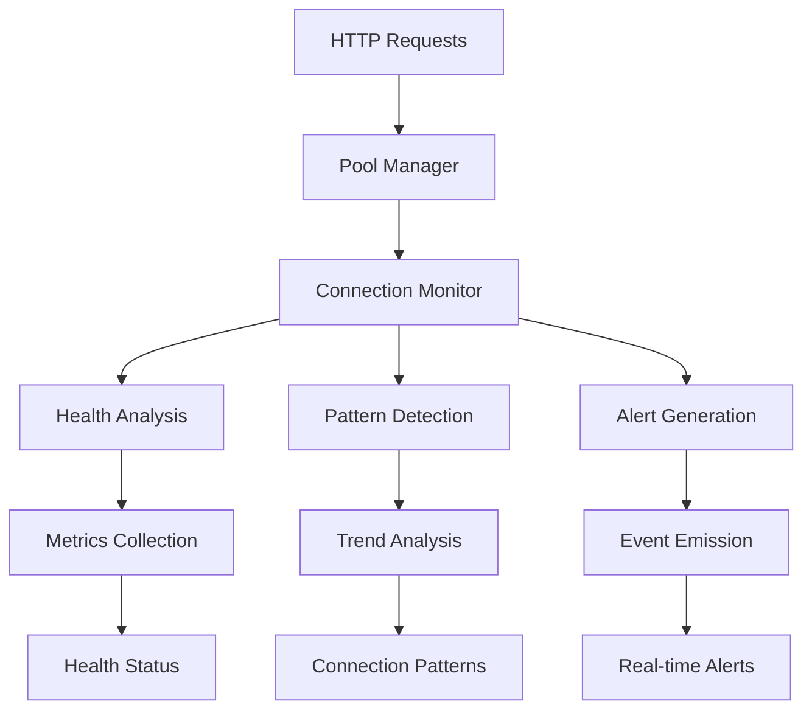
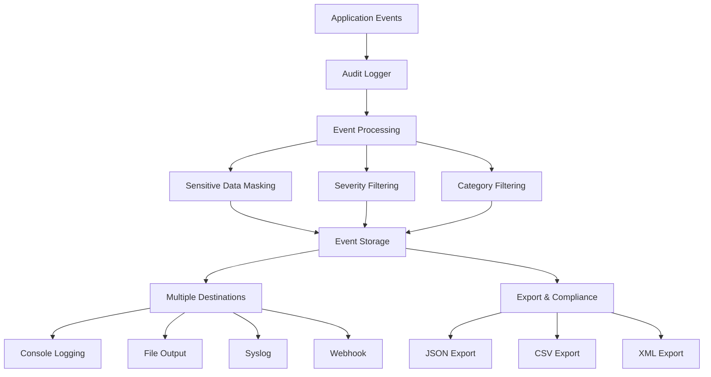

# Advanced Connection Monitoring & Enterprise Audit Logging

This document provides comprehensive guidance on the advanced monitoring and audit logging capabilities implemented in Phase 2 of the MCP Weather Server enterprise enhancements.

## Table of Contents

- [Overview](#overview)
- [Connection Monitoring](#connection-monitoring)
- [Enterprise Audit Logging](#enterprise-audit-logging)
- [Security Monitoring](#security-monitoring)
- [Configuration](#configuration)
- [Integration Examples](#integration-examples)
- [Troubleshooting](#troubleshooting)

## Overview

The MCP Weather Server now includes enterprise-grade monitoring and audit capabilities designed for production deployments requiring:

- **Real-time connection health monitoring**
- **Comprehensive audit trails for compliance**
- **Advanced security threat detection**
- **Performance analytics and alerting**

## Connection Monitoring

### Architecture

The connection monitoring system (`src/undici-resilience/monitoring/connection-monitor.ts`) provides real-time insights into HTTP connection pools, performance metrics, and health patterns.



### Key Features

#### 1. Real-time Health Tracking

Monitor connection health across multiple dimensions:

```typescript
interface ConnectionHealth {
  poolName: string;
  isHealthy: boolean;
  status: 'optimal' | 'warning' | 'critical' | 'offline';
  metrics: {
    activeConnections: number;
    totalConnections: number;
    utilization: number;
    avgResponseTime: number;
    errorRate: number;
    throughput: number;
  };
  thresholds: {
    utilizationWarning: number;    // Default: 70%
    utilizationCritical: number;   // Default: 90%
    responseTimeWarning: number;   // Default: 2000ms
    responseTimeCritical: number;  // Default: 5000ms
    errorRateWarning: number;      // Default: 5%
    errorRateCritical: number;     // Default: 15%
  };
  alerts: ConnectionAlert[];
  lastHealthCheck: number;
}
```

#### 2. Connection Pattern Analysis

Analyze connection patterns across multiple time periods:

```typescript
// Get 5-minute connection patterns
const pattern = connectionMonitor.getConnectionPatterns('weather', '5m');

console.log(pattern);
// Output:
{
  poolName: 'weather',
  period: '5m',
  metrics: {
    avgConnections: 8,
    peakConnections: 15,
    avgUtilization: 45.2,
    peakUtilization: 78.5,
    totalRequests: 234,
    avgThroughput: 12.3,
    peakThroughput: 28.7
  },
  trends: {
    connectionsDirection: 'increasing',
    utilizationDirection: 'stable',
    throughputDirection: 'increasing',
    changePercent: 15.3
  }
}
```

#### 3. Automated Alerting

Configure alerts based on connection health metrics:

```typescript
import { connectionMonitor } from './src/undici-resilience/monitoring/connection-monitor';

// Listen for health check events
connectionMonitor.on('healthCheck', (health) => {
  if (health.status === 'critical') {
    console.log(`CRITICAL: Pool ${health.poolName} unhealthy`, health.metrics);
  }
});

// Listen for specific alerts
connectionMonitor.on('alert', (alert) => {
  switch (alert.severity) {
    case 'critical':
      // Send to incident management system
      sendToIncidentSystem(alert);
      break;
    case 'warning':
      // Log for analysis
      logger.warn('Connection alert', alert);
      break;
  }
});
```

### Usage Examples

#### Basic Health Monitoring

```typescript
import { connectionMonitor } from './src/undici-resilience/monitoring/connection-monitor';

// Get health for specific pool
const weatherHealth = connectionMonitor.getConnectionHealth('weather');
console.log(`Weather API Health: ${weatherHealth.status}`);
console.log(`Utilization: ${weatherHealth.metrics.utilization}%`);
console.log(`Response Time: ${weatherHealth.metrics.avgResponseTime}ms`);

// Get health for all pools
const allHealth = connectionMonitor.getAllConnectionHealth();
Object.entries(allHealth).forEach(([poolName, health]) => {
  console.log(`${poolName}: ${health.status} (${health.metrics.utilization}% util)`);
});
```

#### Pattern Analysis for Capacity Planning

```typescript
// Analyze daily patterns for capacity planning
const dailyPattern = connectionMonitor.getConnectionPatterns('weather', '24h');

if (dailyPattern.trends.utilizationDirection === 'increasing') {
  console.log('Consider scaling up connection pool');
  console.log(`Current peak utilization: ${dailyPattern.metrics.peakUtilization}%`);
}

// Monitor throughput trends
if (dailyPattern.trends.throughputDirection === 'increasing' && 
    dailyPattern.trends.changePercent > 50) {
  console.log('Significant throughput increase detected');
  console.log(`Peak throughput: ${dailyPattern.metrics.peakThroughput} req/s`);
}
```

#### Custom Alert Handling

```typescript
// Set up comprehensive monitoring
connectionMonitor.on('connectionEvent', (event) => {
  if (event.type === 'disconnect' && event.error) {
    logger.error('Connection lost', {
      pool: event.poolName,
      origin: event.origin,
      error: event.error.message
    });
  }
});

// Monitor for performance degradation
connectionMonitor.on('patternAnalysis', (pattern) => {
  if (pattern.trends.changePercent > 100 && 
      pattern.trends.utilizationDirection === 'increasing') {
    console.log(`Rapid utilization increase in ${pattern.poolName}:`, {
      change: `${pattern.trends.changePercent}%`,
      currentUtil: pattern.metrics.avgUtilization
    });
  }
});
```

## Enterprise Audit Logging

### Architecture

The audit logging system (`src/audit/audit-logger.ts`) provides comprehensive audit trails for compliance and security monitoring.



### Key Features

#### 1. Comprehensive Event Categories

Track all security-relevant activities:

```typescript
// Authentication events
auditLogger.logAuthentication('login', 'success', 'user123', {
  ip: '192.168.1.100',
  userAgent: 'Mozilla/5.0...',
  method: 'POST',
  url: '/auth/login'
});

// Authorization events
auditLogger.logAuthorization('access_weather_data', 'weather_api', 'success', 'user123', {
  resource: '/weather/current',
  permissions: ['read']
});

// Data access events
auditLogger.logDataAccess('read', 'weather_data', 'success', 'user123', {
  query: 'city=London',
  recordCount: 1,
  dataSize: 2048
});

// Configuration changes
auditLogger.logConfiguration('update_rate_limit', 'api_config', 'success', 'admin', {
  oldValue: 100,
  newValue: 200,
  configKey: 'rateLimitPerMinute'
});

// Security events
auditLogger.logSecurity('brute_force_detected', 'authentication', 'failure', 'critical', undefined, {
  sourceIP: '192.168.1.200',
  attemptCount: 5,
  timeWindow: '5m'
});

// API usage events
auditLogger.logApiUsage('GET', '/weather/current', 200, 156, 'user123', {
  city: 'London',
  cacheHit: true
});
```

#### 2. Sensitive Data Masking

Automatically protect sensitive information:

```typescript
// Configure sensitive data masking
const auditConfig = {
  sensitiveDataMasking: {
    enabled: true,
    maskApiKeys: true,
    maskPasswords: true,
    maskPersonalData: true,
    customMaskPatterns: [
      'social_security',
      'credit_card',
      'phone_number'
    ]
  }
};

// Before masking:
{
  payload: {
    api_key: 'sk-1234567890abcdef',
    password: 'mySecretPassword',
    user_data: {
      social_security: '123-45-6789'
    }
  }
}

// After masking:
{
  payload: {
    api_key: '***MASKED***',
    password: '***MASKED***',
    user_data: {
      social_security: '***MASKED***'
    }
  }
}
```

#### 3. Multiple Output Formats

Support for various compliance requirements:

```typescript
// JSON format (default)
const jsonExport = auditLogger.export({ 
  startTime: Date.now() - 86400000,  // Last 24 hours
  category: 'security' 
}, 'json');

// CSV for spreadsheet analysis
const csvExport = auditLogger.export({
  severity: 'high'
}, 'csv');

// XML for legacy systems
const xmlExport = auditLogger.export({
  userId: 'admin',
  outcome: 'failure'
}, 'xml');

// Syslog format for SIEM integration
const syslogEvent = auditLogger.formatAsSyslog(event);
// Output: "<134>2025-01-15T10:30:00.000Z mcp-weather-server: AUDIT [audit-1234567890] user=admin action=config_change resource=api_settings outcome=success"

// CEF format for security tools
const cefEvent = auditLogger.formatAsCef(event);
// Output: "CEF:0|MCP|Weather Server|1.0|configuration|config_change|high|rt=1234567890 suser=admin outcome=success"
```

#### 4. Compliance Reporting

Generate reports for regulatory requirements:

```typescript
// Get comprehensive audit statistics
const stats = auditLogger.getStatistics();
console.log('Compliance Report:', {
  totalEvents: stats.totalEvents,
  complianceScore: stats.complianceScore,
  eventsByCategory: stats.eventsByCategory,
  eventsBySeverity: stats.eventsBySeverity,
  topSecurityEvents: stats.topActions.filter(a => a.action.includes('security')),
  timeRange: {
    start: new Date(stats.timeRange.earliest).toISOString(),
    end: new Date(stats.timeRange.latest).toISOString()
  }
});

// Query specific events for investigation
const securityIncidents = auditLogger.query({
  category: 'security',
  severity: 'critical',
  startTime: Date.now() - 604800000, // Last week
  limit: 50
});

console.log(`Found ${securityIncidents.length} critical security events`);
securityIncidents.forEach(event => {
  console.log(`${new Date(event.timestamp).toISOString()}: ${event.action} - ${event.details.description}`);
});
```

### Usage Examples

#### Daily Security Report

```typescript
import { auditLogger } from './src/audit/audit-logger';

async function generateDailySecurityReport() {
  const yesterday = Date.now() - 86400000;
  const today = Date.now();
  
  // Get all security events from yesterday
  const securityEvents = auditLogger.query({
    category: 'security',
    startTime: yesterday,
    endTime: today
  });
  
  // Get failed authentication attempts
  const failedLogins = auditLogger.query({
    category: 'authentication',
    outcome: 'failure',
    startTime: yesterday,
    endTime: today
  });
  
  // Get high-severity events
  const criticalEvents = auditLogger.query({
    severity: 'critical',
    startTime: yesterday,
    endTime: today
  });
  
  const report = {
    date: new Date().toISOString().split('T')[0],
    summary: {
      totalSecurityEvents: securityEvents.length,
      failedLoginAttempts: failedLogins.length,
      criticalIncidents: criticalEvents.length
    },
    details: {
      securityEvents: securityEvents.slice(0, 10), // Top 10
      failedLogins: failedLogins.slice(0, 10),
      criticalEvents: criticalEvents
    }
  };
  
  // Export to file
  const reportJson = JSON.stringify(report, null, 2);
  console.log('Daily Security Report:', report.summary);
  
  // Send to security team
  if (report.summary.criticalIncidents > 0) {
    console.log('⚠️  CRITICAL INCIDENTS DETECTED - Immediate attention required');
  }
  
  return report;
}

// Schedule daily report
setInterval(generateDailySecurityReport, 86400000); // Every 24 hours
```

#### Compliance Export for Auditors

```typescript
async function exportComplianceData(startDate: string, endDate: string) {
  const start = new Date(startDate).getTime();
  const end = new Date(endDate).getTime();
  
  // Export all events for the period
  const allEvents = auditLogger.export({
    startTime: start,
    endTime: end
  }, 'json');
  
  // Export CSV for spreadsheet analysis
  const csvData = auditLogger.export({
    startTime: start,
    endTime: end
  }, 'csv');
  
  // Get statistics
  const stats = auditLogger.getStatistics();
  
  // Verify integrity
  const integrityValid = auditLogger.verifyIntegrity();
  
  const compliancePackage = {
    period: { start: startDate, end: endDate },
    integrity: { valid: integrityValid },
    statistics: stats,
    formats: {
      json: allEvents,
      csv: csvData
    }
  };
  
  console.log(`Compliance export generated for ${startDate} to ${endDate}`);
  console.log(`Total events: ${stats.totalEvents}`);
  console.log(`Compliance score: ${stats.complianceScore}%`);
  console.log(`Integrity check: ${integrityValid ? 'PASSED' : 'FAILED'}`);
  
  return compliancePackage;
}

// Usage: Export last quarter's data
exportComplianceData('2024-10-01', '2024-12-31');
```

#### Real-time Security Monitoring

```typescript
import { auditLogger } from './src/audit/audit-logger';

// Set up real-time security monitoring
auditLogger.on('auditEvent', (event) => {
  // Monitor for suspicious patterns
  if (event.category === 'authentication' && event.outcome === 'failure') {
    console.log('Failed authentication attempt:', {
      user: event.userId,
      ip: event.details.ip,
      timestamp: new Date(event.timestamp).toISOString()
    });
  }
  
  // Track configuration changes
  if (event.category === 'configuration' && event.severity === 'high') {
    console.log('High-impact configuration change:', {
      action: event.action,
      resource: event.resource,
      user: event.userId,
      details: event.details.metadata
    });
  }
});

// Alert on critical events
auditLogger.on('criticalEvent', (event) => {
  console.log('🚨 CRITICAL SECURITY EVENT:', {
    action: event.action,
    resource: event.resource,
    severity: event.severity,
    timestamp: new Date(event.timestamp).toISOString(),
    details: event.details
  });
  
  // Send immediate alert to security team
  sendSecurityAlert(event);
});

async function sendSecurityAlert(event: any) {
  // Implementation would send to:
  // - Email alerts
  // - Slack/Teams notifications
  // - SIEM systems
  // - Incident management platforms
  
  console.log('Security alert sent for event:', event.id);
}
```

## Security Monitoring

The security monitoring system provides automated threat detection and response capabilities. See the main documentation for detailed security features.

## Configuration

### Connection Monitor Configuration

```typescript
import { ConnectionMonitor } from './src/undici-resilience/monitoring/connection-monitor';

const monitor = new ConnectionMonitor({
  healthCheckInterval: 30000,        // 30 seconds
  patternAnalysisInterval: 300000,   // 5 minutes
  alertRetentionTime: 86400000,      // 24 hours
  thresholds: {
    utilizationWarning: 70,          // 70%
    utilizationCritical: 90,         // 90%
    responseTimeWarning: 2000,       // 2 seconds
    responseTimeCritical: 5000,      // 5 seconds
    errorRateWarning: 5,             // 5%
    errorRateCritical: 15            // 15%
  },
  enablePredictiveAlerts: true,
  enablePerformanceBaselines: true
});
```

### Audit Logger Configuration

```typescript
import { AuditLogger } from './src/audit/audit-logger';

const auditLogger = new AuditLogger({
  enabled: true,
  enabledCategories: ['authentication', 'authorization', 'security'],
  minimumSeverity: 'medium',
  retentionDays: 90,
  maxEvents: 10000,
  enableRealTimeAlerts: true,
  outputFormat: 'json',
  destinations: {
    console: true,
    file: true,
    syslog: false,
    webhook: 'https://your-webhook-url.com'
  },
  sensitiveDataMasking: {
    enabled: true,
    maskApiKeys: true,
    maskPasswords: true,
    customMaskPatterns: ['ssn', 'credit_card']
  }
});
```

### Environment Variables

```bash
# Audit Logging
AUDIT_LOGGING_ENABLED=true
AUDIT_LOG_FILE=true
AUDIT_LOG_SYSLOG=false
AUDIT_LOG_WEBHOOK_URL=https://your-siem.com/webhook

# Security Monitoring
SECURITY_MONITORING_ENABLED=true
SECURITY_AUTO_BLOCK=true
SECURITY_ALERT_WEBHOOK=https://security-alerts.com/webhook

# Connection Monitoring
CONNECTION_MONITORING_ENABLED=true
CONNECTION_HEALTH_INTERVAL=30000
CONNECTION_PATTERN_INTERVAL=300000
```

## Integration Examples

### Prometheus/Grafana Integration

```typescript
import { connectionMonitor } from './src/undici-resilience/monitoring/connection-monitor';
import { register, Gauge, Counter } from 'prom-client';

// Create Prometheus metrics
const connectionUtilization = new Gauge({
  name: 'mcp_connection_utilization_percent',
  help: 'Connection pool utilization percentage',
  labelNames: ['pool']
});

const connectionErrors = new Counter({
  name: 'mcp_connection_errors_total',
  help: 'Total connection errors',
  labelNames: ['pool', 'type']
});

// Update metrics from connection monitor
connectionMonitor.on('healthCheck', (health) => {
  connectionUtilization.set({ pool: health.poolName }, health.metrics.utilization);
});

connectionMonitor.on('alert', (alert) => {
  connectionErrors.inc({ 
    pool: alert.poolName, 
    type: alert.type 
  });
});

// Expose metrics endpoint
app.get('/metrics', (req, res) => {
  res.set('Content-Type', register.contentType);
  res.end(register.metrics());
});
```

### Elasticsearch/ELK Stack Integration

```typescript
import { auditLogger } from './src/audit/audit-logger';
import { Client } from '@elastic/elasticsearch';

const esClient = new Client({ node: 'http://elasticsearch:9200' });

// Send audit events to Elasticsearch
auditLogger.on('auditEvent', async (event) => {
  try {
    await esClient.index({
      index: 'mcp-audit-logs',
      body: {
        ...event,
        '@timestamp': new Date(event.timestamp).toISOString()
      }
    });
  } catch (error) {
    console.error('Failed to send to Elasticsearch:', error);
  }
});

// Create Kibana dashboard queries
const securityDashboard = {
  "Failed Logins": {
    query: {
      bool: {
        must: [
          { term: { "category.keyword": "authentication" } },
          { term: { "outcome.keyword": "failure" } }
        ]
      }
    }
  },
  "Critical Events": {
    query: {
      term: { "severity.keyword": "critical" }
    }
  }
};
```

### SIEM Integration (Splunk)

```typescript
import { auditLogger } from './src/audit/audit-logger';

// Configure for Splunk HEC (HTTP Event Collector)
auditLogger.updateConfiguration({
  outputFormat: 'structured',
  destinations: {
    webhook: 'https://splunk.company.com:8088/services/collector/event'
  }
});

// Custom Splunk formatting
auditLogger.on('auditEvent', (event) => {
  const splunkEvent = {
    time: event.timestamp / 1000, // Splunk expects epoch seconds
    host: process.env.HOSTNAME || 'mcp-weather-server',
    source: 'mcp-audit',
    sourcetype: 'json',
    event: event
  };
  
  // Send to Splunk via webhook
  sendToSplunk(splunkEvent);
});
```

## Troubleshooting

### Common Issues

#### 1. High Memory Usage from Event Storage

```typescript
// Monitor memory usage
const memoryUsage = process.memoryUsage();
console.log('Memory usage:', {
  heapUsed: `${Math.round(memoryUsage.heapUsed / 1024 / 1024)} MB`,
  heapTotal: `${Math.round(memoryUsage.heapTotal / 1024 / 1024)} MB`
});

// Reduce retention if needed
auditLogger.updateConfiguration({
  maxEvents: 5000,  // Reduce from 10000
  retentionDays: 30 // Reduce from 90
});

// Force cleanup
auditLogger.cleanupOldEvents();
```

#### 2. Alert Fatigue

```typescript
// Adjust thresholds to reduce noise
connectionMonitor.updateConfiguration({
  thresholds: {
    utilizationWarning: 80,    // Increase from 70
    responseTimeWarning: 3000, // Increase from 2000
    errorRateWarning: 10       // Increase from 5
  }
});

// Filter alerts by severity
connectionMonitor.on('alert', (alert) => {
  if (alert.severity === 'critical') {
    // Only process critical alerts during off-hours
    sendAlert(alert);
  }
});
```

#### 3. Performance Impact

```typescript
// Monitor audit logging performance
const startTime = Date.now();
auditLogger.log('test_action', 'test_resource', 'success', 'low', 'api_usage');
const duration = Date.now() - startTime;

if (duration > 100) { // More than 100ms
  console.warn('Audit logging is slow:', duration + 'ms');
  
  // Consider reducing output destinations
  auditLogger.updateConfiguration({
    destinations: {
      console: true,
      file: false,    // Disable file output
      syslog: false   // Disable syslog
    }
  });
}
```

#### 4. Missing Events

```typescript
// Verify audit configuration
const config = auditLogger.getConfiguration();
console.log('Audit config:', {
  enabled: config.enabled,
  categories: config.enabledCategories,
  minimumSeverity: config.minimumSeverity
});

// Check if events are being filtered
auditLogger.on('auditEvent', (event) => {
  console.log('Event logged:', event.id, event.action);
});

// Test with different severity levels
auditLogger.log('test', 'test', 'success', 'critical', 'security'); // Should always log
auditLogger.log('test', 'test', 'success', 'low', 'security');      // May be filtered
```

## Best Practices

### Security

1. **Sensitive Data Protection**: Always enable sensitive data masking in production
2. **Access Control**: Restrict access to audit logs and monitoring dashboards
3. **Integrity**: Enable integrity checking for compliance requirements
4. **Retention**: Set appropriate retention periods based on regulatory requirements

### Performance

1. **Monitoring Intervals**: Balance monitoring frequency with performance impact
2. **Event Limits**: Set reasonable limits for in-memory event storage
3. **Output Destinations**: Use async webhooks for external integrations
4. **Cleanup**: Regularly clean up old events and metrics

### Compliance

1. **Documentation**: Maintain audit trail documentation for auditors
2. **Testing**: Regularly test audit log exports and integrity verification
3. **Backup**: Ensure audit logs are included in backup procedures
4. **Monitoring**: Monitor the monitoring systems themselves for availability

This comprehensive monitoring and audit system provides enterprise-grade observability, security, and compliance capabilities for the MCP Weather Server, enabling confident deployment in production environments with stringent requirements.
