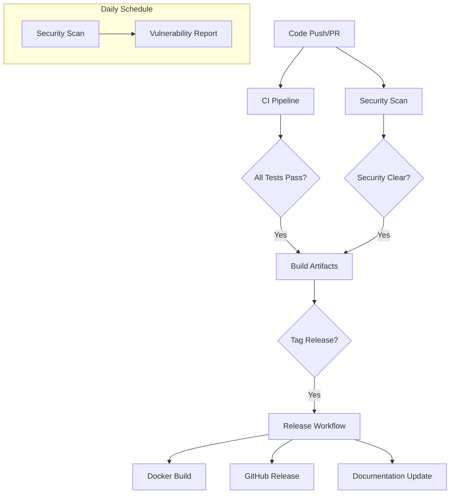

# GitHub Actions Workflows Guide

## Overview

The MCP Weather Server includes a comprehensive CI/CD pipeline built with GitHub Actions that provides automated testing, security scanning, and release management. This guide covers all three workflows and how to customize them for your needs.

## Table of Contents

- [Workflow Overview](#workflow-overview)
- [CI Pipeline (`ci.yml`)](#ci-pipeline-ciyml)
- [Security Scanning (`security.yml`)](#security-scanning-securityyml)
- [Release Automation (`release.yml`)](#release-automation-releaseyml)
- [Configuration](#configuration)
- [Customization Guide](#customization-guide)
- [Troubleshooting](#troubleshooting)
- [Best Practices](#best-practices)

## Workflow Overview



| Workflow | Trigger | Purpose | Duration |
|----------|---------|---------|----------|
| **CI Pipeline** | Push, PR | Quality gates, testing, validation | ~5-8 minutes |
| **Security Scan** | Push, PR, Daily | Vulnerability detection, compliance | ~3-5 minutes |
| **Release** | Tag, Manual | Automated releases, Docker publishing | ~10-15 minutes |

## CI Pipeline (`ci.yml`)

### Purpose
Comprehensive quality assurance with multiple validation stages to ensure code quality and functionality.

### Trigger Events
```yaml
on:
  push:
    branches: [main, develop]
  pull_request:
    branches: [main]
```

### Job Breakdown

#### 1. Security Job
**Duration:** ~2 minutes  
**Purpose:** Early security validation

```yaml
security:
  name: Security Scan
  runs-on: ubuntu-latest
  steps:
    - name: Checkout code
    - name: Setup Node.js
    - name: Install dependencies
    - name: Run npm audit
    - name: Run ESLint security scan
    - name: Check for sensitive files
```

**What it does:**
- Scans for high-severity vulnerabilities in dependencies
- Runs ESLint with security-focused rules
- Checks for accidentally committed sensitive files (`.env`, `.key`, `.pem`)

#### 2. Test Job
**Duration:** ~4 minutes  
**Purpose:** Comprehensive testing and validation

```yaml
test:
  name: Test Suite
  runs-on: ubuntu-latest
  strategy:
    matrix:
      node-version: [22.x]
```

**Test Steps:**
1. **TypeScript Compilation Check**: `npx tsc --noEmit`
2. **Code Linting**: `npm run lint`
3. **Unit Tests with Coverage**: `npm run test:coverage`
4. **Build Verification**: `npm run build`
5. **Transport Testing**: Live validation of stdio and HTTP transports

**Coverage Integration:**
- Uploads results to Codecov
- Tracks coverage trends over time
- Fails if coverage drops significantly

#### 3. Build Job
**Duration:** ~2 minutes  
**Purpose:** Verify production build artifacts

```yaml
build:
  name: Build Check
  needs: [security, test]
```

**Validation Steps:**
- Confirms all critical files are generated (`dist/server.js`, `dist/mcp-server.js`, etc.)
- Validates build completeness
- Ensures production readiness

#### 4. Docker Job
**Duration:** ~3 minutes  
**Purpose:** Container functionality verification

```yaml
docker:
  name: Docker Build Test
  needs: [security, test]
```

**Docker Testing:**
- Builds production Docker image
- Starts container with HTTP transport
- Validates health endpoint responsiveness
- Cleans up test containers

#### 5. Validation Job
**Duration:** ~1 minute  
**Purpose:** Final project validation

```yaml
validate:
  name: Project Validation
  needs: [security, test, build]
```

**Final Checks:**
- Runs complete validation suite (`npm run validate`)
- Confirms all quality gates passed
- Provides final go/no-go decision

### Key Features

#### Transport Testing
Automated verification of both transports:

```bash
# Stdio Transport Test
timeout 10s npm run stdio > /dev/null 2>&1 || echo "Stdio transport test completed"

# HTTP Transport Test  
npm run http &
HTTP_PID=$!
sleep 5
curl -f http://localhost:8080/health || exit 1
kill $HTTP_PID || true
```

#### Matrix Strategy
Currently tests Node.js 22.x, easily expandable:

```yaml
strategy:
  matrix:
    node-version: [22.x]
    # Future: Add multiple Node versions
    # node-version: [20.x, 22.x, 24.x]
```

## Security Scanning (`security.yml`)

### Purpose
Proactive security monitoring with multiple scanning approaches and automated reporting.

### Trigger Events
```yaml
on:
  push:
    branches: [main, develop]
  pull_request:
    branches: [main]
  schedule:
    # Daily at 2 AM UTC
    - cron: '0 2 * * *'
```

### Job Breakdown

#### 1. Dependency Scan
**Purpose:** Identify vulnerable dependencies

```yaml
dependency-scan:
  name: Dependency Security Scan
```

**Scanning Tools:**
- `npm audit --audit-level=moderate --production`
- `npx audit-ci --moderate --production`
- Generates detailed security reports (JSON format)

**Output:** Artifact with security report for analysis

#### 2. Code Scan
**Purpose:** Static analysis for security vulnerabilities

```yaml
code-scan:
  name: Static Code Analysis
```

**Security Checks:**
1. **Hardcoded Secrets Detection:**
   ```bash
   # Scans for API keys, passwords, tokens
   grep -r -E "(api[_-]?key|password|secret|token|auth)" src/
   ```

2. **Unsafe Pattern Detection:**
   ```bash
   # Checks for dangerous functions
   grep -r "eval(" src/
   grep -r "innerHTML" src/
   grep -r "dangerouslySetInnerHTML" src/
   ```

#### 3. Docker Scan
**Purpose:** Container vulnerability analysis

```yaml
docker-scan:
  name: Docker Security Scan
```

**Features:**
- Uses Aqua Security Trivy scanner
- Scans for OS and application vulnerabilities
- Generates SARIF reports for GitHub Security tab
- Integrates with GitHub Code Scanning

#### 4. License Check
**Purpose:** License compliance verification

```yaml
license-check:
  name: License Compliance Check
```

**Approved Licenses:**
- MIT, ISC, BSD, Apache-2.0, CC0-1.0, Unlicense

**Rejection Process:**
- Fails build if non-approved licenses found
- Generates detailed license report
- Provides clear remediation guidance

#### 5. Security Summary
**Purpose:** Consolidated reporting

```yaml
security-summary:
  name: Security Summary
  needs: [dependency-scan, code-scan, docker-scan, license-check]
  if: always()
```

**Reporting Features:**
- ✅/❌ status for each scan type
- Fails on critical security issues
- Provides actionable summary

### Daily Security Monitoring

**Scheduled Execution:**
- Runs automatically at 2 AM UTC daily
- Monitors for new vulnerabilities
- No human intervention required

**Alert System:**
- GitHub notifications for security failures
- Artifact uploads for detailed analysis
- Integration with security monitoring tools

## Release Automation (`release.yml`)

### Purpose
Fully automated release process with multi-platform builds, documentation updates, and artifact management.

### Trigger Events
```yaml
on:
  push:
    tags:
      - 'v*.*.*'  # Semantic version tags
  workflow_dispatch:
    inputs:
      version:
        description: 'Version to release (e.g., 2.6.3)'
        required: true
        type: string
```

### Job Breakdown

#### 1. Validate Release
**Duration:** ~3 minutes  
**Purpose:** Pre-release validation

```yaml
validate-release:
  name: Validate Release
```

**Validation Steps:**
1. Full test suite execution
2. Semantic version format validation
3. Build verification
4. Environment setup for subsequent jobs

**Version Handling:**
- Tag-triggered: Extracts from `refs/tags/v*`
- Manual trigger: Uses workflow input
- Validates format: `X.Y.Z` (semantic versioning)

#### 2. Build Artifacts
**Duration:** ~2 minutes  
**Purpose:** Create release artifacts

```yaml
build-artifacts:
  name: Build Release Artifacts
  needs: validate-release
```

**Artifact Creation:**
- Source code tarball with essential files
- SHA256 checksums for verification
- Includes: `dist/`, `package.json`, `README.md`, `CHANGELOG.md`, `docs/`, etc.

#### 3. Docker Build
**Duration:** ~8 minutes  
**Purpose:** Multi-platform container builds

```yaml
docker-build:
  name: Build and Push Docker Image
  needs: validate-release
```

**Features:**
- **Multi-platform**: `linux/amd64`, `linux/arm64`
- **Docker Hub integration**: Automated publishing
- **Build caching**: GitHub Actions cache for faster builds
- **Tag management**: Automatic `latest` and version-specific tags

**Security:**
- Only pushes from main repository
- Uses encrypted secrets for Docker Hub credentials
- Conditional publishing based on repository ownership

#### 4. GitHub Release
**Duration:** ~2 minutes  
**Purpose:** Create GitHub release with assets

```yaml
github-release:
  name: Create GitHub Release
  needs: [validate-release, build-artifacts, docker-build]
```

**Release Features:**
1. **Automatic Changelog Extraction:**
   ```bash
   # Extracts relevant CHANGELOG.md section
   sed -n "/## \[$(echo $VERSION)\]/,/## \[/p" CHANGELOG.md
   ```

2. **Rich Release Notes:**
   - Installation instructions (NPM, Docker, Source)
   - SHA256 verification guidance
   - Change highlights from changelog

3. **Asset Management:**
   - Source tarballs with checksums
   - Automatic artifact uploading
   - Verification instructions

#### 5. Documentation Updates
**Duration:** ~1 minute  
**Purpose:** Automated documentation maintenance

```yaml
update-documentation:
  name: Update Documentation
  needs: github-release
```

**Update Process:**
1. **Version Badge Updates:** README.md version references
2. **Documentation Versioning:** Updates across `docs/` folder
3. **Memory Bank Updates:** Adds release record to project memory
4. **Automated Commits:** Pushes updates to main branch

#### 6. Post-Release Tasks
**Duration:** ~30 seconds  
**Purpose:** Completion notification and summary

```yaml
post-release:
  name: Post-Release Tasks
  needs: [github-release, update-documentation]
```

**Completion Report:**
```
🎉 Release v2.6.3 completed successfully!

📋 Release Summary:
- ✅ GitHub Release: Created
- ✅ Docker Image: Published  
- ✅ Documentation: Updated
- ✅ Artifacts: Available for download

🔗 Links:
- Release: https://github.com/kumaran-is/mcp-weather-server/releases/tag/v2.6.3
- Docker: https://hub.docker.com/r/kumaranis/mcp-weather-server
```

### Release Process

#### Manual Release
```bash
# Create and push a version tag
git tag v2.6.3
git push origin v2.6.3

# Or use workflow dispatch in GitHub UI
```

#### Automatic Release (Future)
```yaml
# Future enhancement: Auto-increment versions
# Can be triggered by conventional commits
```

## Configuration

### Repository Secrets

Required secrets for full functionality:

```yaml
# Docker Hub (for automated publishing)
DOCKER_USERNAME: your-docker-username
DOCKER_TOKEN: your-docker-access-token

# GitHub Token (automatically provided)
GITHUB_TOKEN: ${{ secrets.GITHUB_TOKEN }}

# Optional: Additional integrations
CODECOV_TOKEN: your-codecov-token  # For coverage reporting
SLACK_WEBHOOK: your-slack-webhook  # For notifications
```

### Environment Variables

Available for workflow customization:

```yaml
env:
  NODE_VERSION: '22'
  REGISTRY: docker.io
  IMAGE_NAME: kumaranis/mcp-weather-server
  
  # Test configuration
  CI: true
  NODE_ENV: test
  LOG_LEVEL: info
```

### Branch Protection

Recommended branch protection rules:

```yaml
# .github/branch-protection.yml (if using GitHub CLI)
main:
  required_status_checks:
    strict: true
    contexts:
      - "CI Pipeline / Security Scan"
      - "CI Pipeline / Test Suite"
      - "CI Pipeline / Build Check"
      - "Security Scan / Dependency Security Scan"
      - "Security Scan / Static Code Analysis"
  enforce_admins: false
  required_pull_request_reviews:
    required_approving_review_count: 1
    dismiss_stale_reviews: true
```

## Customization Guide

### Adding New Tests

#### Unit Test Addition
```yaml
# In ci.yml test job, add step:
- name: Run integration tests
  run: npm run test:integration
```

#### New Linting Rules
```yaml
# Add custom linting step:
- name: Run custom linting
  run: npx eslint src/ --config .eslintrc.custom.js
```

### Custom Security Scans

#### Additional Vulnerability Scanners
```yaml
# Add to security.yml
- name: Run Snyk scan
  uses: snyk/actions/node@master
  env:
    SNYK_TOKEN: ${{ secrets.SNYK_TOKEN }}
```

#### Custom Secret Detection
```yaml
# Enhanced secret detection
- name: Advanced secret scan
  run: |
    npx detect-secrets scan --all-files --force-use-all-plugins \
      --baseline .secrets.baseline
```

### Release Customization

#### Additional Platforms
```yaml
# In docker-build job
platforms: linux/amd64,linux/arm64,linux/arm/v7
```

#### Custom Release Assets
```yaml
# Add in build-artifacts job
- name: Create additional assets
  run: |
    npm run build:docs
    tar -czf release-artifacts/documentation.tar.gz docs/
```

### Notification Integration

#### Slack Notifications
```yaml
# Add to any job
- name: Slack notification
  uses: 8398a7/action-slack@v3
  with:
    status: ${{ job.status }}
    channel: '#ci-cd'
    webhook_url: ${{ secrets.SLACK_WEBHOOK }}
  if: always()
```

#### Email Notifications
```yaml
# For critical failures
- name: Send email on failure
  uses: dawidd6/action-send-mail@v3
  with:
    server_address: smtp.gmail.com
    server_port: 465
    username: ${{ secrets.EMAIL_USERNAME }}
    password: ${{ secrets.EMAIL_PASSWORD }}
    subject: "CI/CD Failure: ${{ github.repository }}"
    body: "Build failed on ${{ github.ref }}"
  if: failure()
```

## Troubleshooting

### Common Issues

#### 1. Docker Build Failures

**Problem:** Docker build times out or fails
```yaml
Error: buildx failed with: ERROR: failed to solve: process "/bin/sh -c npm ci" didn't complete successfully
```

**Solution:**
```yaml
# Increase timeout in docker job
- name: Build Docker image
  timeout-minutes: 15  # Increase from default
  run: docker build -t mcp-weather-server:test .
```

#### 2. Test Timeout Issues

**Problem:** Tests hang or timeout
```yaml
Error: The operation was canceled.
```

**Solution:**
```yaml
# Add explicit timeouts
- name: Run unit tests with coverage
  timeout-minutes: 10
  run: npm run test:coverage
```

#### 3. Security Scan False Positives

**Problem:** Trivy reports false vulnerabilities
```yaml
# Allow specific vulnerabilities
- name: Run Trivy scanner
  uses: aquasecurity/trivy-action@master
  with:
    image-ref: 'mcp-weather-server:security-scan'
    severity: 'HIGH,CRITICAL'
    ignore-unfixed: true
    trivyignores: .trivyignore
```

**`.trivyignore` example:**
```
# False positive in base image
CVE-2023-12345

# Development dependency, not in production
npm:package-name
```

#### 4. Release Permission Issues

**Problem:** Cannot push to Docker Hub or create releases

**Solution:**
```yaml
# Verify repository secrets
- name: Debug authentication
  run: |
    echo "Repository: ${{ github.repository }}"
    echo "Actor: ${{ github.actor }}"
    echo "Event: ${{ github.event_name }}"
```

### Debug Mode

Enable debug logging for troubleshooting:

```yaml
# Add to any job
env:
  ACTIONS_STEP_DEBUG: true
  ACTIONS_RUNNER_DEBUG: true
```

### Log Analysis

#### Workflow Logs
- **Location:** GitHub Actions tab → Workflow run → Job details
- **Retention:** 90 days for public repos, 400 days for private
- **Download:** Available as ZIP archives

#### Artifact Inspection
```bash
# Download and inspect artifacts
curl -H "Authorization: token $GITHUB_TOKEN" \
  -L https://api.github.com/repos/owner/repo/actions/artifacts/123/zip \
  -o artifacts.zip
```

## Best Practices

### 1. Workflow Organization

#### Job Dependencies
```yaml
# Organize jobs logically
jobs:
  security:
    # Independent - can run immediately
  
  test:
    # Independent - can run in parallel with security
  
  build:
    needs: [security, test]  # Wait for quality gates
  
  deploy:
    needs: [build]  # Only after successful build
```

#### Resource Management
```yaml
# Optimize runner usage
strategy:
  matrix:
    os: [ubuntu-latest]  # Use specific versions
  fail-fast: false  # Don't cancel other jobs on failure
```

### 2. Security Best Practices

#### Secret Management
```yaml
# Use environment-specific secrets
env:
  DOCKER_USERNAME: ${{ secrets.DOCKER_USERNAME }}
  # Never expose secrets in logs
```

#### Least Privilege
```yaml
permissions:
  contents: read
  security-events: write  # Only what's needed
```

### 3. Performance Optimization

#### Caching Strategy
```yaml
# Cache dependencies
- name: Cache node modules
  uses: actions/cache@v3
  with:
    path: ~/.npm
    key: ${{ runner.os }}-node-${{ hashFiles('package-lock.json') }}
    restore-keys: |
      ${{ runner.os }}-node-
```

#### Parallel Execution
```yaml
# Run independent jobs in parallel
jobs:
  security:
    runs-on: ubuntu-latest
  test:
    runs-on: ubuntu-latest  # Runs simultaneously with security
```

### 4. Monitoring and Alerts

#### Status Badges
Add to README.md:
```markdown
[](https://github.com/user/repo/actions)
[](https://github.com/user/repo/actions)
```

#### Failure Notifications
```yaml
# Critical path monitoring
- name: Critical failure alert
  if: failure() && github.ref == 'refs/heads/main'
  run: |
    curl -X POST ${{ secrets.SLACK_WEBHOOK }} \
      -H 'Content-type: application/json' \
      --data '{"text":"🚨 Critical CI failure on main branch!"}'
```

---

## Conclusion

The GitHub Actions workflows provide comprehensive automation for quality assurance, security monitoring, and release management. They're designed to be both thorough and efficient, ensuring high code quality while minimizing manual intervention.

Key benefits:
- **Quality Assurance**: Automated testing and validation
- **Security Monitoring**: Proactive vulnerability detection
- **Release Automation**: Professional release process
- **Documentation Maintenance**: Automatic updates and consistency

For additional customization or troubleshooting, refer to the individual workflow files in `.github/workflows/` or create an issue in the project repository.
