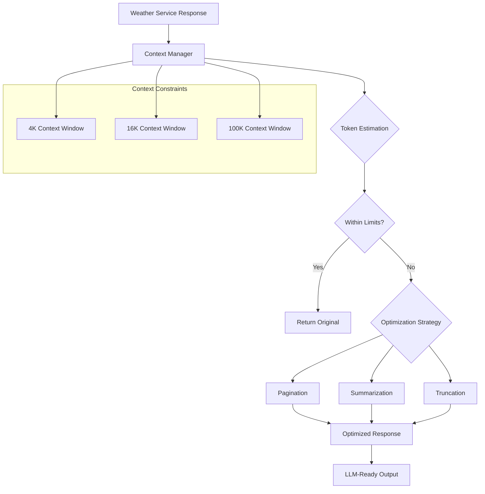

# LLM Optimization Guide

## Overview

The MCP Weather Server includes an advanced **LLM Context Management System** located in `src/context/` that automatically optimizes responses for different context window sizes and LLM requirements. This system ensures optimal performance across various AI assistants and context constraints.

## Table of Contents

- [Architecture Overview](#architecture-overview)
- [Core Components](#core-components)
- [Optimization Strategies](#optimization-strategies)
- [Weather-Specific Features](#weather-specific-features)
- [Configuration](#configuration)
- [Usage Examples](#usage-examples)
- [Integration Guide](#integration-guide)
- [Best Practices](#best-practices)
- [Troubleshooting](#troubleshooting)

## Architecture Overview



## Core Components

### 1. Context Manager (`ContextManager`)

The central orchestrator that analyzes, optimizes, and formats responses.

**Key Responsibilities:**
- Token estimation and analysis
- Strategy selection and execution
- Response formatting with metadata
- Configuration management

### 2. Token Estimation Engine

Provides accurate token counting for any data structure:

```typescript
interface TokenEstimate {
  tokens: number;      // Estimated token count (~4 chars/token)
  characters: number;  // Total character count
  words: number;       // Word count
}
```

**Estimation Algorithm:**
- Uses 4 characters per token approximation (optimized for English)
- Handles complex JSON structures
- Accounts for formatting and whitespace

### 3. Optimization Strategies

Three progressive optimization approaches:

#### Priority Order:
1. **Pagination** (Preferred) - For arrays/lists
2. **Summarization** (Balanced) - For all data types
3. **Truncation** (Last resort) - When other methods fail

## Optimization Strategies

### 1. Pagination Strategy

**Best for:** Weather forecasts, historical data, large arrays

**How it works:**
- Calculates optimal page size based on token limits
- Preserves data structure and completeness
- Provides navigation metadata (cursors, hasMore flags)

**Example Use Case:**
```typescript
// 7-day forecast → 3-day pages for 4K context
{
  "data": [/* First 3 days */],
  "metadata": {
    "optimizationApplied": "pagination",
    "hasMore": true,
    "nextCursor": "eyJvZmZzZXQiOjMsInRvdGFsIjo3fQ=="
  }
}
```

### 2. Summarization Strategy

**Best for:** Complex objects, detailed weather data, statistical analysis

**Weather-Specific Intelligence:**
- **Date Range Extraction**: Identifies forecast periods
- **Temperature Aggregation**: Min/max/average calculations
- **Condition Summaries**: Weather pattern analysis
- **Geographical Grouping**: Location-based summaries

**Example Transformation:**
```typescript
// Original: 2000 tokens
{
  "forecast": [/* 7 days of detailed hourly data */]
}

// Summarized: 500 tokens
{
  "_summary": true,
  "totalItems": 7,
  "dateRange": { "start": "2024-01-01", "end": "2024-01-07" },
  "temperatureRange": { "min": -2, "max": 18 },
  "sample": [/* First 3 days */],
  "aggregates": {
    "avgTemp": 8.5,
    "precipitationDays": 3,
    "clearDays": 4
  }
}
```

### 3. Truncation Strategy

**Used when:** Pagination and summarization aren't sufficient

**Features:**
- Preserves beginning and end of content
- Maintains JSON validity when possible
- Provides truncation metadata
- Graceful fallback for any data type

## Weather-Specific Features

### 1. Forecast Array Detection

Automatically identifies weather forecast arrays:

```typescript
private isWeatherForecastArray(data: any[]): boolean {
  return data.length > 0 && data.every(item => 
    item && typeof item === 'object' && 
    (item.date || item.time || item.temperature !== undefined)
  );
}
```

### 2. Temperature Range Analysis

Extracts meaningful temperature insights:

```typescript
{
  "temperatureRange": {
    "min": -5,
    "max": 22,
    "avg": 8.5
  }
}
```

### 3. Time Period Intelligence

Smart date/time handling for weather periods:

```typescript
{
  "dateRange": {
    "start": "2024-01-01T00:00:00Z",
    "end": "2024-01-07T23:59:59Z"
  }
}
```

### 4. Adaptive Page Sizing

Calculates optimal pages based on weather data complexity:

- **Current weather**: 1 item (detailed)
- **Daily forecasts**: 2-3 days (moderate detail)
- **Hourly forecasts**: 12-24 hours (high detail)

## Configuration

### Environment Variables

```bash
# Context limits (tokens)
MAX_INPUT_TOKENS=4000        # Maximum input size
MAX_OUTPUT_TOKENS=4000       # Maximum response size
MAX_TOTAL_TOKENS=8000        # Total conversation limit
PREFERRED_RESPONSE_SIZE=2000 # Target response size

# Optimization preferences
ENABLE_PAGINATION=true       # Allow pagination
ENABLE_SUMMARIZATION=true    # Allow summarization
ENABLE_TRUNCATION=false      # Allow truncation as fallback
```

### Programmatic Configuration

```typescript
import { ContextManager } from './src/context/context-manager';

const customManager = new ContextManager({
  maxInputTokens: 8000,
  maxOutputTokens: 8000,
  maxTotalTokens: 16000,
  preferredResponseSize: 4000
});
```

## Usage Examples

### 1. Basic Optimization

```typescript
import { contextManager } from './src/context/context-manager';

async function optimizeWeatherResponse(weatherData: any) {
  const optimized = await contextManager.optimizeResponse(weatherData, {
    maxTokens: 4000,
    allowPagination: true,
    allowSummary: true
  });
  
  return {
    weather: optimized.data,
    meta: optimized.metadata
  };
}
```

### 2. Context-Aware Tool Implementation

```typescript
// In weather-service.ts
export class WeatherService {
  async getForecast(city: string, days: number, contextLimit?: number): Promise<any> {
    const rawForecast = await this.fetchForecast(city, days);
    
    // Apply context optimization
    const optimized = await contextManager.optimizeResponse(rawForecast, {
      maxTokens: contextLimit || 4000,
      allowPagination: true,
      prioritizeRecent: true
    });
    
    return optimized;
  }
}
```

### 3. Custom Optimization Options

```typescript
const optimized = await contextManager.optimizeResponse(data, {
  maxTokens: 2000,           // Strict limit
  allowPagination: true,     // Prefer chunking
  allowSummary: true,        // Allow smart summaries
  allowTruncation: false,    // Never truncate
  prioritizeRecent: true,    // Recent weather first
  includeMetadata: true      // Include optimization info
});
```

## Integration Guide

### 1. Service Layer Integration

```typescript
// weather-service.ts
import { contextManager, OptimizedResponse } from '../context/context-manager';

export class WeatherService {
  async getCurrentWeather(city: string): Promise<OptimizedResponse> {
    const weatherData = await this.fetchCurrentWeather(city);
    return await contextManager.optimizeResponse(weatherData);
  }
}
```

### 2. MCP Server Integration

```typescript
// mcp-server.ts
export class WeatherMCPServer {
  private async formatToolResponse(data: any): Promise<ToolResponse> {
    const optimized = await contextManager.optimizeResponse(data);
    
    return {
      content: [{
        type: 'text',
        text: JSON.stringify(optimized.data, null, 2)
      }],
      _meta: {
        tokens: optimized.metadata.tokenEstimate.tokens,
        optimization: optimized.metadata.optimizationApplied,
        hasMore: optimized.metadata.hasMore
      }
    };
  }
}
```

### 3. Custom Tool Implementation

```typescript
async handleCustomWeatherTool(args: any): Promise<any> {
  const rawData = await this.processWeatherRequest(args);
  
  // Apply context-aware optimization
  const result = await contextManager.optimizeResponse(rawData, {
    maxTokens: this.getContextLimit(args),
    allowPagination: this.shouldUsePagination(rawData),
    allowSummary: args.summary || false
  });
  
  return result;
}
```

## Best Practices

### 1. Context Limits by Use Case

| Use Case | Recommended Limit | Strategy |
|----------|-------------------|----------|
| **Current Weather** | 1K tokens | No optimization needed |
| **3-day Forecast** | 2K tokens | Minimal optimization |
| **7-day Forecast** | 4K tokens | Pagination preferred |
| **Historical Data** | 8K tokens | Summarization + pagination |
| **Climate Analysis** | 16K tokens | Heavy summarization |

### 2. Optimization Strategy Selection

```typescript
// Choose strategy based on data characteristics
const strategy = {
  maxTokens: getContextLimit(),
  allowPagination: Array.isArray(data) && data.length > 5,
  allowSummary: isComplexObject(data) || hasDeepNesting(data),
  allowTruncation: isFallbackAcceptable(),
  prioritizeRecent: isTimeSeriesData(data)
};
```

### 3. Error Handling

```typescript
try {
  const optimized = await contextManager.optimizeResponse(data, options);
  return optimized;
} catch (error) {
  logger.error('Context optimization failed', { error, dataSize: JSON.stringify(data).length });
  
  // Fallback to basic truncation
  return {
    data: JSON.stringify(data).slice(0, 1000) + '...',
    metadata: {
      optimizationApplied: 'emergency_truncation',
      hasMore: true,
      error: error.message
    }
  };
}
```

### 4. Performance Monitoring

```typescript
// Track optimization effectiveness
logger.info('Context optimization applied', {
  tool: 'get_weather_forecast',
  originalTokens: estimate.tokens,
  optimizedTokens: result.metadata.tokenEstimate.tokens,
  strategy: result.metadata.optimizationApplied,
  compressionRatio: (estimate.tokens / result.metadata.tokenEstimate.tokens).toFixed(2)
});
```

## Troubleshooting

### Common Issues

#### 1. Over-Optimization

**Problem:** Responses are too compressed, losing important information

**Solution:**
```typescript
// Increase token limits or disable aggressive optimization
const options = {
  maxTokens: 6000,        // Increase limit
  allowSummary: false,    // Disable summarization
  allowPagination: true   // Use pagination instead
};
```

#### 2. Under-Optimization

**Problem:** Responses still exceed context windows

**Solution:**
```typescript
// Enable more aggressive optimization
const options = {
  maxTokens: 2000,        // Stricter limit
  allowTruncation: true,  // Allow fallback truncation
  prioritizeRecent: true  // Focus on recent data
};
```

#### 3. Inconsistent Results

**Problem:** Optimization varies unpredictably

**Solution:**
```typescript
// Use consistent configuration
const standardOptions = {
  maxTokens: this.config.standardContextLimit,
  allowPagination: true,
  allowSummary: true,
  allowTruncation: false,  // Consistent behavior
  includeMetadata: true
};
```

### Debug Information

Enable detailed logging for optimization analysis:

```typescript
// Set debug level
process.env.LOG_LEVEL = 'debug';

// Check optimization metadata
console.log('Optimization Details:', {
  original: contextManager.estimateTokens(originalData),
  optimized: result.metadata.tokenEstimate,
  strategy: result.metadata.optimizationApplied,
  hasMore: result.metadata.hasMore
});
```

### Performance Metrics

Monitor optimization performance:

```typescript
// Key metrics to track
const metrics = {
  avgCompressionRatio: 2.3,      // 2.3x smaller responses
  optimizationHitRate: 0.85,     // 85% of responses optimized
  paginationUsage: 0.60,         // 60% use pagination
  summarizationUsage: 0.25,      // 25% use summarization
  truncationUsage: 0.05          // 5% require truncation
};
```

## Future Enhancements

### Planned Features

1. **ML-Based Token Estimation**: More accurate token counting using model-specific tokenizers
2. **Context Persistence**: Remember optimization preferences per client
3. **Streaming Optimization**: Real-time optimization for streaming responses
4. **Custom Summarization**: Domain-specific summarization strategies
5. **A/B Testing**: Compare optimization strategies for effectiveness

### Extension Points

The system is designed for easy extension:

```typescript
// Custom optimization strategy
class CustomWeatherOptimizer extends ContextManager {
  protected applyCityBasedOptimization(data: any): OptimizedResponse {
    // Custom logic for city-specific optimization
  }
}
```

---

## Conclusion

The LLM optimization system provides intelligent, automatic response optimization that significantly improves the interaction between AI assistants and the weather server. By understanding token constraints and applying appropriate optimization strategies, it ensures optimal performance across various context window sizes while preserving the most important information.

For additional support or questions about the optimization system, please refer to the source code in `src/context/context-manager.ts` or create an issue in the project repository.
