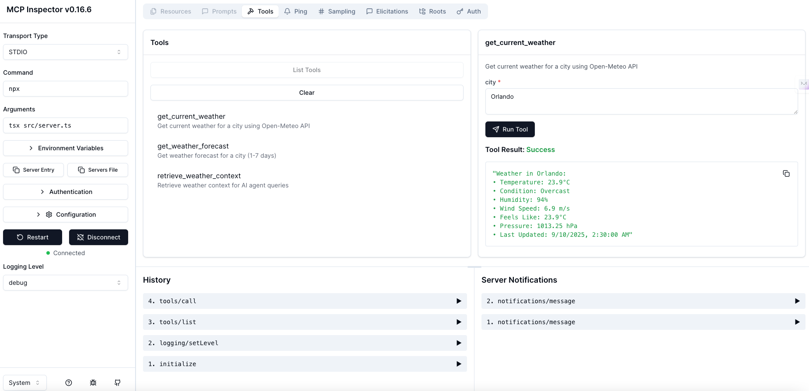
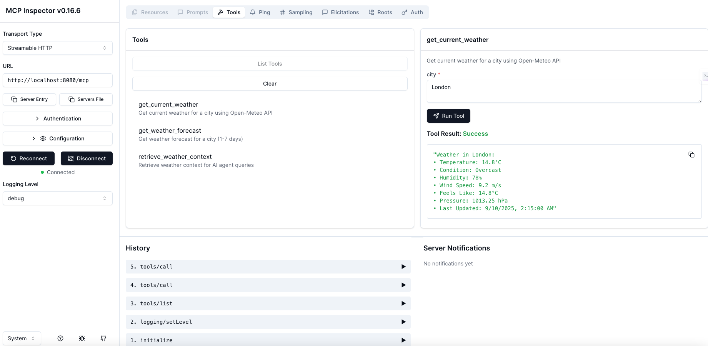

# MCP Inspector Testing Guide

This guide provides step-by-step instructions for testing the MCP Weather Server using the official MCP Inspector tool for both stdio and HTTP transports.

## Table of Contents

1. [What is MCP Inspector?](#what-is-mcp-inspector)
2. [Installation](#installation)
3. [Testing Stdio Transport](#testing-stdio-transport)
4. [Testing HTTP Transport](#testing-http-transport)
5. [Verifying Server Functionality](#verifying-server-functionality)
6. [Common Test Scenarios](#common-test-scenarios)
7. [Troubleshooting](#troubleshooting)
8. [Best Practices](#best-practices)

## What is MCP Inspector?

MCP Inspector is the official debugging and testing tool for Model Context Protocol servers. It provides:
- Interactive testing interface
- Real-time message inspection
- Protocol compliance verification
- Visual tool exploration
- Session management for HTTP transport

## Installation

### Prerequisites

- Node.js 22.x or later
- npm or npx installed
- MCP Weather Server properly configured

### Install MCP Inspector

```bash
# Install globally (recommended)
npm install -g @modelcontextprotocol/inspector

# Or use npx (no installation needed)
npx @modelcontextprotocol/inspector
```

### Verify Installation

```bash
# Check if inspector is installed
mcp-inspector --version

# Or with npx
npx @modelcontextprotocol/inspector --version
```

## Testing Stdio Transport

### Quick Start for Stdio Testing

**Step-by-Step Instructions:**

1. **No server to start** (Inspector will spawn the process)
2. **Open MCP Inspector** in your browser
3. **Configure the connection:**
   - ✅ **Transport Type**: Select `Stdio` (not SSE or HTTP)
   - ✅ **Command**: Enter `npx`
   - ✅ **Arguments**: Add `tsx` and `src/server.ts` (each on separate line)
   - ✅ **Working Directory**: `/path/to/mcp-weather-server`
   - ✅ **Environment Variables** (optional): `MCP_TRANSPORT=stdio`


*MCP Inspector configuration for stdio transport*

4. **Click "Connect"** button
5. **Connection is automatic** (server process spawns)
6. **Test tools** immediately available

### Stdio vs HTTP Transport Comparison

| Feature | Stdio Transport | HTTP Transport |
|---------|----------------|----------------|
| **Server Start** | Inspector spawns it | Must start manually first |
| **Transport Type** | Select "Stdio" | Select "Streamable HTTP" |
| **Command** | `npx tsx src/server.ts` | Not needed |
| **URL** | Not needed | `http://localhost:8080/mcp` |
| **Process** | Managed by Inspector | Independent process |
| **Connection** | Automatic | Click "Connect" |
| **Best For** | Local development | Remote/production |

## Testing Stdio Transport

### Step 1: Prepare the Server

1. **Navigate to project directory:**
```bash
cd /path/to/mcp-weather-server
```

2. **Ensure dependencies are installed:**
```bash
npm install
```

3. **Check environment configuration:**
```bash
# Copy example if .env doesn't exist
cp .env.example .env

# Verify stdio transport is configured
grep MCP_TRANSPORT .env
# Should show: MCP_TRANSPORT=stdio
```

### Step 2: Launch MCP Inspector for Stdio

**Method 1 - Command Line with Full Path:**

```bash
# Navigate to your project directory
cd /path/to/mcp-weather-server

# Launch with stdio transport
mcp-inspector stdio "npx tsx src/server.ts"

# Or using npx directly
npx @modelcontextprotocol/inspector stdio "npx tsx src/server.ts"

# With custom environment variables
MCP_TRANSPORT=stdio LOG_LEVEL=debug mcp-inspector stdio "npx tsx src/server.ts"
```

**Method 2 - Using Inspector UI (Recommended):**

1. Open MCP Inspector in browser (`http://localhost:5173` or `http://localhost:6274`)
2. Click "New Connection" or use the connection form
3. Configure stdio connection:
   - **Transport Type**: Select `Stdio` ⚠️ (NOT "SSE" or "HTTP")
   - **Command**: `npx`
   - **Arguments**: 
     ```
     tsx
     src/server.ts
     ```
     (Enter each argument on a separate line)
   - **Working Directory**: `/path/to/mcp-weather-server`
   - **Environment Variables** (optional):
     ```
     MCP_TRANSPORT=stdio
     LOG_LEVEL=debug
     ```
4. Click "Connect" button

### Step 3: Inspector Interface for Stdio

Once launched, you'll see:
```
🔍 MCP Inspector running on http://localhost:5173
📡 Stdio server process started
✅ Process spawned successfully
```

**Visual Indicators:**
- Transport shows: `Stdio`
- Status: `Connected` (green)
- Process: Shows PID of the server process
- No URL field (unlike HTTP transport)

### Step 4: Test Stdio Transport Features

In the MCP Inspector interface:

1. **Initialize Connection:**
   - Click "Initialize" button
   - Verify server info appears:
     ```json
     {
       "serverInfo": {
         "name": "weather",
         "version": "1.0.0"
       },
       "protocolVersion": "2025-06-18"
     }
     ```

2. **Explore Available Tools:**
   - Navigate to "Tools" tab
   - You should see 3 tools:
     - `get_current_weather`
     - `get_weather_forecast`
     - `retrieve_weather_context`

3. **Test Current Weather:**
   - Select `get_current_weather` tool
   - Enter parameters:
     ```json
     {
       "city": "London"
     }
     ```
   - Click "Execute"
   - Verify weather data is returned

4. **Test Weather Forecast:**
   - Select `get_weather_forecast` tool
   - Enter parameters:
     ```json
     {
       "city": "Tokyo",
       "days": 3
     }
     ```
   - Click "Execute"
   - Verify 3-day forecast is returned

5. **Test AI Context:**
   - Select `retrieve_weather_context` tool
   - Enter parameters:
     ```json
     {
       "query": "What's the weather like in Paris for outdoor dining?"
     }
     ```
   - Click "Execute"
   - Verify contextual response

### Step 5: Inspect Messages

1. Navigate to "Messages" tab
2. Review the JSON-RPC message exchange:
   - Request format
   - Response format
   - Protocol compliance

## Testing HTTP Transport

### Step 1: Configure for HTTP

1. **Update environment:**
```bash
# Edit .env file
MCP_TRANSPORT=http
MCP_HTTP_PORT=8080
```

Or use environment variable:
```bash
export MCP_TRANSPORT=http
```

### Step 2: Start HTTP Server

```bash
# Start the HTTP server
npm run http

# Or with explicit transport
MCP_TRANSPORT=http npm run dev
```

You should see:
```
[INFO] Starting MCP Weather Server
[INFO] Using HTTP transport
[INFO] HTTP server started on port 8080
```

### Step 3: Launch MCP Inspector for HTTP

**Method 1 - Using Command Line:**

```bash
# Using MCP Inspector with HTTP endpoint
mcp-inspector http http://localhost:8080/mcp

# Or with npx
npx @modelcontextprotocol/inspector http http://localhost:8080/mcp
```

**Method 2 - Using Inspector UI (Recommended):**

1. Open MCP Inspector in your browser (`http://localhost:5173`)
2. Click "New Connection" or "Connect"
3. Configure the connection settings:
   - **Transport Type**: Select `Streamable HTTP` ⚠️ (NOT plain "HTTP")
   - **URL**: Enter exactly `http://localhost:8080/mcp` (must include `/mcp` path)
   - Click the "Connect" button


*MCP Inspector showing correct Streamable HTTP transport configuration*

**Critical Configuration:**
```
✅ Transport Type: Streamable HTTP (supports SSE streaming)
✅ URL: http://localhost:8080/mcp (include /mcp path)
❌ NOT: HTTP (lacks streaming support)
❌ NOT: http://localhost:8080 (missing /mcp endpoint)
```

### Step 4: Inspector Interface for HTTP

Once connected successfully, you'll see:
- **Connection Status**: "Connected" with green indicator
- **Transport**: Shows "Streamable HTTP"
- **Session ID**: Auto-generated UUID (managed by Inspector)
- **Tools Available**: All 3 weather tools listed
- **SSE Stream**: Active for real-time notifications

### Step 5: Verify Successful Connection

After connecting with `Streamable HTTP` transport, verify:

1. **Tools Tab Shows 3 Tools:**
   - `get_current_weather` - Get current weather for a city
   - `get_weather_forecast` - Get weather forecast (1-7 days)  
   - `retrieve_weather_context` - Get weather info with AI context

2. **Connection Indicator:**
   - Green "Connected" status
   - Transport shows "Streamable HTTP"
   - URL shows `http://localhost:8080/mcp`

### Step 6: Test HTTP Transport Features

1. **Test Current Weather:**
   - Click on `get_current_weather` tool
   - Enter parameters: `{"city": "London"}`
   - Click "Execute"
   - Verify weather data is returned

2. **Test Forecast:**
   - Click on `get_weather_forecast` tool
   - Enter parameters: `{"city": "Tokyo", "days": 3}`
   - Execute and verify forecast data

3. **Test Session Persistence:**
   - Note current session ID
   - Refresh browser
   - Reconnect with same session
   - Verify session continuity

4. **Test SSE Streaming:**
   - Navigate to "Stream" tab
   - Verify real-time notifications
   - Check connection stability

### Step 6: Monitor Network Activity

1. Open browser DevTools (F12)
2. Navigate to Network tab
3. Filter by "mcp"
4. Observe:
   - POST requests for commands
   - GET request for SSE stream
   - Headers including `Mcp-Session-Id`

## Verifying Server Functionality

### Complete Test Checklist

#### ✅ Initialization
- [ ] Server responds to initialize request
- [ ] Protocol version matches (2025-06-18)
- [ ] Server info contains name and version
- [ ] Capabilities are properly declared

#### ✅ Tool Discovery
- [ ] `tools/list` returns 3 tools
- [ ] Each tool has proper schema
- [ ] Tool descriptions are clear
- [ ] Parameters are well-defined

#### ✅ Weather Operations
- [ ] Current weather returns valid data
- [ ] Forecast respects day parameter (1-7)
- [ ] Invalid city returns appropriate error
- [ ] Context tool extracts city correctly

#### ✅ Protocol Compliance
- [ ] JSON-RPC 2.0 format
- [ ] Proper error codes
- [ ] Request IDs match responses
- [ ] Notifications don't have IDs

#### ✅ Transport Specific
**Stdio:**
- [ ] Clean process startup
- [ ] Proper stream handling
- [ ] Graceful shutdown

**HTTP:**
- [ ] Session management works
- [ ] SSE stream maintains connection
- [ ] CORS headers present
- [ ] Health endpoint responds

## Common Test Scenarios

### 1. Test Error Handling

**Invalid City Name:**
```json
{
  "method": "tools/call",
  "params": {
    "name": "get_current_weather",
    "arguments": {
      "city": ""
    }
  }
}
```
Expected: Error response with meaningful message

**Invalid Days Parameter:**
```json
{
  "method": "tools/call",
  "params": {
    "name": "get_weather_forecast",
    "arguments": {
      "city": "London",
      "days": 10
    }
  }
}
```
Expected: Error or clamped to maximum (7 days)

### 2. Test Edge Cases

**Special Characters in City:**
```json
{
  "city": "São Paulo"
}
```

**City with Spaces:**
```json
{
  "city": "New York"
}
```

**Non-existent City:**
```json
{
  "city": "Fakecity123"
}
```

### 3. Test Performance

1. **Rapid Requests:**
   - Execute 10 requests quickly
   - Verify all complete
   - Check for rate limiting

2. **Concurrent Requests:**
   - Open multiple inspector instances
   - Execute simultaneous requests
   - Verify proper handling

## Troubleshooting

### Common Issues and Solutions

#### 1. Inspector Won't Connect (Stdio)

**Problem:** "Failed to start server process"

**Solutions:**
- Verify path to server: `which tsx`
- Check Node.js version: `node --version` (must be 22+)
- Ensure dependencies installed: `npm install`
- Try absolute path: `mcp-inspector stdio "/usr/local/bin/npx tsx /full/path/to/server.ts"`

#### 2. Inspector Won't Connect (HTTP)

**Problem:** "Connection refused"

**Solutions:**
- Verify server is running: `curl http://localhost:8080/health`
- Check port availability: `lsof -i :8080`
- Ensure correct URL: `http://localhost:8080/mcp` (note the `/mcp` path)
- Check CORS settings in `.env`

#### 3. Session Issues (HTTP)

**Problem:** "Session not found" errors

**Solutions:**
- Let Inspector manage sessions automatically
- Don't manually set session headers
- Check server logs for session creation
- Verify session timeout settings

#### 4. No Tools Showing

**Problem:** Tools list is empty

**Solutions:**
- Check initialization completed successfully
- Verify server logs show tools registration
- Ensure proper MCP protocol version
- Check for TypeScript compilation errors

#### 5. Weather API Errors

**Problem:** "Failed to fetch weather data"

**Solutions:**
- Verify internet connection
- Check Open-Meteo API status: https://open-meteo.com
- Review API timeout settings in `.env`
- Check server logs for detailed errors

### Debug Mode

Enable detailed logging:

```bash
# For stdio
LOG_LEVEL=debug mcp-inspector stdio "npx tsx src/server.ts"

# For HTTP (in server terminal)
LOG_LEVEL=debug npm run http
```

### Check Server Logs

**Stdio:** Logs appear in Inspector console
**HTTP:** Logs appear in server terminal

Look for:
- Initialization success
- Tool registration
- API calls to Open-Meteo
- Error messages with stack traces

## Best Practices

### 1. Testing Workflow

1. **Start with stdio** - Simpler, fewer moving parts
2. **Verify all tools work** - Complete functionality check
3. **Switch to HTTP** - Test production transport
4. **Test error cases** - Ensure robust error handling
5. **Performance test** - Verify scalability

### 2. Development Testing

```bash
# Quick test script
#!/bin/bash
echo "Testing stdio transport..."
timeout 30 npx @modelcontextprotocol/inspector stdio "npx tsx src/server.ts" &
sleep 5
curl http://localhost:5173/health

echo "Testing HTTP transport..."
MCP_TRANSPORT=http npm run dev &
sleep 2
curl http://localhost:8080/health
npx @modelcontextprotocol/inspector http http://localhost:8080/mcp
```

### 3. CI/CD Integration

```yaml
# Example GitHub Actions
- name: Test MCP Server
  run: |
    npm install
    npm run build
    # Test stdio
    npx @modelcontextprotocol/inspector stdio "node dist/server.js" --test
    # Test HTTP
    MCP_TRANSPORT=http node dist/server.js &
    sleep 2
    curl -f http://localhost:8080/health
```

### 4. Documentation

Always document:
- Test results with screenshots
- Any custom configuration used
- Performance benchmarks
- Error scenarios encountered

## Advanced Testing

### Custom Inspector Scripts

Create `test-inspector.js`:
```javascript
const { exec } = require('child_process');
const http = require('http');

// Start server
const server = exec('MCP_TRANSPORT=http npm run dev');

// Wait for server
setTimeout(() => {
  // Test health endpoint
  http.get('http://localhost:8080/health', (res) => {
    console.log('Health check:', res.statusCode);
  });
  
  // Launch inspector
  exec('mcp-inspector http http://localhost:8080/mcp');
}, 2000);
```

### Automated Testing

Use Inspector's test mode:
```bash
# Run automated tests
mcp-inspector test stdio "npx tsx src/server.ts" --test-file tests.json

# Where tests.json contains test scenarios
```

## Summary

The MCP Inspector provides comprehensive testing capabilities for both stdio and HTTP transports:

1. **Visual Interface** - Easy to use, no coding required
2. **Protocol Validation** - Ensures MCP compliance
3. **Real-time Debugging** - See all message exchanges
4. **Session Management** - Automatic for HTTP
5. **Tool Testing** - Interactive parameter input

Use this guide to thoroughly test your MCP Weather Server and ensure it works correctly with any MCP-compatible client.

## Resources

- [MCP Inspector GitHub](https://github.com/modelcontextprotocol/inspector)
- [MCP Specification](https://modelcontextprotocol.io)
- [MCP Weather Server Docs](../README.md)
- [Testing Guide](TESTING.md)

---

**Last Updated:** September 2025
**MCP Version:** 2025-06-18
**Inspector Version:** Latest