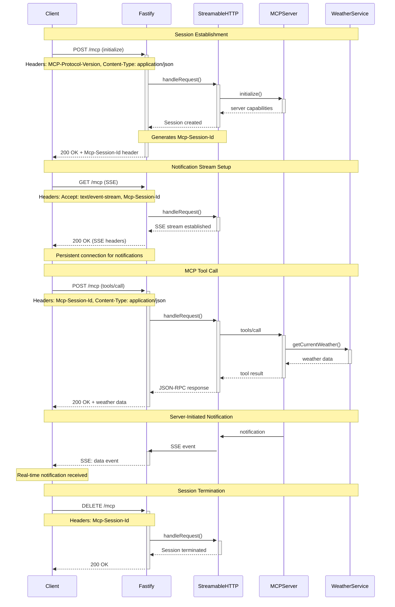

# MCP Streamable HTTP Transport Architecture

**Model Context Protocol (MCP) Streamable HTTP Transport** enables bidirectional communication between AI clients and MCP servers over standard HTTP/HTTPS protocols. This document explains the architecture, implementation patterns, and design decisions behind the dual-endpoint approach.

## 🏗️ Overview

The MCP Streamable HTTP transport solves the fundamental challenge of enabling **full-duplex communication over HTTP**, which is inherently a request-response protocol. It achieves this through a sophisticated **POST + GET (SSE) architecture** that provides:

- **Client-to-Server** requests via POST endpoints
- **Server-to-Client** notifications via Server-Sent Events (SSE)
- **Session management** with persistent state
- **Resumable connections** with graceful error recovery

## 📡 Transport Architecture

### Core Endpoints

| Method | Endpoint | Purpose | Communication Direction |
|--------|----------|---------|------------------------|
| **POST** | `/mcp` | MCP requests, tool calls, resource requests | Client → Server |
| **GET** | `/mcp` | SSE stream for notifications | Server → Client |
| **DELETE** | `/mcp` | Session termination | Client → Server |

### Request Flow Diagram



## 🔄 Communication Patterns

### 1. Session Management

#### Session Lifecycle
```typescript
// 1. Session Creation (POST /mcp)
const sessionId = randomUUID();
transports[sessionId] = new StreamableHTTPServerTransport({
  sessionIdGenerator: () => sessionId,
  onsessioninitialized: (id) => {
    console.log(`Session ${id} initialized`);
  }
});

// 2. Session Usage (subsequent requests)
const transport = transports[sessionId]; // Reuse existing

// 3. Session Cleanup (DELETE /mcp or connection close)
delete transports[sessionId];
transport.close();
```

#### Headers in Session Management
```http
# Initial Request
POST /mcp HTTP/1.1
Content-Type: application/json
MCP-Protocol-Version: 2025-06-18

# Server Response with Session
HTTP/1.1 200 OK
Mcp-Session-Id: 550e8400-e29b-41d4-a716-446655440000
Content-Type: application/json

# Subsequent Requests
POST /mcp HTTP/1.1
Content-Type: application/json
Mcp-Session-Id: 550e8400-e29b-41d4-a716-446655440000
```

### 2. Bidirectional Communication

#### Client-to-Server (POST)
```typescript
// Tool calls, resource requests, prompt requests
app.post('/mcp', async (req, res) => {
  const sessionId = req.headers['mcp-session-id'];
  const transport = transports[sessionId];
  
  // Process MCP request
  await transport.handleRequest(req, res, req.body);
});
```

#### Server-to-Client (SSE)
```typescript
// Real-time notifications
app.get('/mcp', async (req, res) => {
  const sessionId = req.headers['mcp-session-id'];
  const transport = transports[sessionId];
  
  // Establish SSE stream
  res.setHeader('Content-Type', 'text/event-stream');
  res.setHeader('Cache-Control', 'no-cache');
  res.setHeader('Connection', 'keep-alive');
  
  await transport.handleRequest(req, res);
});
```

### 3. Error Handling & Resilience

#### Connection Recovery
```typescript
// Resumable SSE with Last-Event-ID
app.get('/mcp', async (req, res) => {
  const lastEventId = req.headers['last-event-id'];
  const transport = transports[sessionId];
  
  if (lastEventId && transport.supportsResumption()) {
    // Resume from last known event
    await transport.resumeFrom(lastEventId);
  }
});
```

#### Circuit Breaker Pattern
```typescript
// Graceful degradation
if (!transport || transport.isClosed()) {
  return res.status(400).json({
    jsonrpc: '2.0',
    error: {
      code: -32000,
      message: 'Session expired or invalid'
    },
    id: null
  });
}
```

## ⚙️ Implementation Modes

### Stateful Mode (Recommended)
```typescript
const transports: { [sessionId: string]: StreamableHTTPServerTransport } = {};

// Maintain session across requests
app.post('/mcp', async (req, res) => {
  const sessionId = req.headers['mcp-session-id'];
  let transport = transports[sessionId];
  
  if (!transport && isInitializeRequest(req.body)) {
    transport = new StreamableHTTPServerTransport({
      sessionIdGenerator: () => randomUUID(),
      onsessioninitialized: (id) => {
        transports[id] = transport;
      }
    });
    await server.connect(transport);
  }
  
  await transport.handleRequest(req, res, req.body);
});
```

**Benefits:**
- ✅ Session continuity
- ✅ Real-time notifications 
- ✅ Resumable connections
- ✅ Efficient resource usage

### Stateless Mode
```typescript
// New transport per request
app.post('/mcp', async (req, res) => {
  const server = getServer();
  const transport = new StreamableHTTPServerTransport({
    sessionIdGenerator: undefined, // Disable sessions
  });
  
  await server.connect(transport);
  await transport.handleRequest(req, res, req.body);
  
  // Cleanup immediately
  transport.close();
  server.close();
});

// SSE not supported in stateless mode
app.get('/mcp', (req, res) => {
  res.status(405).json({
    jsonrpc: '2.0',
    error: { code: -32000, message: 'Method not allowed' },
    id: null
  });
});
```

**Benefits:**
- ✅ Simpler deployment
- ✅ No memory leaks
- ✅ Stateless scaling
- ❌ No real-time notifications
- ❌ Higher latency per request

## 🔒 Security Considerations

### DNS Rebinding Protection
```typescript
const transport = new StreamableHTTPServerTransport({
  sessionIdGenerator: () => randomUUID(),
  enableDnsRebindingProtection: true,
  allowedHosts: ['127.0.0.1', 'localhost'],
  allowedOrigins: ['https://yourdomain.com']
});
```

### CORS Configuration
```typescript
import cors from 'cors';

app.use(cors({
  origin: ['https://your-domain.com'],
  exposedHeaders: ['Mcp-Session-Id'], // Critical for browser clients
  allowedHeaders: ['Content-Type', 'mcp-session-id', 'last-event-id'],
  credentials: true
}));
```

### Authentication Integration
```typescript
app.post('/mcp', async (req, res) => {
  // Validate session before processing
  const sessionId = req.headers['mcp-session-id'];
  if (!isValidSession(sessionId)) {
    return res.status(401).json({
      jsonrpc: '2.0',
      error: { code: -32001, message: 'Unauthorized' },
      id: null
    });
  }
  
  // Process authenticated request
  const transport = transports[sessionId];
  await transport.handleRequest(req, res, req.body);
});
```

## 📊 Message Queue System

### In-Memory Buffering
```typescript
class SessionManager {
  private clients: Map<string, ClientConnection> = new Map();
  private messageQueues: Map<string, unknown[]> = new Map();

  // Queue messages for offline clients
  queueMessage(sessionId: string, message: unknown) {
    if (!this.clients.has(sessionId)) {
      let queue = this.messageQueues.get(sessionId) || [];
      queue.push(message);
      this.messageQueues.set(sessionId, queue);
    } else {
      // Send immediately to connected client
      this.sendMessage(sessionId, message);
    }
  }

  // Deliver queued messages on reconnect
  deliverQueuedMessages(sessionId: string) {
    const queue = this.messageQueues.get(sessionId) || [];
    for (const message of queue) {
      this.sendMessage(sessionId, message);
    }
    this.messageQueues.delete(sessionId); // Clear queue
  }
}
```

### Resumable SSE
```http
# Client reconnects with last known event
GET /mcp HTTP/1.1
Accept: text/event-stream
Last-Event-ID: 1234567890
Mcp-Session-Id: 550e8400-e29b-41d4-a716-446655440000

# Server resumes from that point
HTTP/1.1 200 OK
Content-Type: text/event-stream

id: 1234567891
data: {"jsonrpc":"2.0","method":"notifications/resources/list_changed"}

id: 1234567892
data: {"jsonrpc":"2.0","method":"notifications/tools/list_changed"}
```

## 🚀 Production Considerations

### Load Balancing
```typescript
// Sticky sessions required for stateful mode
// Use session affinity or distributed session store

// Redis-based session store
import Redis from 'redis';
const redis = Redis.createClient();

const getTransport = async (sessionId: string) => {
  const transportData = await redis.get(`session:${sessionId}`);
  return transportData ? deserializeTransport(transportData) : null;
};

const storeTransport = async (sessionId: string, transport: any) => {
  await redis.setex(`session:${sessionId}`, 3600, serializeTransport(transport));
};
```

### Health Monitoring
```typescript
app.get('/health', (req, res) => {
  const activeConnections = Object.keys(transports).length;
  const memoryUsage = process.memoryUsage();
  
  res.json({
    status: 'healthy',
    timestamp: new Date().toISOString(),
    transport: 'streamable-http',
    activeSessions: activeConnections,
    memoryUsage: memoryUsage.heapUsed,
    protocolVersion: '2025-06-18'
  });
});
```

### Graceful Shutdown
```typescript
process.on('SIGTERM', async () => {
  console.log('Shutting down gracefully...');
  
  // Close all active transports
  for (const transport of Object.values(transports)) {
    await transport.close();
  }
  
  // Close server
  await server.close();
  
  // Exit cleanly
  process.exit(0);
});
```

## 🔧 Configuration Examples

### Development Setup
```typescript
const transport = new StreamableHTTPServerTransport({
  sessionIdGenerator: () => randomUUID(),
  enableDnsRebindingProtection: false, // Disabled for local dev
  onsessioninitialized: (sessionId) => {
    console.log(`Development session ${sessionId} created`);
    transports[sessionId] = transport;
  }
});
```

### Production Setup
```typescript
const transport = new StreamableHTTPServerTransport({
  sessionIdGenerator: () => randomUUID(),
  enableDnsRebindingProtection: true,
  allowedHosts: process.env.ALLOWED_HOSTS?.split(',') || ['your-domain.com'],
  allowedOrigins: process.env.ALLOWED_ORIGINS?.split(',') || ['https://your-domain.com'],
  onsessioninitialized: async (sessionId) => {
    // Store in distributed cache
    await storeSession(sessionId, transport);
  }
});
```

## 🔄 Backwards Compatibility

### SSE Fallback Support
```typescript
// Support both modern Streamable HTTP and legacy SSE
app.all('/mcp', async (req, res) => {
  if (supportsStreamableHTTP(req)) {
    // Use modern Streamable HTTP transport
    await handleStreamableHTTP(req, res);
  } else {
    // Fallback to legacy SSE transport
    await handleLegacySSE(req, res);
  }
});

const supportsStreamableHTTP = (req: Request): boolean => {
  const protocolVersion = req.headers['mcp-protocol-version'];
  return protocolVersion === '2025-06-18' || protocolVersion === '2025-03-26';
};
```

## 📈 Performance Optimization

### Connection Pooling
```typescript
// Reuse transport instances efficiently
const transportPool = new Map<string, StreamableHTTPServerTransport>();
const maxPoolSize = parseInt(process.env.MAX_POOL_SIZE || '100');

const getOrCreateTransport = (sessionId: string) => {
  if (transportPool.size >= maxPoolSize) {
    // Implement LRU eviction
    evictLeastRecentlyUsed();
  }
  
  let transport = transportPool.get(sessionId);
  if (!transport) {
    transport = createNewTransport(sessionId);
    transportPool.set(sessionId, transport);
  }
  
  return transport;
};
```

### Memory Management
```typescript
// Automatic cleanup for idle sessions
setInterval(() => {
  const now = Date.now();
  const maxIdleTime = 30 * 60 * 1000; // 30 minutes
  
  for (const [sessionId, transport] of Object.entries(transports)) {
    if (now - transport.lastActivity > maxIdleTime) {
      console.log(`Cleaning up idle session: ${sessionId}`);
      transport.close();
      delete transports[sessionId];
    }
  }
}, 5 * 60 * 1000); // Check every 5 minutes
```

## 🏆 Best Practices

### 1. **Always Use Session Management**
- Maintain state across requests for optimal performance
- Implement session timeout and cleanup
- Use distributed storage for multi-instance deployments

### 2. **Handle Connection Interruptions**
- Support resumable SSE with `Last-Event-ID`
- Queue messages for temporarily disconnected clients
- Provide clear error messages for expired sessions

### 3. **Implement Proper Security**
- Enable DNS rebinding protection in production
- Validate all session IDs and origins
- Use HTTPS in production environments

### 4. **Monitor Performance**
- Track active session counts
- Monitor memory usage and cleanup
- Implement health checks and metrics

### 5. **Plan for Scale**
- Use sticky sessions or distributed session storage
- Implement connection limits and rate limiting
- Consider stateless mode for simple use cases

---

This architecture provides a robust foundation for **production-grade MCP servers** that can handle both **local development** (with tools like Cline) and **remote production deployments** seamlessly, all while maintaining the real-time capabilities expected by modern AI applications.
