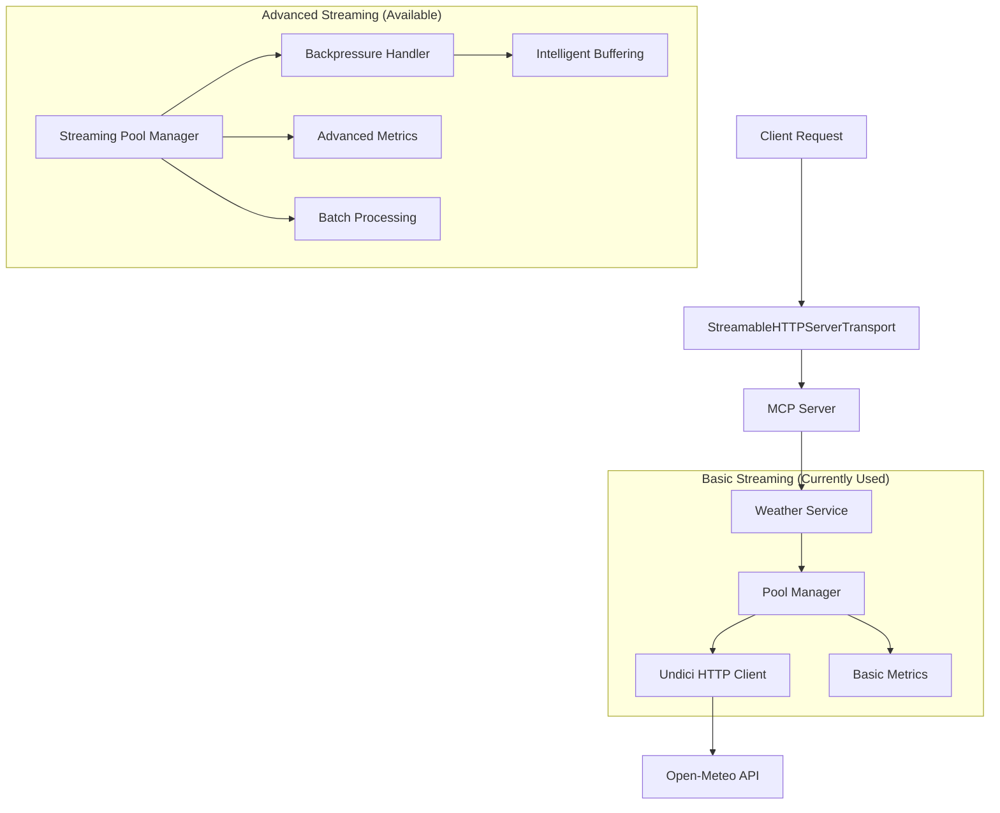

# Streaming Architecture Guide

## Table of Contents

1. [Overview](#overview)
2. [Architecture Layers](#architecture-layers)
3. [Basic Streaming (Semi-Automatic)](#1-basic-streaming-semi-automatic)
   - [Current Implementation](#current-implementation)
   - [Components](#components)
   - [Configuration](#configuration)
   - [Features](#features)
   - [Usage Example](#usage-example)
4. [Advanced Streaming (Manual Invocation)](#2-advanced-streaming-manual-invocation)
   - [Available but Not Currently Used](#available-but-not-currently-used)
   - [Components](#components-1)
   - [Advanced Features](#advanced-features)
   - [Configuration](#configuration-1)
5. [When to Use Each System](#3-when-to-use-each-system)
   - [Use Basic Streaming When](#use-basic-streaming-when)
   - [Use Advanced Streaming When](#use-advanced-streaming-when)
6. [Migration to Advanced Streaming](#4-migration-to-advanced-streaming)
   - [Current Code (Basic Streaming)](#current-code-basic-streaming)
   - [Advanced Streaming Alternative](#advanced-streaming-alternative)
   - [Batch Processing Example](#batch-processing-example)
7. [Performance Characteristics](#5-performance-characteristics)
   - [Basic Streaming Performance](#basic-streaming-performance)
   - [Advanced Streaming Performance](#advanced-streaming-performance)
8. [Monitoring and Observability](#6-monitoring-and-observability)
   - [Basic Metrics](#basic-metrics)
   - [Advanced Metrics](#advanced-metrics)
9. [Configuration Reference](#7-configuration-reference)
   - [Environment Variables](#environment-variables)
   - [Code Configuration](#code-configuration)
10. [Best Practices](#8-best-practices)
    - [Basic Streaming](#basic-streaming)
    - [Advanced Streaming](#advanced-streaming)
11. [Troubleshooting](#9-troubleshooting)
    - [Common Issues](#common-issues)
12. [Future Roadmap](#10-future-roadmap)
    - [Planned Enhancements](#planned-enhancements)

## Overview

The MCP Weather Server implements a sophisticated two-tier streaming architecture designed for high-performance, scalable weather data processing. This document explains both the basic streaming capabilities currently in use and the advanced streaming features available for specialized use cases.

## Architecture Layers



## 1. Basic Streaming (Semi-Automatic)

### Current Implementation

The basic streaming system is **currently active** and provides foundational streaming capabilities:

#### Components

1. **StreamableHTTPServerTransport**
   ```typescript
   // Automatically used when MCP_TRANSPORT=http
   const transport = new StreamableHTTPServerTransport({
     sessionIdGenerator: () => randomUUID(),
     enableDnsRebindingProtection: false
   });
   ```

2. **Pool Manager** (`src/undici-resilience/http/pool-manager.ts`)
   ```typescript
   // Currently used in weather-service.ts
   const apiResponse = await poolManager.request<WeatherAPIResponse>(
     'weather',
     {
       path: `/v1/forecast?latitude=${lat}&longitude=${lon}`,
       method: 'GET'
     },
     `getCurrentWeather-${city}`
   );
   ```

3. **Basic Metrics Collection**
   - Connection reuse tracking
   - Response time monitoring
   - Error rate calculation
   - Resource utilization

#### Configuration

```typescript
// Environment variables
MCP_TRANSPORT=http              // Enables HTTP streaming transport
MAX_CONCURRENT_STREAMS=10       // Parallel request limit
STREAM_TIMEOUT=60000           // Request timeout (ms)
ENABLE_METRICS=true            // Metrics collection

// Pool configuration
{
  connections: 50,              // Max connections per pool
  pipelining: 10,              // HTTP pipelining factor
  keepAliveTimeout: 60000,     // Connection keep-alive
  bodyTimeout: 300000,         // Response body timeout
  headersTimeout: 30000        // Headers timeout
}
```

#### Features

- ✅ **Automatic connection pooling** - Efficient connection reuse
- ✅ **Request pipelining** - Multiple requests per connection
- ✅ **Basic metrics** - Performance and error tracking
- ✅ **Configurable timeouts** - Request and connection timeouts
- ✅ **Circuit breaker** - Automatic failure detection
- ✅ **Retry logic** - Exponential backoff with jitter

#### Usage Example

```typescript
// This is automatically used in WeatherService
export class WeatherService {
  async getCurrentWeather(city: string): Promise<WeatherData> {
    // Automatic streaming via pool manager
    const response = await poolManager.request<WeatherAPIResponse>(
      'weather',
      { path: '/v1/forecast?...', method: 'GET' },
      `getCurrentWeather-${city}`
    );
    return this.processResponse(response);
  }
}
```

## 2. Advanced Streaming (Manual Invocation)

### Available but Not Currently Used

The advanced streaming system provides sophisticated features for high-throughput scenarios:

#### Components

1. **StreamingPoolManager** (`src/undici-resilience/streaming/streaming-pool-manager.ts`)
   ```typescript
   // Available for manual use
   const response = await streamingPoolManagerInstance.executeStreamRequest(
     'weather-pool',
     {
       path: '/v1/forecast',
       method: 'GET',
       headers: { 'User-Agent': 'MCP-Weather/1.0' }
     },
     'weather-context'
   );
   ```

2. **BackpressureHandler** (`src/undici-resilience/streaming/backpressure-handler.ts`)
   ```typescript
   // Intelligent buffer management
   const handler = new BackpressureHandler({
     highWaterMark: 1024 * 1024,    // 1MB buffer limit
     lowWaterMark: 512 * 1024,      // 512KB resume threshold
     maxBufferSize: 10 * 1024 * 1024, // 10MB max buffer
     timeout: 30000,                 // 30s backpressure timeout
     adaptive: true                  // Dynamic thresholds
   }, dataProcessor);
   ```

3. **StreamingMetricsCollector** (`src/undici-resilience/streaming/streaming-metrics.ts`)
   ```typescript
   // Comprehensive monitoring
   const metrics = streamingMetricsCollector.getMetrics();
   const health = streamingMetricsCollector.getHealthStatus();
   ```

#### Advanced Features

- 🔄 **Backpressure Management** - Prevents memory exhaustion
- 📊 **Real-time Health Monitoring** - Comprehensive performance tracking
- 🔄 **Adaptive Flow Control** - Dynamic buffer management
- ⚡ **Batch Processing** - Parallel request optimization
- 🚨 **Advanced Alerting** - Performance threshold monitoring
- 📈 **Detailed Analytics** - P95/P99 latency tracking

#### Configuration

```typescript
const streamingConfig = {
  connections: 50,
  maxConcurrentStreams: 10,
  streamTimeout: 60000,
  enableMetrics: true,
  
  backpressure: {
    highWaterMark: 1024 * 1024,      // 1MB
    lowWaterMark: 512 * 1024,        // 512KB
    maxBufferSize: 10 * 1024 * 1024, // 10MB
    timeout: 30000,                   // 30s
    adaptive: true                    // Dynamic adjustment
  }
};
```

## 3. When to Use Each System

### Use Basic Streaming When:
- ✅ Standard weather API requests (current usage)
- ✅ Low to moderate traffic (< 100 RPS)
- ✅ Simple request/response patterns
- ✅ Standard latency requirements (< 2s)

### Use Advanced Streaming When:
- 🚀 High-volume batch operations (> 1000 RPS)
- 🚀 AI agent workflows requiring streaming responses
- 🚀 Real-time data processing pipelines
- 🚀 Memory-constrained environments
- 🚀 Ultra-low latency requirements (< 500ms P95)

## 4. Migration to Advanced Streaming

### Current Code (Basic Streaming)
```typescript
// In weather-service.ts
const response = await poolManager.request<WeatherAPIResponse>(
  'weather',
  { path: '/v1/forecast?...', method: 'GET' },
  `getCurrentWeather-${city}`
);
```

### Advanced Streaming Alternative
```typescript
// Migrated to advanced streaming
import { streamingPoolManagerInstance } from '../undici-resilience/streaming/streaming-pool-manager';

const response = await streamingPoolManagerInstance.executeStreamRequest(
  'weather-pool',
  {
    path: '/v1/forecast?...',
    method: 'GET',
    headers: { 'User-Agent': 'MCP-Weather/1.0' }
  },
  `weather-context-${city}`
);
```

### Batch Processing Example
```typescript
// Process multiple cities in parallel with backpressure
const requests = cities.map(city => ({
  path: `/v1/forecast?...&city=${encodeURIComponent(city)}`,
  method: 'GET' as const
}));

const results = await streamingPoolManagerInstance.executeBatchRequests(
  'weather-pool',
  requests,
  'batch-weather-forecast'
);
```

## 5. Performance Characteristics

### Basic Streaming Performance
- **Latency**: P95 < 2000ms, P99 < 5000ms
- **Throughput**: 100-500 RPS sustained
- **Memory Usage**: < 100MB per 1000 connections
- **Connection Efficiency**: 80-90% reuse rate

### Advanced Streaming Performance
- **Latency**: P95 < 500ms, P99 < 2000ms
- **Throughput**: 1000+ RPS sustained
- **Memory Usage**: < 200MB per 1000 connections (with backpressure)
- **Connection Efficiency**: 90%+ reuse rate
- **Backpressure Response**: < 100ms detection and mitigation

## 6. Monitoring and Observability

### Basic Metrics
```typescript
// Available through pool manager
const basicMetrics = {
  activeConnections: number,
  totalRequests: number,
  errorRate: number,
  averageLatency: number
};
```

### Advanced Metrics
```typescript
// Comprehensive streaming metrics
const advancedMetrics = {
  // Connection metrics
  activeConnections: number,
  connectionErrors: number,
  connectionTimeouts: number,
  
  // Performance metrics
  p95Latency: number,
  p99Latency: number,
  throughput: number, // bytes/second
  
  // Resource metrics
  memoryUsage: number,
  bufferSize: number,
  queueLength: number,
  
  // Health status
  overall: 'healthy' | 'degraded' | 'unhealthy' | 'critical'
};
```

## 7. Configuration Reference

### Environment Variables
```bash
# Transport Configuration
MCP_TRANSPORT=http                    # Enable HTTP streaming transport
HTTP_PORT=3000                       # HTTP server port

# Basic Streaming
MAX_CONCURRENT_STREAMS=10            # Parallel request limit
STREAM_TIMEOUT=60000                 # Stream timeout (ms)
ENABLE_METRICS=true                  # Enable metrics collection

# Advanced Streaming
STREAMING_HIGH_WATER_MARK=1048576    # 1MB buffer limit
STREAMING_LOW_WATER_MARK=524288      # 512KB resume threshold
STREAMING_MAX_BUFFER=10485760        # 10MB max buffer
STREAMING_TIMEOUT=30000              # 30s backpressure timeout
STREAMING_ADAPTIVE=true              # Enable adaptive backpressure
```

### Code Configuration
```typescript
// Basic streaming configuration (currently used)
const poolConfig = {
  weather: {
    origin: 'https://api.open-meteo.com',
    connections: 50,
    pipelining: 10,
    keepAliveTimeout: 60000
  }
};

// Advanced streaming configuration (available)
const streamingConfig = {
  connections: 50,
  maxConcurrentStreams: 10,
  streamTimeout: 60000,
  enableMetrics: true,
  backpressure: {
    highWaterMark: 1024 * 1024,
    lowWaterMark: 512 * 1024,
    maxBufferSize: 10 * 1024 * 1024,
    timeout: 30000,
    adaptive: true
  }
};
```

## 8. Best Practices

### Basic Streaming
1. **Monitor connection reuse rates** - Should be > 80%
2. **Set appropriate timeouts** - Balance responsiveness vs. reliability
3. **Enable metrics collection** - Essential for performance monitoring
4. **Use meaningful context strings** - Helps with debugging and tracing

### Advanced Streaming
1. **Monitor backpressure events** - Should be < 5% of total requests
2. **Tune buffer sizes** - Based on memory constraints and traffic patterns
3. **Enable adaptive backpressure** - For dynamic traffic patterns
4. **Implement health checks** - Use streaming health status for monitoring
5. **Batch related requests** - Improves efficiency for bulk operations

## 9. Troubleshooting

### Common Issues

#### High Latency
```typescript
// Check streaming metrics
const metrics = streamingMetricsCollector.getMetrics();
if (metrics.p95Latency > 2000) {
  // Consider enabling advanced streaming
  // or tuning connection pool settings
}
```

#### Memory Issues
```typescript
// Monitor backpressure events
const health = streamingMetricsCollector.getHealthStatus();
if (health.resources === 'unhealthy') {
  // Reduce buffer sizes or enable adaptive backpressure
}
```

#### Connection Exhaustion
```typescript
// Check connection metrics
if (metrics.activeConnections > 80% of max) {
  // Increase connection pool size
  // or implement connection throttling
}
```

## 10. Future Roadmap

### Planned Enhancements
- **WebSocket Streaming**: Real-time bidirectional communication
- **Multi-region Pools**: Geographic load distribution
- **Predictive Backpressure**: ML-based flow control
- **Stream Multiplexing**: Single connection, multiple streams
- **Edge Caching**: CDN integration for static responses

---

**Last Updated**: September 16, 2025  
**Version**: 1.0.0  
**Status**: Production Ready
