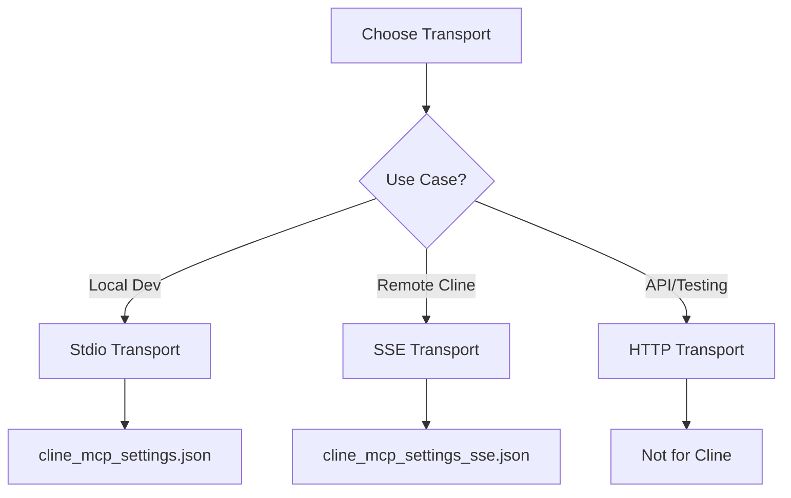

# MCP Agent Configuration Guide

This directory contains configuration files and documentation for integrating the MCP Weather Server with AI agents like Cline.

## 📚 Table of Contents

- [MCP Agent Configuration Guide](#mcp-agent-configuration-guide)
  - [📚 Table of Contents](#-table-of-contents)
  - [Overview](#overview)
  - [Transport Options](#transport-options)
    - [Comparison Table](#comparison-table)
  - [Configuration Files](#configuration-files)
  - [Quick Start](#quick-start)
    - [Local Development (Stdio)](#local-development-stdio)
    - [Remote Access (SSE)](#remote-access-sse)
    - [Production API (HTTP)](#production-api-http)
  - [Transport Decision Matrix](#transport-decision-matrix)
  - [Configuration Options](#configuration-options)
    - [Common Settings](#common-settings)
    - [Stdio-Specific](#stdio-specific)
    - [SSE-Specific](#sse-specific)
  - [Available Tools](#available-tools)
    - [1. `get_current_weather`](#1-get_current_weather)
    - [2. `get_weather_forecast`](#2-get_weather_forecast)
    - [3. `retrieve_weather_context`](#3-retrieve_weather_context)
  - [Installation Steps](#installation-steps)
    - [Step 1: Choose Transport](#step-1-choose-transport)
    - [Step 2: Configure Server](#step-2-configure-server)
      - [For Stdio (Local):](#for-stdio-local)
      - [For SSE (Remote):](#for-sse-remote)
    - [Step 3: Configure Cline](#step-3-configure-cline)
  - [Testing Your Configuration](#testing-your-configuration)
    - [Quick Test Commands](#quick-test-commands)
    - [Test in Cline](#test-in-cline)
  - [Troubleshooting](#troubleshooting)
    - [Common Issues \& Solutions](#common-issues--solutions)
    - [Debug Commands](#debug-commands)
  - [Performance Considerations](#performance-considerations)
    - [Optimization Tips](#optimization-tips)
  - [Security Notes](#security-notes)
    - [Security by Transport](#security-by-transport)
    - [Best Practices](#best-practices)
  - [Example Usage](#example-usage)
    - [In Cline Chat](#in-cline-chat)
    - [Programmatic Usage (Python)](#programmatic-usage-python)
  - [Support](#support)
    - [Documentation](#documentation)
    - [Resources](#resources)
    - [Quick Links](#quick-links)
  - [Summary](#summary)

## Overview

The MCP Weather Server supports **three transport protocols** to maximize compatibility across different deployment scenarios:

| Transport | Best For | Port | Config File |
|-----------|----------|------|-------------|
| **Stdio** | Local Cline development | None | `cline_mcp_settings.json` |
| **SSE** | Remote Cline access | 8081 | `cline_mcp_settings_sse.json` |
| **HTTP** | Production APIs (not Cline) | 8080 | `cline_mcp_settings_http.json` |

## Transport Options

### Comparison Table

| Feature | Stdio | SSE | HTTP |
|---------|-------|-----|------|
| **Cline Support** | ✅ Yes | ✅ Yes | ❌ No |
| **Remote Access** | ❌ No | ✅ Yes | ✅ Yes |
| **Latency** | Best (~10ms) | Good (~30ms) | Good (~50ms) |
| **Complexity** | Simple | Medium | Complex |
| **Session Mgmt** | No | No | Yes |
| **Best Use Case** | Local Dev | Remote Cline | APIs/ LangChain/LangGraphCrewAI/AutoGen/OpenAI |

## Configuration Files

| File | Transport | Purpose | Cline Compatible |
|------|-----------|---------|------------------|
| [`cline_mcp_settings.json`](cline_mcp_settings.json) | Stdio | Local development | ✅ Yes |
| [`cline_mcp_settings_sse.json`](cline_mcp_settings_sse.json) | SSE | Remote access | ✅ Yes |
| [`cline_mcp_settings_http.json`](cline_mcp_settings_http.json) | HTTP | Documentation only | ❌ No |
| [`CLINE-INTEGRATION.md`](CLINE-INTEGRATION.md) | All | Detailed guide | 📚 Docs |

## Quick Start

### Local Development (Stdio)

**Best for:** VS Code with Cline on same machine

1. **Copy configuration:**
   ```json
   {
     "mcpServers": {
       "weather": {
         "command": "npx",
         "args": ["tsx", "src/server.ts"],
         "cwd": "/path/to/mcp-weather-server"
       }
     }
   }
   ```

2. **Update path** in `cwd` to your project location
3. **No server start needed** - Cline spawns the process

### Remote Access (SSE)

**Best for:** Accessing MCP server from different machine

1. **Start SSE server:**
   ```bash
   npm run sse
   # or
   MCP_TRANSPORT=sse npm run dev
   ```

2. **Copy configuration:**
   ```json
   {
     "mcpServers": {
       "weather-remote": {
         "url": "http://your-server-ip:8081/sse",
         "transport": { "type": "sse" }
       }
     }
   }
   ```

3. **Update URL** with your server's IP address

### Production API (HTTP)

**⚠️ Note:** HTTP transport is NOT supported by Cline. Use for:
- MCP Inspector testing
-  LangChain/LangGraphCrewAI/AutoGen/OpenAI integrations
- Custom applications
- API testing

Start with: `npm run http`

## Transport Decision Matrix

| Your Need | Recommended Transport | Config File | Start Command |
|-----------|----------------------|-------------|---------------|
| Local Cline in VS Code | **Stdio** | `cline_mcp_settings.json` | (auto-spawned) |
| Remote Cline access | **SSE** | `cline_mcp_settings_sse.json` | `npm run sse` |
| Docker + Cline | **SSE** | `cline_mcp_settings_sse.json` | `npm run sse` |
| MCP Inspector testing | **HTTP** | N/A | `npm run http` |
|  LangChain/LangGraphCrewAI/AutoGen/OpenAI/API | **HTTP** | N/A | `npm run http` |
| CLI testing | **Stdio** | N/A | `npm run stdio` |

## Configuration Options

### Common Settings

| Setting | Description | Default |
|---------|-------------|---------|
| `autoApprove` | Tools that don't require confirmation | All weather tools |
| `alwaysAllow` | Always allowed without approval | `tools/list` |
| `disabled` | Whether server is disabled | `false` |
| `timeout` | Request timeout (ms) | `30000` |

### Stdio-Specific

| Setting | Description | Example |
|---------|-------------|---------|
| `command` | Command to execute | `npx` |
| `args` | Command arguments | `["tsx", "src/server.ts"]` |
| `cwd` | Working directory | `/path/to/server` |
| `env` | Environment variables | `{"LOG_LEVEL": "debug"}` |

### SSE-Specific

| Setting | Description | Example |
|---------|-------------|---------|
| `url` | SSE endpoint URL | `http://192.168.1.100:8081/sse` |
| `transport.type` | Must be "sse" | `"sse"` |

## Available Tools

All configurations auto-approve these three tools:

### 1. `get_current_weather`
- **Purpose:** Get current weather conditions
- **Parameters:** `city` (string)
- **Example:** "What's the weather in London?"

### 2. `get_weather_forecast`
- **Purpose:** Get multi-day forecast
- **Parameters:** `city` (string), `days` (1-7)
- **Example:** "Show me a 5-day forecast for Tokyo"

### 3. `retrieve_weather_context`
- **Purpose:** Extract weather context from query
- **Parameters:** `query` (string)
- **Example:** "Is it good weather for hiking in Paris?"

## Installation Steps

### Step 1: Choose Transport



### Step 2: Configure Server

#### For Stdio (Local):
```bash
# No server start needed
# Cline spawns the process
```

#### For SSE (Remote):
```bash
# Start SSE server
npm run sse

# Or with custom port
MCP_SSE_PORT=3001 npm run sse
```

### Step 3: Configure Cline

1. Open VS Code
2. Access Cline MCP settings
3. Copy appropriate configuration
4. Update paths/URLs
5. Save and restart Cline

## Testing Your Configuration

### Quick Test Commands

| Transport | Health Check | Expected Response |
|-----------|--------------|-------------------|
| Stdio | N/A (process-based) | Tool execution works |
| SSE | `curl http://localhost:8081/health` | `{"status":"healthy","transport":"sse"}` |
| HTTP | `curl http://localhost:8080/health` | `{"status":"healthy","transport":"http"}` |

### Test in Cline

Ask these questions to verify:
1. "What's the weather in London?"
2. "Give me a 3-day forecast for Tokyo"
3. "Is it good weather for outdoor activities in Paris?"

## Troubleshooting

### Common Issues & Solutions

| Problem | Likely Cause | Solution |
|---------|--------------|----------|
| **Cline can't connect (local)** | Wrong path | Check `cwd` in config |
| **Cline can't connect (remote)** | SSE server not running | Run `npm run sse` |
| **"Transport not supported"** | Using HTTP with Cline | Switch to SSE or stdio |
| **Timeout errors** | Network latency | Increase `timeout` value |
| **No tools available** | Server startup failed | Check server logs |
| **Port in use** | Another service on port | Change `MCP_SSE_PORT` |

### Debug Commands

```bash
# Check if server running
ps aux | grep tsx

# Test SSE endpoint
curl -N http://localhost:8081/sse

# View detailed logs
MCP_TRANSPORT=sse LOG_LEVEL=debug npm run dev

# Check port availability
lsof -i :8081
```

## Performance Considerations

| Transport | Latency | Throughput | Memory | CPU |
|-----------|---------|------------|---------|-----|
| **Stdio** | ~10ms | High | Low | Low |
| **SSE** | ~30ms | Medium | Medium | Medium |
| **HTTP** | ~50ms | High | High | Medium |

### Optimization Tips

1. **Stdio:** Best performance, use for local development
2. **SSE:** Good for remote, keep connection alive
3. **HTTP:** Best for high-volume production APIs

## Security Notes

### Security by Transport

| Transport | Security Level | Recommendations |
|-----------|---------------|-----------------|
| **Stdio** | ⭐⭐⭐⭐⭐ Highest | No network exposure |
| **SSE** | ⭐⭐⭐ Medium | Use firewall, consider HTTPS |
| **HTTP** | ⭐⭐⭐ Medium | Add authentication, use HTTPS |

### Best Practices

1. **Local Development:** Use stdio (most secure)
2. **Remote Access:** 
   - Use SSE on trusted networks only
   - Implement firewall rules for port 8081
   - Consider VPN for production
3. **Production:**
   - Use HTTPS/WSS
   - Add authentication
   - Monitor access logs
   - Rate limit requests

## Example Usage

### In Cline Chat

```
User: "What's the weather in London?"
Cline: [Calls get_current_weather]
Result: "London: 15.2°C, partly cloudy, humidity 65%"

User: "I need a 3-day forecast for Tokyo"
Cline: [Calls get_weather_forecast with days=3]
Result: "Tokyo 3-day forecast: ..."

User: "Good weather for hiking in Paris?"
Cline: [Calls retrieve_weather_context]
Result: "Paris weather is suitable for outdoor activities..."
```

### Programmatic Usage (Python)

```python
# For HTTP transport (not Cline)
import requests

response = requests.post("http://localhost:8080/mcp", json={
    "jsonrpc": "2.0",
    "method": "tools/call",
    "params": {
        "name": "get_current_weather",
        "arguments": {"city": "London"}
    },
    "id": 1
})
```

## Support

### Documentation
- [CLINE-INTEGRATION.md](CLINE-INTEGRATION.md) - Detailed Cline setup
- [Main README](../../README.md) - Project overview
- [TRANSPORT-STRATEGY.md](../TRANSPORT-STRATEGY.md) - Transport architecture
- [MCP-INSPECTOR-GUIDE.md](../MCP-INSPECTOR-GUIDE.md) - Testing guide

### Resources
- **MCP Specification:** [modelcontextprotocol.io](https://modelcontextprotocol.io)
- **Cline Extension:** [VS Code Marketplace](https://marketplace.visualstudio.com/items?itemName=cline)
- **GitHub Issues:** [Report bugs](https://github.com/kumaran-is/mcp-weather-server/issues)

### Quick Links
- [Configuration Files](.)
- [Testing Guide](../TESTING.md)
- [Docker Setup](../DOCKER-DEPLOYMENT.md)

---

## Summary

The MCP Weather Server provides three transports for maximum flexibility:

1. **Stdio** - Best for local Cline development (zero config)
2. **SSE** - Best for remote Cline access (simple protocol)
3. **HTTP** - Best for production APIs (not for Cline)

Choose the right transport for your use case and follow the configuration steps above.

---

**Last Updated:** September 2025  
**MCP Version:** 2025-06-18  
**Supported Transports:** Stdio, SSE, HTTP  
**Cline Compatible:** Stdio ✅, SSE ✅, HTTP ❌