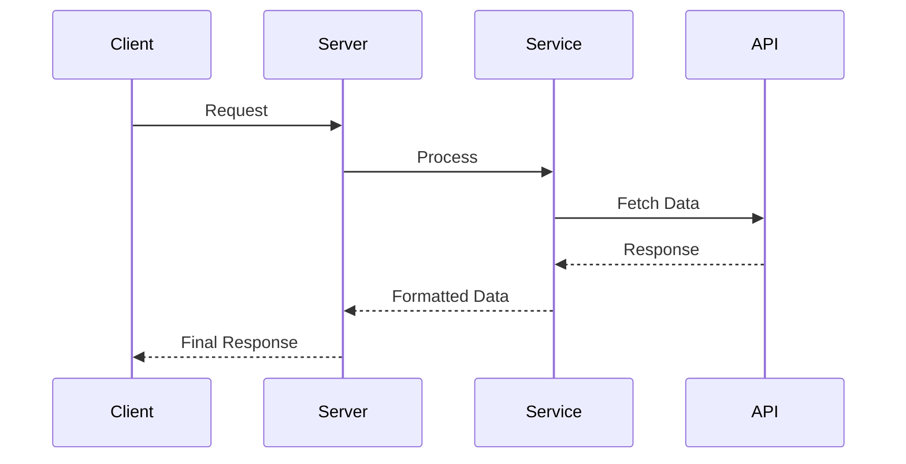

# MCP Weather Server - System Patterns

## 🏗️ **System Architecture**

### **Core Architecture Pattern**
The MCP Weather Server follows a **modular, layered architecture** designed for maintainability, testability, and scalability:

```
┌─────────────────────────────────────────────────────────────┐
│                    CLIENT LAYER                             │
│  ┌─────────────────────────────────────────────────────┐    │
│  │  AI Assistants (Cline, Claude)                    │    │
│  │  HTTP Clients (Web Apps, APIs)                    │    │
│  └─────────────────────────────────────────────────────┘    │
└─────────────────────────────────────────────────────────────┘
                                │
┌─────────────────────────────────────────────────────────────┐
│                 TRANSPORT LAYER                              │
│  ┌─────────────────────────────────────────────────────┐    │
│  │  StdioTransport: Local AI assistant communication   │    │
│  │  HTTPTransport: Remote client communication         │    │
│  │  WebSocketTransport: Real-time communication        │    │
│  └─────────────────────────────────────────────────────┘    │
└─────────────────────────────────────────────────────────────┘
                                │
┌─────────────────────────────────────────────────────────────┐
│                 PROTOCOL LAYER                               │
│  ┌─────────────────────────────────────────────────────┐    │
│  │  MCP Server: Protocol implementation & lifecycle    │    │
│  │  Request Handlers: Tool execution & validation      │    │
│  │  Response Formatters: MCP-compliant output          │    │
│  └─────────────────────────────────────────────────────┘    │
└─────────────────────────────────────────────────────────────┘
                                │
┌─────────────────────────────────────────────────────────────┐
│                 SERVICE LAYER                               │
│  ┌─────────────────────────────────────────────────────┐    │
│  │  WeatherService: Open-Meteo API integration         │    │
│  │  GeocodingService: City coordinate resolution       │    │
│  │  CacheService: Response caching & optimization      │    │
│  └─────────────────────────────────────────────────────┘    │
└─────────────────────────────────────────────────────────────┘
                                │
┌─────────────────────────────────────────────────────────────┐
│                 INFRASTRUCTURE LAYER                        │
│  ┌─────────────────────────────────────────────────────┐    │
│  │  Configuration: Environment-based config           │    │
│  │  Logging: Structured logging with Pino             │    │
│  │  Error Handling: Comprehensive error management    │    │
│  │  Health Checks: System monitoring & diagnostics    │    │
│  └─────────────────────────────────────────────────────┘    │
└─────────────────────────────────────────────────────────────┘
```

## 🎯 **Key Design Patterns**

### **1. Dependency Injection Pattern**
```typescript
// Service instantiation with dependency injection
export class WeatherMCPServer {
  constructor(
    private weatherService: WeatherService = new WeatherService(),
    private config: ConfigManager = ConfigManager.getInstance()
  ) {}
}
```
**Benefits:**
- Testable components with mock dependencies
- Loose coupling between services
- Easy configuration and service swapping

### **2. Factory Pattern for Transport Selection**
```typescript
// Transport factory based on configuration
const transport = config.transport.type === 'http'
  ? new HTTPTransport(mcpServer)
  : new StdioTransport();
```
**Benefits:**
- Runtime transport selection
- Easy addition of new transport types
- Configuration-driven behavior

### **3. Strategy Pattern for Tool Execution**
```typescript
// Tool execution strategy pattern
const toolStrategies = {
  'get_current_weather': handleCurrentWeather,
  'get_weather_forecast': handleForecast,
  'retrieve_weather_context': handleContextRetrieval
};
```
**Benefits:**
- Extensible tool system
- Clean separation of tool logic
- Easy testing of individual tools

### **4. Observer Pattern for Logging**
```typescript
// Centralized logging observer
export class Logger {
  private loggers: LogObserver[] = [];

  log(level: LogLevel, message: string, meta?: any) {
    this.loggers.forEach(logger => logger.notify(level, message, meta));
  }
}
```
**Benefits:**
- Multiple logging outputs (console, file, remote)
- Extensible logging system
- Consistent log formatting

## 🔧 **Component Design Patterns**

### **Weather Service Pattern**
```typescript
export class WeatherService {
  async getCurrentWeather(city: string): Promise<WeatherData> {
    // 1. Input validation
    // 2. Geocoding (city → coordinates)
    // 3. API call with retry logic
    // 4. Data transformation
    // 5. Error handling
  }
}
```
**Pattern Benefits:**
- Consistent error handling across all methods
- Retry logic for network resilience
- Input validation at service boundaries
- Structured data transformation

### **MCP Handler Pattern**
```typescript
export class MCPToolHandler {
  async handle(request: MCPRequest): Promise<MCPResponse> {
    // 1. Request validation
    // 2. Authentication/Authorization
    // 3. Business logic execution
    // 4. Response formatting
    // 5. Error handling
  }
}
```
**Pattern Benefits:**
- Consistent request/response handling
- Centralized validation and error handling
- Easy testing of individual handlers
- Clear separation of concerns

### **Configuration Pattern**
```typescript
export class ConfigManager {
  private static instance: ConfigManager;

  static getInstance(): ConfigManager {
    if (!ConfigManager.instance) {
      ConfigManager.instance = new ConfigManager();
    }
    return ConfigManager.instance;
  }
}
```
**Pattern Benefits:**
- Singleton ensures consistent configuration
- Lazy loading of configuration
- Environment variable validation
- Type-safe configuration access

## 📊 **Data Flow Patterns**

### **Request Flow Pattern**
```
Client Request → Transport Layer → MCP Protocol → Service Layer → External API
                      ↓                    ↓                    ↓
                 Validation         Tool Selection     Data Fetching
                      ↓                    ↓                    ↓
              Error Handling    Response Formatting  Data Transformation
                      ↓                    ↓                    ↓
                 Logging            Serialization       Caching
                      └──────────────────┼────────────────────┘
                                         ↓
                                   Client Response
```

### **Error Handling Pattern**
```
Error Occurs → Catch Block → Error Classification → Logging → User-Friendly Message
     ↓               ↓              ↓                    ↓             ↓
  Service      Error Type      Error Code         Structured       MCP Error
  Failure      (Network,       Assignment        Log Entry        Response
               Validation,     (400, 500, etc.)                 Formatting
               API Error)
```

### **Caching Pattern**
```
Request → Cache Check → Cache Hit? → Return Cached → Update Cache TTL
    ↓          ↓              ↓          ↓              ↓
   No       Cache Miss     API Call   Store Result   Background
   Cache    → API Call    → Process   → Return Data   → Cleanup
```

## 🔄 **Communication Patterns**

### **MCP Protocol Communication**
```json
// Request Pattern
{
  "jsonrpc": "2.0",
  "id": "unique-request-id",
  "method": "tools/call",
  "params": {
    "name": "get_current_weather",
    "arguments": { "city": "London" }
  }
}

// Response Pattern
{
  "jsonrpc": "2.0",
  "id": "unique-request-id",
  "result": {
    "content": [{
      "type": "text",
      "text": "Weather data here..."
    }]
  }
}
```

### **HTTP Transport Communication**
```
Client → POST /mcp → Server Processing → SSE Response
   ↓         ↓             ↓                    ↓
Headers  JSON Body    Tool Execution      Real-time
Validation           Input Validation     Data Streaming
```

### **Stdio Transport Communication**
```
AI Assistant → Stdout → MCP Server → Stdin → AI Assistant
     ↓            ↓          ↓          ↓         ↓
  JSON RPC     Message     Process     Response   Display
  Request      Parsing     Request     Formatting Results
```

## 🛡️ **Security Patterns**

### **Input Validation Pattern**
```typescript
export class InputValidator {
  static validateCity(city: string): boolean {
    return typeof city === 'string' &&
           city.length > 0 &&
           city.length <= 100 &&
           /^[a-zA-Z\s,.-]+$/.test(city);
  }

  static sanitizeInput(input: string): string {
    return input.trim().replace(/[<>\"'&]/g, '');
  }
}
```
**Security Benefits:**
- Prevents injection attacks
- Validates input format and length
- Sanitizes potentially dangerous characters
- Consistent validation across all inputs

### **Rate Limiting Pattern**
```typescript
export class RateLimiter {
  private requests = new Map<string, number[]>();

  isAllowed(clientId: string, limit: number, window: number): boolean {
    const now = Date.now();
    const clientRequests = this.requests.get(clientId) || [];

    // Remove old requests outside the window
    const validRequests = clientRequests.filter(
      timestamp => now - timestamp < window
    );

    if (validRequests.length >= limit) {
      return false;
    }

    validRequests.push(now);
    this.requests.set(clientId, validRequests);
    return true;
  }
}
```

### **CORS Security Pattern**
```typescript
export class CORSPolicy {
  private allowedOrigins: string[];

  isOriginAllowed(origin: string): boolean {
    return this.allowedOrigins.includes(origin) ||
           this.allowedOrigins.includes('*');
  }

  getCORSHeaders(origin: string): Record<string, string> {
    if (!this.isOriginAllowed(origin)) {
      throw new Error('Origin not allowed');
    }

    return {
      'Access-Control-Allow-Origin': origin,
      'Access-Control-Allow-Methods': 'GET, POST, DELETE, OPTIONS',
      'Access-Control-Allow-Headers': 'Content-Type, MCP-Protocol-Version',
      'Access-Control-Max-Age': '86400'
    };
  }
}
```

## 📈 **Performance Patterns**

### **Connection Pooling Pattern**
```typescript
export class ConnectionPool {
  private pool: Connection[] = [];
  private maxConnections: number;

  async getConnection(): Promise<Connection> {
    if (this.pool.length > 0) {
      return this.pool.pop()!;
    }

    if (this.pool.length < this.maxConnections) {
      return await this.createConnection();
    }

    // Wait for available connection
    return await this.waitForConnection();
  }

  releaseConnection(connection: Connection): void {
    if (this.pool.length < this.maxConnections) {
      this.pool.push(connection);
    } else {
      connection.close();
    }
  }
}
```

### **Caching Strategy Pattern**
```typescript
export class CacheManager {
  private cache = new Map<string, CacheEntry>();

  async get<T>(key: string): Promise<T | null> {
    const entry = this.cache.get(key);

    if (!entry) return null;

    if (Date.now() > entry.expiresAt) {
      this.cache.delete(key);
      return null;
    }

    return entry.data as T;
  }

  async set<T>(key: string, data: T, ttl: number): Promise<void> {
    this.cache.set(key, {
      data,
      expiresAt: Date.now() + ttl,
      createdAt: Date.now()
    });
  }
}
```

## 🔧 **Error Handling Patterns**

### **Error Classification Pattern**
```typescript
export enum ErrorType {
  NETWORK = 'NETWORK',
  VALIDATION = 'VALIDATION',
  API = 'API',
  CONFIGURATION = 'CONFIGURATION',
  UNKNOWN = 'UNKNOWN'
}

export class ErrorClassifier {
  static classify(error: Error): ErrorType {
    if (error.message.includes('network') || error.message.includes('timeout')) {
      return ErrorType.NETWORK;
    }
    if (error.message.includes('validation') || error.message.includes('invalid')) {
      return ErrorType.VALIDATION;
    }
    if (error.message.includes('API') || error.message.includes('service')) {
      return ErrorType.API;
    }
    return ErrorType.UNKNOWN;
  }
}
```

### **Graceful Degradation Pattern**
```typescript
export class GracefulDegradation {
  async executeWithFallback<T>(
    primary: () => Promise<T>,
    fallback: () => Promise<T>,
    logError: boolean = true
  ): Promise<T> {
    try {
      return await primary();
    } catch (error) {
      if (logError) {
        logger.error('Primary operation failed, using fallback', { error });
      }
      return await fallback();
    }
  }
}
```

## 📋 **Testing Patterns**

### **Unit Testing Pattern**
```typescript
describe('WeatherService', () => {
  let service: WeatherService;
  let mockApi: vi.Mocked<WeatherAPI>;

  beforeEach(() => {
    mockApi = createMockWeatherAPI();
    service = new WeatherService(mockApi);
  });

  it('should fetch current weather', async () => {
    mockApi.getCurrentWeather.mockResolvedValue(mockWeatherData);

    const result = await service.getCurrentWeather('London');

    expect(result).toEqual(expectedWeatherData);
    expect(mockApi.getCurrentWeather).toHaveBeenCalledWith('London');
  });
});
```

### **Integration Testing Pattern**
```typescript
describe('MCP Server Integration', () => {
  let server: TestServer;
  let client: TestClient;

  beforeAll(async () => {
    server = await createTestServer();
    client = await createTestClient(server);
  });

  it('should handle complete weather request flow', async () => {
    const request = createWeatherRequest('London');
    const response = await client.send(request);

    expect(response.result.content).toBeDefined();
    expect(response.result.content[0].text).toContain('London');
  });
});
```

## 🚀 **Deployment Patterns**

### **Containerization Pattern**
```dockerfile
# Multi-stage Docker build
FROM node:22-alpine AS builder
WORKDIR /app
COPY package*.json ./
RUN npm ci
COPY . .
RUN npm run build

FROM node:22-alpine AS production
COPY --from=builder /app/dist ./dist
COPY --from=builder /app/package*.json ./
RUN npm ci --only=production
EXPOSE 8080
CMD ["npm", "start"]
```

### **Health Check Pattern**
```typescript
export class HealthChecker {
  async check(): Promise<HealthStatus> {
    const checks = await Promise.all([
      this.checkDatabase(),
      this.checkExternalAPIs(),
      this.checkMemoryUsage(),
      this.checkResponseTime()
    ]);

    return {
      status: checks.every(check => check.healthy) ? 'healthy' : 'unhealthy',
      checks,
      timestamp: new Date().toISOString()
    };
  }
}
```

## 🎯 **Design Principles Applied**

### **SOLID Principles**
- **Single Responsibility**: Each class has one primary responsibility
- **Open/Closed**: Components are open for extension, closed for modification
- **Liskov Substitution**: Subtypes are substitutable for their base types
- **Interface Segregation**: Clients depend only on methods they use
- **Dependency Inversion**: High-level modules don't depend on low-level modules

### **Clean Architecture**
- **Dependency Rule**: Dependencies point inward toward the core
- **Entities**: Core business logic (Weather data models)
- **Use Cases**: Application-specific business rules (Weather queries)
- **Interface Adapters**: Controllers and presenters (MCP handlers)
- **Frameworks & Drivers**: External interfaces (HTTP, Database)

### **Twelve-Factor App**
- **Codebase**: Single codebase tracked in version control
- **Dependencies**: Explicitly declared and isolated
- **Config**: Stored in environment variables
- **Backing Services**: Treated as attached resources
- **Build, Release, Run**: Strictly separated stages
- **Processes**: Stateless, share-nothing processes
- **Port Binding**: Self-contained services
- **Concurrency**: Scaled via process model
- **Disposability**: Fast startup and graceful shutdown
- **Dev/Prod Parity**: Keep development and production as similar as possible
- **Logs**: Treated as event streams
- **Admin Processes**: Run as one-off processes

### **Documentation Patterns**

#### **Mermaid.js Diagram Pattern**

**Benefits:**
- Visual representation of complex flows
- Easy to understand system interactions
- Standardized diagram format
- Integrates well with documentation

#### **README Architecture Pattern**
```markdown
## 🏗️ Architecture

### System Flow
[Sequence diagrams showing request flows]

### Component Interactions
[Graph showing component relationships]

### Data Flow Patterns
[Description of data movement patterns]
```
**Benefits:**
- Comprehensive system overview
- Visual learning aids
- Professional documentation standard
- Easy maintenance and updates

---

**These patterns ensure the MCP Weather Server is maintainable, scalable, secure, and follows industry best practices for modern application development.**
