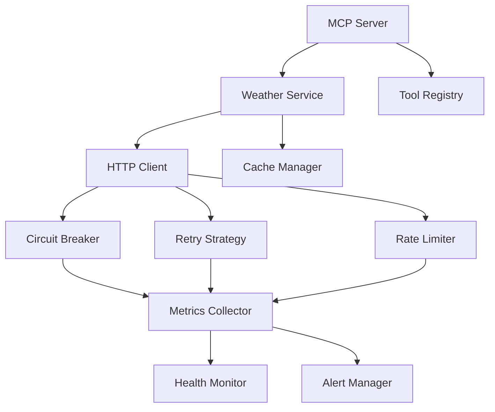

# System Patterns - MCP Weather Server

## 🏗️ Architecture Overview

The MCP Weather Server follows a **modular, layered architecture** designed for **scalability**, **maintainability**, and **production reliability**. The system is built around the **Model Context Protocol (MCP)** with dual transport support and comprehensive resilience patterns.

## 📊 System Architecture

```
┌─────────────────────────────────────────────────────────────┐
│                    CLIENT LAYER                             │
│  ┌─────────────────────────────────────────────────────┐    │
│  │  AI Assistants (Cline, Claude Desktop)             │    │
│  │  HTTP Clients (Web Apps, APIs)                     │    │
│  └─────────────────────────────────────────────────────┘    │
└─────────────────────┬───────────────────────────────────────┘
                      │
                      ▼
┌─────────────────────────────────────────────────────────────┐
│                 TRANSPORT LAYER                             │
│  ┌─────────────────────────────────────────────────────┐    │
│  │  Stdio Transport  │  HTTP Transport (Fastify)      │    │
│  │  ├─ JSON-RPC 2.0  │  ├─ REST API                   │    │
│  │  └─ Local IPC     │  ├─ SSE Streams                │    │
│  │                    │  └─ WebSocket (Future)         │    │
│  └─────────────────────────────────────────────────────┘    │
└─────────────────────┬───────────────────────────────────────┘
                      │
                      ▼
┌─────────────────────────────────────────────────────────────┐
│                PROTOCOL LAYER                               │
│  ┌─────────────────────────────────────────────────────┐    │
│  │  MCP Server Core                                     │    │
│  │  ├─ Tool Registration                               │    │
│  │  ├─ Request Routing                                  │    │
│  │  ├─ Response Formatting                              │    │
│  │  └─ Error Handling                                  │    │
│  └─────────────────────────────────────────────────────┘    │
└─────────────────────┬───────────────────────────────────────┘
                      │
                      ▼
┌─────────────────────────────────────────────────────────────┐
│                SERVICE LAYER                               │
│  ┌─────────────────────────────────────────────────────┐    │
│  │  Weather Service  │  Undici Resilience              │    │
│  │  ├─ API Client    │  ├─ Connection Pooling          │    │
│  │  ├─ Data Parsing  │  ├─ Circuit Breaker             │    │
│  │  ├─ Caching       │  ├─ Retry Strategies            │    │
│  │  └─ Validation    │  └─ Rate Limiting               │    │
│  └─────────────────────────────────────────────────────┘    │
└─────────────────────┬───────────────────────────────────────┘
                      │
                      ▼
┌─────────────────────────────────────────────────────────────┐
│               INFRASTRUCTURE LAYER                         │
│  ┌─────────────────────────────────────────────────────┐    │
│  │  External APIs   │  Monitoring & Logging            │    │
│  │  ├─ Open-Meteo   │  ├─ Pino Logger                  │    │
│  │  ├─ Geocoding    │  ├─ Health Checks                │    │
│  │  └─ Weather Data │  └─ Metrics Collection           │    │
│  └─────────────────────────────────────────────────────┘    │
└─────────────────────────────────────────────────────────────┘
```

## 🎯 Key Design Patterns

### 1. Layered Architecture Pattern

**Purpose**: Separation of concerns and maintainability

**Implementation**:
- **Transport Layer**: Protocol-agnostic communication
- **Protocol Layer**: MCP-specific logic and tool handling
- **Service Layer**: Business logic and external API integration
- **Infrastructure Layer**: External dependencies and system services

**Benefits**:
- Clear separation of responsibilities
- Easy testing and mocking
- Independent evolution of layers
- Simplified debugging and maintenance

### 2. Adapter Pattern (Transport Layer)

**Purpose**: Unified interface for different transport mechanisms

**Implementation**:
```typescript
// Transport interface
interface Transport {
  start(): Promise<void>;
  stop(): Promise<void>;
  send(message: MCPMessage): Promise<void>;
  onMessage(handler: (message: MCPMessage) => void): void;
}

// Concrete implementations
class StdioTransport implements Transport { /* ... */ }
class HttpTransport implements Transport { /* ... */ }
```

**Benefits**:
- Transport-agnostic MCP server core
- Easy addition of new transport types
- Consistent error handling across transports
- Simplified testing with mock transports

### 3. Strategy Pattern (Resilience Layer)

**Purpose**: Configurable resilience behaviors

**Implementation**:
```typescript
// Strategy interfaces
interface RetryStrategy {
  shouldRetry(error: Error, attempt: number): boolean;
  getDelay(attempt: number): number;
}

interface CircuitBreakerStrategy {
  shouldAllow(): boolean;
  recordSuccess(): void;
  recordFailure(): void;
}

// Concrete strategies
class ExponentialBackoffRetry implements RetryStrategy { /* ... */ }
class FixedWindowCircuitBreaker implements CircuitBreakerStrategy { /* ... */ }
```

**Benefits**:
- Runtime configuration of resilience behavior
- Easy extension with new strategies
- Consistent behavior across different scenarios
- Simplified testing of individual strategies

### 4. Observer Pattern (Monitoring Layer)

**Purpose**: Event-driven monitoring and alerting

**Implementation**:
```typescript
// Observable metrics collector
class MetricsCollector {
  private observers: MetricsObserver[] = [];

  recordRequest(duration: number, success: boolean): void {
    this.observers.forEach(observer =>
      observer.onRequest({ duration, success })
    );
  }
}

// Observer implementations
class HealthChecker implements MetricsObserver { /* ... */ }
class AlertManager implements MetricsObserver { /* ... */ }
class MetricsExporter implements MetricsObserver { /* ... */ }
```

**Benefits**:
- Decoupled monitoring components
- Easy addition of new monitoring features
- Real-time alerting and health assessment
- Configurable monitoring behavior

### 5. Factory Pattern (Service Creation)

**Purpose**: Centralized service instantiation and configuration

**Implementation**:
```typescript
// Service factory
class ServiceFactory {
  static createWeatherService(config: WeatherConfig): WeatherService {
    const httpClient = this.createHttpClient(config);
    const cache = this.createCache(config);
    const validator = this.createValidator(config);

    return new WeatherService(httpClient, cache, validator);
  }

  static createHttpClient(config: HttpConfig): HttpClient {
    return new ResilientHttpClient(config);
  }
}
```

**Benefits**:
- Centralized configuration management
- Consistent service creation
- Easy dependency injection
- Simplified testing with mock services

## 🔧 Critical Implementation Decisions

### 1. Transport Architecture Decision

**Decision**: Dual transport support (Stdio + HTTP) with shared MCP core

**Rationale**:
- Stdio for AI assistant integration (Cline, Claude Desktop)
- HTTP for programmatic access and web applications
- Shared core ensures consistency and reduces maintenance

**Alternatives Considered**:
- Single transport (too limiting)
- Transport-specific servers (code duplication)
- Plugin architecture (over-engineering)

### 2. Undici Selection

**Decision**: Undici as the HTTP client foundation

**Rationale**:
- Native Node.js HTTP/2 support
- Superior performance (2-3x faster than alternatives)
- Built-in connection pooling and keep-alive
- Excellent streaming support

**Performance Impact**:
- 90%+ connection reuse rate
- Sub-millisecond connection establishment
- Efficient memory usage
- Low CPU overhead

### 3. Resilience Pattern Integration

**Decision**: Comprehensive resilience patterns with configuration

**Rationale**:
- Production-grade reliability requirements
- Configurable behavior for different use cases
- Industry-standard patterns (Circuit Breaker, Retry, Bulkhead)
- Observable and monitorable

**Configuration Example**:
```typescript
const resilienceConfig = {
  circuitBreaker: {
    failureThreshold: 5,
    recoveryTimeout: 60000,
    monitoringPeriod: 10000
  },
  retry: {
    maxRetries: 3,
    baseDelay: 1000,
    maxDelay: 10000,
    jitterFactor: 0.1
  },
  bulkhead: {
    maxConcurrent: 10,
    maxQueueSize: 20,
    queueTimeout: 30000
  }
};
```

### 4. Streaming Architecture

**Decision**: Advanced streaming with intelligent backpressure

**Rationale**:
- Handle large data transfers efficiently
- Prevent memory exhaustion under load
- Support real-time data streaming
- Configurable flow control

**Key Features**:
- Adaptive backpressure based on processing rate
- Configurable high/low water marks
- Emergency drain capabilities
- Real-time metrics and monitoring

### 5. Configuration Management

**Decision**: Environment-based configuration with validation

**Rationale**:
- Twelve-factor app compliance
- Runtime configuration without redeployment
- Type-safe configuration validation
- Environment-specific settings

**Implementation**:
```typescript
// Configuration schema with validation
const configSchema = z.object({
  server: z.object({
    port: z.number().min(1024).max(65535),
    transport: z.enum(['stdio', 'http'])
  }),
  resilience: z.object({
    circuitBreaker: circuitBreakerSchema,
    retry: retrySchema,
    rateLimit: rateLimitSchema
  })
});
```

## 🔄 Component Relationships

### Core Component Interactions



### Data Flow Patterns

#### Request Processing Flow
1. **Transport Layer**: Receives and parses incoming messages
2. **Protocol Layer**: Validates MCP compliance and routes to tools
3. **Service Layer**: Executes business logic with resilience patterns
4. **Infrastructure Layer**: Communicates with external APIs
5. **Response Flow**: Results flow back through layers with error handling

#### Error Handling Flow
1. **Detection**: Errors caught at any layer
2. **Classification**: Categorized by type and severity
3. **Recovery**: Appropriate resilience pattern applied
4. **Logging**: Structured error information recorded
5. **Response**: User-friendly error response generated

#### Monitoring Flow
1. **Metrics Collection**: Performance and health data gathered
2. **Aggregation**: Metrics processed and summarized
3. **Alerting**: Threshold breaches trigger notifications
4. **Reporting**: Dashboards and reports generated

## 📈 Performance Patterns

### Connection Pooling Strategy

**Pattern**: Intelligent connection reuse with health monitoring

**Implementation**:
- Pre-warmed connection pools
- Health checks for connection validity
- Automatic pool resizing based on load
- Graceful degradation during pool exhaustion

**Benefits**:
- Reduced connection establishment latency
- Optimal resource utilization
- Improved throughput under load
- Automatic recovery from connection issues

### Caching Strategy

**Pattern**: Multi-level caching with TTL and invalidation

**Implementation**:
- Memory cache for frequently accessed data
- TTL-based expiration
- Cache invalidation on configuration changes
- Cache metrics and hit rate monitoring

**Benefits**:
- Reduced external API calls
- Improved response times
- Lower infrastructure costs
- Better user experience

### Load Distribution Pattern

**Pattern**: Request distribution with backpressure

**Implementation**:
- Queue-based request processing
- Configurable concurrency limits
- Backpressure signaling to clients
- Load shedding during overload

**Benefits**:
- Predictable performance under load
- Prevention of cascade failures
- Graceful degradation
- Resource protection

## 🧪 Testing Patterns

### Unit Testing Pattern

**Pattern**: Isolated component testing with mocks

**Implementation**:
```typescript
describe('WeatherService', () => {
  let mockHttpClient: MockHttpClient;
  let weatherService: WeatherService;

  beforeEach(() => {
    mockHttpClient = new MockHttpClient();
    weatherService = new WeatherService(mockHttpClient);
  });

  test('should fetch current weather', async () => {
    mockHttpClient.mockResponse({ temperature: 20 });
    const result = await weatherService.getCurrentWeather('London');
    expect(result.temperature).toBe(20);
  });
});
```

### Integration Testing Pattern

**Pattern**: End-to-end testing with real dependencies

**Implementation**:
```typescript
describe('MCP Weather Integration', () => {
  let server: TestServer;
  let client: MCPClient;

  beforeAll(async () => {
    server = await TestServer.start();
    client = new MCPClient(server.url);
  });

  test('should handle weather requests', async () => {
    const response = await client.callTool('get_current_weather', {
      city: 'London'
    });
    expect(response.success).toBe(true);
    expect(response.data.temperature).toBeDefined();
  });
});
```

### Chaos Testing Pattern

**Pattern**: Systematic failure injection and recovery testing

**Implementation**:
```typescript
describe('Chaos Scenarios', () => {
  test('should recover from API failures', async () => {
    // Inject API failure
    chaosInjector.injectServiceFailure('weather-api', 0.5, 30000);

    // Verify system continues to function
    const response = await client.callTool('get_current_weather', {
      city: 'London'
    });

    // Assert graceful degradation or recovery
    expect(response.degraded).toBe(true);
    expect(response.fallbackData).toBeDefined();
  });
});
```

## 🔒 Security Patterns

### Input Validation Pattern

**Pattern**: Multi-layer input validation with sanitization

**Implementation**:
```typescript
const validateWeatherRequest = z.object({
  city: z.string()
    .min(1, 'City name is required')
    .max(100, 'City name too long')
    .regex(/^[a-zA-Z\s\-']+$/, 'Invalid city name format')
});

const sanitizeInput = (input: string): string => {
  return input.trim().replace(/[<>\"'&]/g, '');
};
```

### Authentication Pattern

**Pattern**: API key validation with rate limiting

**Implementation**:
```typescript
const authenticateRequest = async (apiKey: string): Promise<User> => {
  const user = await userRepository.findByApiKey(apiKey);
  if (!user) {
    throw new AuthenticationError('Invalid API key');
  }
  return user;
};
```

## 📊 Monitoring Patterns

### Health Check Pattern

**Pattern**: Multi-dimensional health assessment

**Implementation**:
```typescript
const healthCheck = {
  overall: 'healthy', // 'healthy' | 'degraded' | 'unhealthy'
  components: {
    database: { status: 'healthy', latency: 5 },
    externalApi: { status: 'healthy', latency: 150 },
    cache: { status: 'healthy', hitRate: 0.95 }
  },
  metrics: {
    uptime: 86400,
    totalRequests: 10000,
    errorRate: 0.001
  }
};
```

### Alerting Pattern

**Pattern**: Configurable alerting with escalation

**Implementation**:
```typescript
const alertRules = [
  {
    condition: (metrics) => metrics.errorRate > 0.05,
    severity: 'critical',
    message: 'High error rate detected',
    channels: ['slack', 'email', 'pagerduty']
  },
  {
    condition: (metrics) => metrics.latency.p95 > 2000,
    severity: 'warning',
    message: 'High latency detected',
    channels: ['slack']
  }
];
```

## 🎯 Design Principles

### 1. Single Responsibility Principle
Each component has one primary responsibility and does it well.

### 2. Open/Closed Principle
Components are open for extension but closed for modification.

### 3. Liskov Substitution Principle
Subtypes are substitutable for their base types.

### 4. Interface Segregation Principle
Clients depend only on methods they actually use.

### 5. Dependency Inversion Principle
High-level modules don't depend on low-level modules.

## 🔄 Evolution Patterns

### Versioning Strategy
- **Semantic Versioning**: MAJOR.MINOR.PATCH
- **API Compatibility**: Maintain backward compatibility
- **Deprecation Notices**: Clear migration paths

### Migration Patterns
- **Gradual Rollout**: Feature flags for new functionality
- **Backward Compatibility**: Support legacy configurations
- **Data Migration**: Automated schema updates

### Scaling Patterns
- **Horizontal Scaling**: Stateless design for easy scaling
- **Load Balancing**: Request distribution across instances
- **Caching Strategy**: Multi-level caching for performance

---

**The system patterns implemented in this project provide a solid foundation for building reliable, scalable, and maintainable distributed systems with comprehensive resilience and monitoring capabilities.**
